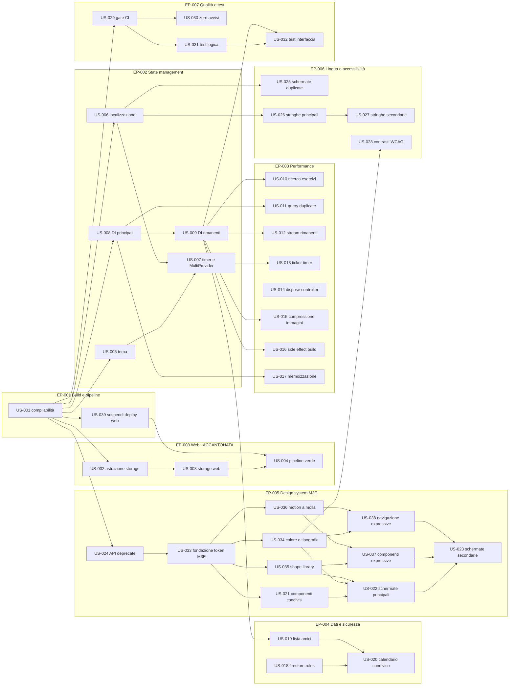

# GymFlow — Product Backlog

**Generated by:** Archetipo Spec Skill
**Date:** 2026-08-06
**Source PRD:** N/A — backlog derivato da analisi tecnica del codice e da esecuzione dell'app su emulatore Android
**Version:** 1.2
**Direzione UI/UX:** Material 3 Expressive (vedi EP-005 e il vincolo documentato in fondo al file)
**Target attivo:** Android. Il Web è accantonato in EP-008, da affrontare per ultima.
**Processo di lavoro:** vedi [WORKFLOW.md](WORKFLOW.md)

---

## Backlog Summary

| Epic | Title | Stories | Story Points | Scope |
|---|---|---|---|---|
| EP-001 | Stabilità della build e della pipeline | 3 | 4 | MVP |
| EP-002 | Unificazione dello state management | 5 | 15 | MVP |
| EP-003 | Performance runtime e consumo risorse | 8 | 20 | MVP |
| EP-004 | Integrità dei dati e sicurezza Firestore | 3 | 9 | MVP |
| EP-005 | Design system Material 3 Expressive | 10 | 36 | Growth |
| EP-006 | Localizzazione e accessibilità | 4 | 12 | Growth |
| EP-007 | Qualità del codice e test automatizzati | 4 | 11 | Growth |
| EP-008 | Recupero del target Web | 3 | 10 | Later 🕓 |

**Total stories:** 40
**Total story points:** 117
**MVP stories:** 19 (48pt)
**Accantonate (Later):** 3 (10pt)

---

## Prioritization Notes

- **EP-001 viene prima di tutto**, ma è ora minima: due storie da 1 punto. US-001 sblocca il resto del backlog, US-039 impedisce alla pipeline di restare rossa per un target che abbiamo deciso di rimandare.
- **EP-008 è esplicitamente per ultima.** Decisione di prodotto del 2026-08-06: il target Web viene accantonato per concentrare l'attenzione su Android. Il costo del rinvio è documentato nell'epica.
- **EP-002 è un prerequisito tecnico di EP-003.** Non ha senso ottimizzare gli stream finché convivono due sistemi di dependency injection: si ottimizzerebbe codice destinato a essere riscritto. Le due epiche vanno affrontate in sequenza, non in parallelo.
- **EP-003 contiene i guadagni misurabili.** Query Firestore ricreate a ogni carattere digitato, stream N+1 e ticker a 33 Hz sono costi diretti in latenza, batteria e fatturazione Firestore.
- **EP-004 è MVP nonostante sembri infrastrutturale.** Le regole Firestore non sono versionate e a runtime si osservano `permission-denied`: è un rischio di sicurezza e di regressione silenziosa, non un refinement.
- **EP-005 è l'epica più grande del backlog e non è un refinement estetico.** Material 3 Expressive non è supportato da Flutter: va costruito. US-033 è la storia che decide *come*, e ogni altra storia dell'epica dipende da quella decisione. Affrontare EP-005 senza aver chiuso US-033 significa produrre codice da riscrivere.
- **EP-006 è Growth ma ad alta visibilità.** US-025 (unificazione delle due schermate duplicate) va anticipata rispetto al resto perché elimina codice invece di aggiungerne, ed è l'unica storia del backlog che riduce la superficie di manutenzione.
- **EP-007 chiude il ciclo.** Il gate di CI (US-029) nasce controllando solo gli errori; solo dopo US-030 può trattare anche gli avvisi come bloccanti, altrimenti nascerebbe già rosso.

---

## Dipendenze e ordine di esecuzione

> _Ogni storia riporta il campo **Depends on**. Questa sezione ne dà la vista d'insieme._

### Grafo delle dipendenze

### Percorsi critici

| Percorso | Storie | Punti | Nota |
|---|---|---|---|
| **Design system Expressive** | US-001 → US-024 → US-033 → US-035 → US-037 → US-023 | 22 | Il più lungo del backlog attivo; US-033 è il collo di bottiglia |
| **Abilitazione dei test** | US-001 → US-008 → US-009 → US-032 | 10 | Senza DI completa i widget test non possono sostituire i servizi |
| **Recupero del target Web** 🕓 | US-001 → US-002 → US-003 → US-004 | 11 | Accantonato in EP-008. Strettamente sequenziale: nessuna parallelizzazione possibile |

### Ordine di esecuzione consigliato

| Fase | Storie eseguibili | Punti | Razionale |
|---|---|---|---|
| **1 — Sblocco** | US-001, US-014, US-018 | 6 | US-001 sblocca quasi tutto. US-014 e US-018 sono indipendenti: si possono affrontare in parallelo da subito |
| **2 — Fondamenta** | US-039, US-005, US-006, US-008, US-024, US-029 | 14 | US-039 spegne il rumore della CI. Le altre sono fondamenta parallele: stato, DI, tema |
| **3 — Costruzione** | US-007, US-009, US-033, US-025, US-026, US-030, US-031 | 21 | US-033 apre l'intera EP-005; US-009 apre metà EP-003 |
| **4 — Ottimizzazione e stile** | US-010÷US-013, US-015÷US-017, US-019, US-021, US-034÷US-036, US-027, US-032 | 45 | La fase più larga: qui il lavoro si parallelizza al massimo |
| **5 — Rifinitura** | US-020, US-022, US-023, US-037, US-038, US-028 | 19 | Dipendono da tutto il resto; US-028 richiede la palette definitiva di US-034 |
| **6 — Web** 🕓 | US-002, US-003, US-004 | 10 | Accantonata per decisione di prodotto. Da riprendere solo a fase 5 conclusa, ristimando US-003 |

**Storie senza alcuna dipendenza** (attaccabili in qualsiasi momento): US-001, US-014, US-018.

---

## Epics & User Stories

---

### EP-001: Stabilità della build e della pipeline

> Riportare il progetto a uno stato in cui il target attivo compila e la pipeline non segnala falsi allarmi.
> **Scope:** MVP | **Stories:** 2 | **Story Points:** 2

> ℹ️ **Nota di scope.** Le storie relative al target Web sono state spostate in **EP-008**, da affrontare per ultima. Questa epica si limita a rendere sano il target Android e a impedire che la pipeline resti rossa nel frattempo.

---

#### US-001: Ripristinare la compilabilità del branch di sviluppo

**Epic:** EP-001 | **Priority:** HIGH | **Story Points:** 1
**Depends on:** —  _(nessuna: è la storia radice del backlog)_ | **Blocks:** US-005, US-006, US-008, US-024, US-029, US-039, US-002 🕓
**Status:** ✅ DONE

**Story**
Come sviluppatore del team GymFlow,
voglio che il branch `dev` compili senza errori,
così da poter lavorare e testare senza dover prima riparare il codice di qualcun altro.

**Demonstrates**
Dopo questa storia: `flutter analyze` non riporta alcun errore e `flutter run` parte su emulatore.

**Acceptance Criteria**
- [ ] `flutter analyze` riporta 0 elementi di severità `error`
- [ ] La voce "Elimina" del menu contestuale in `program_list_screen.dart` usa una chiave di localizzazione, non una stringa manipolata a runtime
- [ ] La chiave `delete` è presente sia nel dizionario EN sia in quello IT
- [ ] L'app si avvia su emulatore Android fino alla schermata di login

> **Nota:** già implementata durante la sessione di analisi del 2026-08-06. Resta a backlog per tracciabilità.

---

#### US-039: Sospendere il deploy web finché il target non viene recuperato

**Epic:** EP-001 | **Priority:** HIGH | **Story Points:** 1
**Depends on:** US-001 | **Blocks:** US-004
**Status:** ✅ DONE

**Story**
Come sviluppatore del team GymFlow,
voglio che la pipeline smetta di fallire per un target che abbiamo deciso di rimandare,
così da poter distinguere un fallimento reale da uno già noto e accettato.

**Demonstrates**
Dopo questa storia: nessun push su `main` produce una notifica di fallimento causata dal build web.

**Acceptance Criteria**
- [x] Il workflow `deploy_web.yml` non viene più eseguito automaticamente sui push a `main`
- [x] Il workflow resta nel repository e può essere avviato manualmente
- [x] Nel file del workflow è presente un commento che spiega la sospensione e rimanda a EP-008
- [x] Dopo un push su `main`, la lista delle esecuzioni non contiene esecuzioni fallite
- [x] La sospensione è reversibile con la sola riattivazione del trigger

---

#### US-040: Ripristinare la compilabilità della build release

**Epic:** EP-001 | **Priority:** HIGH | **Story Points:** 2
**Depends on:** —  _(nessuna)_ | **Blocks:** —  _(nessuna)_
**Status:** ✅ DONE

> **Risolta il 2026-08-06.** Il blocco condizionale in `android/build.gradle.kts` alza a 34 il `compileSdk` dei plugin che ne dichiarano meno di 31. Verifica A/B: senza il blocco la build release fallisce, con il blocco produce i pacchetti. Dimensioni: arm64-v8a 25,9 MB, armeabi-v7a 22,7 MB, x86_64 27,7 MB.

**Story**
Come sviluppatore del team GymFlow,
voglio poter produrre un pacchetto di release installabile,
così da poter distribuire l'applicazione a chi deve provarla o usarla.

**Demonstrates**
Dopo questa storia: `flutter build apk --release` completa e produce un pacchetto installabile.

**Acceptance Criteria**
- [x] `flutter build apk --release` termina con exit code 0
- [ ] Il pacchetto prodotto si installa e si avvia su un telefono Android reale — _da confermare sull'APK_
- [x] `flutter build apk --debug` continua a funzionare
- [x] La causa della correzione è documentata nel file di configurazione toccato
- [x] La dimensione del pacchetto release è riportata nella storia per riferimento futuro

> **Difetto rilevato il 2026-08-06** durante la verifica di US-007, fuori dallo scope di quella storia.
>
> `flutter build apk --release` fallisce al task `:isar_flutter_libs:verifyReleaseResources` con
> `AAPT: error: resource android:attr/lStar not found`. È un difetto noto di `isar_flutter_libs`
> con versioni di `androidx.core` non allineate: la risorsa `lStar` compare da `androidx.core` 1.7.
> La build **debug** funziona, quindi il problema si manifesta solo in release e non era mai emerso.
>
> **Conseguenza: oggi l'applicazione non e distribuibile.** Le prove sul telefono si fanno con
> pacchetti di debug, molto più pesanti (101 MB contro i 57 MB dell'ultima release riuscita,
> risalente al 28 gennaio 2026).
>
> Da valutare in fase di planning: forzare la versione di `androidx.core` nella configurazione
> Gradle, oppure sostituire Isar, il che intreccia questa storia con EP-008.

---

### EP-002: Unificazione dello state management

> Eliminare la convivenza di Provider e Riverpod, portando tutta l'applicazione su un unico sistema di dependency injection.
> **Scope:** MVP | **Stories:** 5 | **Story Points:** 15

---

#### US-005: Migrare la gestione del tema a Riverpod

**Epic:** EP-002 | **Priority:** MEDIUM | **Story Points:** 3
**Depends on:** US-001 | **Blocks:** US-007
**Status:** ✅ DONE

**Story**
Come sviluppatore del team GymFlow,
voglio che la preferenza di tema sia gestita da un provider Riverpod,
così da avere un solo modo di leggere e scrivere stato condiviso in tutta l'app.

**Demonstrates**
Dopo questa storia: cambiare tema e colore primario dalle impostazioni funziona come prima, ma senza `ChangeNotifierProvider`.

**Acceptance Criteria**
- [x] Il tema (modalità chiaro/scuro/sistema e colore primario) è esposto da un provider Riverpod
- [x] La preferenza continua a persistere tra riavvii tramite `SharedPreferences`
- [x] Cambiando tema dalle impostazioni, l'intera app si aggiorna immediatamente
- [x] Il colore selezionato è usato senza ricorrere all'API deprecata `Color.value`
- [x] `ThemeProvider` basato su `ChangeNotifier` è rimosso

---

#### US-006: Migrare la localizzazione a Riverpod

**Epic:** EP-002 | **Priority:** MEDIUM | **Story Points:** 3
**Depends on:** US-001 | **Blocks:** US-007, US-025, US-026
**Status:** ✅ DONE

**Story**
Come sviluppatore del team GymFlow,
voglio che la lingua corrente sia gestita da un provider Riverpod,
così da eliminare la seconda dipendenza da `package:provider` nelle schermate.

**Demonstrates**
Dopo questa storia: il cambio lingua funziona come prima e nessuna schermata usa più `Provider.of<LocalizationProvider>`.

**Acceptance Criteria**
- [x] La lingua corrente e la funzione di traduzione sono esposte da un provider Riverpod
- [x] Cambiando lingua dalle impostazioni, tutte le schermate aperte si aggiornano
- [x] La preferenza di lingua persiste tra riavvii
- [x] Nessun file in `lib/src/ui` importa più `LocalizationProvider` via `package:provider`

---

#### US-007: Migrare il servizio timer e rimuovere MultiProvider

**Epic:** EP-002 | **Priority:** MEDIUM | **Story Points:** 3
**Depends on:** US-005, US-006 | **Blocks:** US-013
**Status:** ✅ DONE

**Story**
Come sviluppatore del team GymFlow,
voglio che cronometro e timer siano gestiti da Riverpod e che `MultiProvider` sparisca dall'avvio dell'app,
così da avere un unico albero di stato e un solo punto di configurazione.

**Demonstrates**
Dopo questa storia: `app.dart` contiene solo `MaterialApp`, senza alcun `MultiProvider` annidato dentro `ProviderScope`.

**Acceptance Criteria**
- [x] Lo stato di cronometro e timer è esposto da un provider Riverpod
- [ ] L'overlay flottante del timer continua a comparire, essere trascinabile e controllabile come prima — _da confermare sull'APK_
- [x] `MultiProvider` è rimosso da `app.dart`
- [x] La dipendenza `provider` è rimossa da `pubspec.yaml`
- [x] Il doppio `@override` su `build` in `app.dart` è corretto

---

#### US-008: Consumare i servizi via DI nelle schermate principali

**Epic:** EP-002 | **Priority:** HIGH | **Story Points:** 3
**Depends on:** US-001 | **Blocks:** US-009, US-011, US-017
**Status:** ⬜ TODO

**Story**
Come sviluppatore del team GymFlow,
voglio che dashboard, calendario e lista allenamenti ottengano `FirestoreService` e `AuthService` dai provider,
così da poterli sostituire con dei doppi nei test e da non ricreare oggetti a ogni build.

**Demonstrates**
Dopo questa storia: le tre schermate più usate dell'app non contengono più alcuna chiamata a `FirestoreService()` o `AuthService()`.

**Acceptance Criteria**
- [ ] `dashboard_screen.dart`, `calendar_screen.dart` e `home_screen.dart` ottengono i servizi da provider Riverpod
- [ ] Nessuna di queste tre schermate contiene l'istanziazione diretta `FirestoreService()` o `AuthService()`
- [ ] Esiste un provider per `AuthService` analogo a `firestoreServiceProvider`
- [ ] Il comportamento funzionale delle tre schermate è invariato

---

#### US-009: Completare la migrazione a DI sulle schermate rimanenti

**Epic:** EP-002 | **Priority:** MEDIUM | **Story Points:** 3
**Depends on:** US-008 | **Blocks:** US-010, US-012, US-015, US-016, US-019, US-032
**Status:** ⬜ TODO

**Story**
Come sviluppatore del team GymFlow,
voglio che nessuna schermata istanzi più direttamente i servizi,
così da avere un unico punto di creazione e un solo posto da modificare quando cambia il backend.

**Demonstrates**
Dopo questa storia: una ricerca di `FirestoreService()` in `lib/src/ui` non produce risultati.

**Acceptance Criteria**
- [ ] Le schermate impostazioni, profilo, creazione programma, creazione allenamento, libreria esercizi, amici, gamification e misurazioni usano i provider
- [ ] Una ricerca di `FirestoreService()`, `AuthService()` e `HealthService()` in `lib/src/ui` non produce occorrenze
- [ ] `HealthService` è esposto da un provider
- [ ] Tutte le schermate migrate mantengono il comportamento precedente

---

### EP-003: Performance runtime e consumo risorse

> Eliminare le riletture inutili da Firestore, i rebuild superflui e le perdite di memoria.
> **Scope:** MVP | **Stories:** 8 | **Story Points:** 20

---

#### US-010: Ricerca esercizi senza riaprire la query a ogni tasto

**Epic:** EP-003 | **Priority:** HIGH | **Story Points:** 3
**Depends on:** US-009 | **Blocks:** —  _(nessuna)_
**Status:** ⬜ TODO

**Story**
Come atleta che cerca un esercizio nella libreria,
voglio che i risultati si filtrino in modo fluido mentre digito,
così da trovare quello che cerco senza sfarfallii né attese.

**Demonstrates**
Dopo questa storia: digitando "bench" nella ricerca, la lista si filtra senza spinner intermedi e senza nuove letture da Firestore.

**Acceptance Criteria**
- [ ] Lo stream degli esercizi è creato una sola volta e non dentro il metodo `build`
- [ ] Digitando nella barra di ricerca non viene aperta alcuna nuova sottoscrizione Firestore
- [ ] Il filtro per testo e per tipo di esercizio produce gli stessi risultati di oggi
- [ ] Durante la digitazione non compare l'indicatore di caricamento
- [ ] Il `TextEditingController` della ricerca viene rilasciato alla chiusura della schermata

---

#### US-011: Eliminare le query duplicate nel menu di avvio rapido

**Epic:** EP-003 | **Priority:** HIGH | **Story Points:** 3
**Depends on:** US-008 | **Blocks:** —  _(nessuna)_
**Status:** ⬜ TODO

**Story**
Come atleta che apre l'avvio rapido dalla dashboard,
voglio vedere subito l'elenco dei miei allenamenti,
così da iniziare la sessione senza attese.

**Demonstrates**
Dopo questa storia: aprendo l'avvio rapido con più programmi attivi viene eseguita una sola query sugli allenamenti invece di una per ciascun allenamento.

**Acceptance Criteria**
- [ ] Il menu di avvio rapido esegue una sola sottoscrizione alla collezione degli allenamenti
- [ ] Non esistono `StreamBuilder` annidati sulla stessa query dentro `dashboard_screen.dart`
- [ ] Gli allenamenti mostrati sono gli stessi di oggi, raggruppati per programma
- [ ] Nessun allenamento appare duplicato quando è associato a più programmi
- [ ] Con zero programmi viene mostrato il messaggio di stato vuoto

---

#### US-012: Stabilizzare gli stream nelle schermate rimanenti

**Epic:** EP-003 | **Priority:** MEDIUM | **Story Points:** 3
**Depends on:** US-009 | **Blocks:** —  _(nessuna)_
**Status:** ⬜ TODO

**Story**
Come atleta che usa l'app quotidianamente,
voglio che le schermate non ricarichino i dati ogni volta che tocco un controllo,
così da avere un'esperienza fluida e non consumare traffico inutilmente.

**Demonstrates**
Dopo questa storia: interagire con filtri e controlli in calendario, amici, impostazioni e gamification non provoca ricaricamenti.

**Acceptance Criteria**
- [ ] Nessuno `StreamBuilder` in `lib/src/ui` riceve uno stream costruito dentro `build`
- [ ] Gli stream sono creati in `initState` o esposti da provider
- [ ] Cambiando mese nel calendario non viene riaperta la sottoscrizione agli eventi
- [ ] Il comportamento funzionale di tutte le schermate coinvolte è invariato

---

#### US-013: Ticker del timer attivo solo quando serve

**Epic:** EP-003 | **Priority:** MEDIUM | **Story Points:** 2
**Depends on:** US-007 | **Blocks:** —  _(nessuna)_
**Status:** ⬜ TODO

**Story**
Come atleta che usa l'app durante l'allenamento,
voglio che l'app non consumi batteria quando cronometro e timer sono fermi,
così da arrivare a fine sessione senza aver scaricato il telefono.

**Demonstrates**
Dopo questa storia: con timer e cronometro fermi non viene eseguito alcun tick periodico.

**Acceptance Criteria**
- [ ] Il ticker parte all'avvio di cronometro o timer e si ferma quando entrambi sono inattivi
- [ ] Il ticker non viene avviato nel costruttore del servizio
- [ ] La frequenza di aggiornamento è coerente con la precisione mostrata a schermo
- [ ] Il tempo trascorso resta corretto anche quando l'app va in background e torna in primo piano
- [ ] Il ticker viene fermato in `dispose`

---

#### US-014: Rilasciare i controller dei campi di testo

**Epic:** EP-003 | **Priority:** HIGH | **Story Points:** 2
**Depends on:** —  _(nessuna)_ | **Blocks:** —  _(nessuna)_
**Status:** ✅ DONE

**Story**
Come atleta che naviga a lungo tra le schermate dell'app,
voglio che l'app resti reattiva anche dopo molte aperture e chiusure,
così da non doverla riavviare per recuperare fluidità.

**Demonstrates**
Dopo questa storia: aprire e chiudere ripetutamente il creatore di allenamenti non fa crescere l'occupazione di memoria.

**Acceptance Criteria**
- [x] Ogni `TextEditingController` dichiarato in uno `State` viene rilasciato in `dispose`
- [x] Le schermate login, registrazione, profilo, creatore allenamenti, libreria esercizi e collegamento amici rilasciano tutti i propri controller
- [x] I controller creati dentro finestre di dialogo vengono rilasciati alla chiusura del dialogo
- [x] Aprendo e chiudendo 20 volte il creatore di allenamenti, la memoria rilevata da DevTools torna al livello iniziale — _verificato per via strutturale, vedi review_

---

#### US-015: Comprimere le immagini del profilo prima del caricamento

**Epic:** EP-003 | **Priority:** MEDIUM | **Story Points:** 2
**Depends on:** US-009 | **Blocks:** —  _(nessuna)_
**Status:** ⬜ TODO

**Story**
Come atleta che imposta la propria foto profilo,
voglio che il caricamento sia rapido anche con connessione lenta,
così da non dover attendere l'invio di una foto a piena risoluzione.

**Demonstrates**
Dopo questa storia: caricando una foto da 8 MB, il file trasferito su Storage è di poche centinaia di kilobyte.

**Acceptance Criteria**
- [ ] La selezione dell'immagine applica un limite di dimensione e un livello di qualità
- [ ] Un'immagine sorgente da 8 MP produce un caricamento inferiore a 500 KB
- [ ] L'avatar resta nitido alle dimensioni con cui è mostrato nell'app
- [ ] In caso di errore di caricamento viene mostrato un messaggio e lo stato di attesa viene chiuso
- [ ] Le chiamate a `print` nel flusso di caricamento sono sostituite da logging appropriato

---

#### US-016: Rimuovere gli effetti collaterali dalla costruzione delle impostazioni

**Epic:** EP-003 | **Priority:** MEDIUM | **Story Points:** 2
**Depends on:** US-009 | **Blocks:** —  _(nessuna)_
**Status:** ⬜ TODO

**Story**
Come atleta che modifica i dati della propria palestra,
voglio che ciò che digito non venga sovrascritto mentre scrivo,
così da poter salvare le modifiche in modo affidabile.

**Demonstrates**
Dopo questa storia: modificando il nome della palestra e attendendo un aggiornamento dal server, il testo digitato non viene perso.

**Acceptance Criteria**
- [ ] I campi di testo delle impostazioni non vengono popolati dentro il metodo `build`
- [ ] L'inizializzazione dei campi dal profilo avviene una sola volta, alla prima disponibilità dei dati
- [ ] Digitando in un campo e ricevendo un aggiornamento del profilo, il testo inserito non viene sovrascritto
- [ ] Il campo `_isLoading` inutilizzato viene rimosso o collegato all'indicatore di salvataggio
- [ ] Le chiamate a `print` nel salvataggio sono sostituite da logging appropriato

---

#### US-017: Memoizzare il calcolo delle statistiche

**Epic:** EP-003 | **Priority:** LOW | **Story Points:** 3
**Depends on:** US-008 | **Blocks:** —  _(nessuna)_
**Status:** ⬜ TODO

**Story**
Come atleta con centinaia di allenamenti registrati,
voglio che la dashboard resti fluida al crescere del mio storico,
così da non veder rallentare l'app proprio mentre accumulo risultati.

**Demonstrates**
Dopo questa storia: con 500 sessioni caricate, scorrere la dashboard non provoca cali di frame rate.

**Acceptance Criteria**
- [ ] Volume totale, RPE medio e serie di giorni consecutivi sono calcolati una sola volta per ogni aggiornamento dei dati
- [ ] I valori sono esposti da provider derivati e non ricalcolati a ogni `build`
- [ ] Con 500 sessioni di prova, lo scorrimento della dashboard resta sopra i 55 fps in profile mode
- [ ] I valori mostrati coincidono con quelli calcolati oggi
- [ ] I confronti sempre veri segnalati dall'analyzer in `statistics_helper.dart` sono rimossi

---

### EP-004: Integrità dei dati e sicurezza Firestore

> Versionare le regole di sicurezza e rimuovere i troncamenti silenziosi dei dati.
> **Scope:** MVP | **Stories:** 3 | **Story Points:** 9

---

#### US-018: Versionare le regole di sicurezza Firestore

**Epic:** EP-004 | **Priority:** HIGH | **Story Points:** 3
**Depends on:** —  _(nessuna)_ | **Blocks:** US-020
**Status:** ⬜ TODO

**Story**
Come atleta che affida a GymFlow i propri dati di allenamento,
voglio che nessun altro utente possa leggerli o modificarli,
così da poter usare l'app con fiducia.

**Demonstrates**
Dopo questa storia: le regole sono nel repository, applicate al database corretto, e un accesso non autorizzato viene respinto.

**Acceptance Criteria**
- [ ] Esiste un file `firestore.rules` versionato nel repository
- [ ] Le regole sono riferite nel `firebase.json` e si applicano al database `gymflow`
- [ ] Ogni utente autenticato può leggere e scrivere solo i propri documenti
- [ ] I dati condivisi sono leggibili solo dagli utenti presenti nella lista di condivisione del proprietario
- [ ] Un utente non autenticato non può leggere alcuna collezione
- [ ] Avviando l'app e autenticandosi non compaiono errori `permission-denied` nei log

---

#### US-019: Gestire liste di amici oltre i dieci elementi

**Epic:** EP-004 | **Priority:** MEDIUM | **Story Points:** 3
**Depends on:** US-009 | **Blocks:** US-020
**Status:** ⬜ TODO

**Story**
Come atleta con più di dieci amici collegati,
voglio vederli tutti nella lista,
così da non perdere il contatto con parte del mio gruppo.

**Demonstrates**
Dopo questa storia: un utente con 25 amici li vede tutti e 25 nella schermata amici.

**Acceptance Criteria**
- [ ] Le richieste sui profili amici sono suddivise in gruppi entro il limite di Firestore
- [ ] Con 25 amici collegati, la lista ne mostra 25
- [ ] I risultati dei gruppi sono uniti senza duplicati
- [ ] I commenti che documentano il limite come compromesso temporaneo sono rimossi
- [ ] La lista si aggiorna quando viene aggiunto un nuovo amico

---

#### US-020: Gestire il calendario condiviso oltre i dieci contatti

**Epic:** EP-004 | **Priority:** MEDIUM | **Story Points:** 3
**Depends on:** US-018, US-019 | **Blocks:** —  _(nessuna)_
**Status:** ⬜ TODO

**Story**
Come atleta che si allena con un gruppo numeroso,
voglio vedere sul calendario le sessioni di tutti quelli che le hanno condivise con me,
così da organizzare gli allenamenti insieme.

**Demonstrates**
Dopo questa storia: con 15 amici che condividono il calendario, gli eventi di tutti e 15 compaiono.

**Acceptance Criteria**
- [ ] Le sessioni condivise e gli allenamenti pianificati condivisi sono recuperati per tutti i contatti autorizzati
- [ ] Con 15 amici che condividono, il calendario mostra eventi provenienti da tutti e 15
- [ ] Il limite complessivo sul numero di eventi caricati resta configurabile e documentato
- [ ] Revocando la condivisione, gli eventi del contatto scompaiono dal calendario
- [ ] I cast superflui segnalati dall'analyzer in `calendar_screen.dart` sono rimossi

---

### EP-005: Design system Material 3 Expressive

> Costruire il linguaggio visivo dell'app su Material 3 Expressive: forme, movimento, tipografia e componenti.
> **Scope:** Growth | **Stories:** 10 | **Story Points:** 36

> ⚠️ **Vincolo di piattaforma.** Material 3 Expressive **non è supportato da Flutter** e non è in sviluppo. Del set Expressive, in Flutter 3.38.7 esistono nativamente solo: la variante di palette `DynamicSchemeVariant.expressive` e i token `Durations` / `Easing`. Le 35 forme, il motion fisico a molla, la tipografia emphasized e tutti e 15 i componenti vanno ottenuti da package di terze parti o implementati internamente. US-033 esiste per decidere come, ed è il prerequisito di ogni altra storia dell'epica.

> Le storie sono elencate in ordine di dipendenza: eseguirle in sequenza è la strada più corta.

---

#### US-024: Sostituire le API deprecate di colore e tema

**Epic:** EP-005 | **Priority:** MEDIUM | **Story Points:** 3
**Depends on:** US-001 | **Blocks:** US-033
**Status:** ✅ DONE

**Story**
Come sviluppatore del team GymFlow,
voglio che il codice non usi API deprecate del framework,
così da poter costruire il nuovo design system su fondamenta che non stanno per essere rimosse.

**Demonstrates**
Dopo questa storia: `flutter analyze` non riporta più avvisi di deprecazione su colori e tema.

**Acceptance Criteria**
- [x] Le 95 occorrenze di `withOpacity` sono sostituite dall'API corrente senza perdita di precisione
- [x] `background` e `onBackground` nel `ColorScheme` sono sostituiti da `surface` e `onSurface`
- [x] `MaterialStateProperty` è sostituito da `WidgetStateProperty`
- [x] `Color.value` e `activeColor` deprecati sono sostituiti
- [x] `flutter analyze` non riporta avvisi `deprecated_member_use` su queste API
- [x] I colori resi a schermo sono visivamente identici a prima

---

#### US-033: Decidere e fondare l'infrastruttura dei token Expressive

**Epic:** EP-005 | **Priority:** HIGH | **Story Points:** 3
**Depends on:** US-024 | **Blocks:** US-021, US-034, US-035, US-036
**Status:** ✅ DONE

> **Decisione presa il 2026-08-06:** approccio ibrido per categoria, documentato in [`docs/adr/001-material-3-expressive.md`](adr/001-material-3-expressive.md). Colore, durate e curve dai token nativi; spaziature, forme ed elevazioni interni; motion a molla dal package `motor` (238 like, 77k download mensili) da valutare in US-036; componenti interni, perche la famiglia `m3e_*` e tutta 0.x e `m3e_buttons` richiede un SDK superiore a quello del progetto.

**Story**
Come sviluppatore del team GymFlow,
voglio una decisione documentata su come ottenere Material 3 Expressive e un punto unico da cui leggere i suoi token,
così da non disseminare l'app di scelte incoerenti e da poter passare al supporto ufficiale quando arriverà.

**Demonstrates**
Dopo questa storia: esiste un file di token Expressive interrogabile dal tema, e la decisione package-contro-implementazione-propria è scritta e motivata.

**Acceptance Criteria**
- [x] È scritta una nota di decisione che confronta almeno tre opzioni: package di terze parti, implementazione interna, approccio ibrido
- [x] La nota valuta per ogni opzione: manutenzione, dimensione aggiunta al bundle, copertura dei 15 componenti, costo di migrazione al supporto ufficiale futuro
- [x] I token Expressive non nativi sono esposti tramite una `ThemeExtension` interrogabile con `Theme.of(context)`
- [x] I token già nativi (`Durations`, `Easing`, variante di palette) sono usati direttamente, senza duplicarli
- [x] La `ThemeExtension` è definita in modo che una futura sostituzione con le API ufficiali non richieda modifiche nei widget consumatori
- [x] Esiste una schermata di catalogo interna che mostra i token disponibili, accessibile solo in build di debug

---

#### US-034: Adottare palette e tipografia Expressive

**Epic:** EP-005 | **Priority:** MEDIUM | **Story Points:** 3
**Depends on:** US-033 | **Blocks:** US-022, US-028, US-038
**Status:** ⬜ TODO

**Story**
Come atleta che apre l'app,
voglio un'identità cromatica e tipografica decisa e riconoscibile,
così da percepire GymFlow come un prodotto con un carattere proprio invece che come un tema di default.

**Demonstrates**
Dopo questa storia: l'app usa la palette Expressive generata dal colore scelto e la gerarchia tipografica distingue nettamente titoli e contenuti.

**Acceptance Criteria**
- [ ] Il `ColorScheme` è generato con `ColorScheme.fromSeed` usando `DynamicSchemeVariant.expressive`
- [ ] La palette è generata per tema chiaro e scuro dallo stesso colore seme
- [ ] La scala tipografica include le varianti emphasized per i livelli display, headline e title
- [ ] Le varianti emphasized sono ottenute variando peso e spaziatura del font già in uso, senza aggiungere una seconda famiglia
- [ ] I colori definiti a mano in `app_theme.dart` sono sostituiti dai ruoli del `ColorScheme` generato
- [ ] La personalizzazione del colore primario dalle impostazioni continua a funzionare e rigenera l'intera palette

---

#### US-021: Estrarre i componenti visivi condivisi

**Epic:** EP-005 | **Priority:** MEDIUM | **Story Points:** 3
**Depends on:** US-033 | **Blocks:** US-022
**Status:** ⬜ TODO

**Story**
Come sviluppatore del team GymFlow,
voglio disporre di card, spaziature ed elevazioni definite in un unico posto e allineate ai token Expressive,
così da non riscrivere la stessa decorazione in ogni schermata.

**Demonstrates**
Dopo questa storia: esiste un widget card riutilizzabile che legge i propri valori dai token, e nessuna schermata ridefinisce le proprie costanti.

**Acceptance Criteria**
- [ ] Esiste un widget card condiviso che copre i casi d'uso oggi risolti da `_buildBentoCard`
- [ ] Il widget legge raggi, spaziature ed elevazione dai token di US-033, senza valori numerici propri
- [ ] Il widget supporta titolo opzionale e azione al tocco opzionale
- [ ] Il widget rende correttamente sia in tema chiaro sia in tema scuro
- [ ] `_buildBentoCard` è rimosso da `dashboard_screen.dart` e sostituito dal componente condiviso
- [ ] Il componente compare nella schermata di catalogo interna

---

#### US-035: Introdurre la libreria di forme Expressive

**Epic:** EP-005 | **Priority:** MEDIUM | **Story Points:** 5
**Depends on:** US-033 | **Blocks:** US-022, US-037
**Status:** ⬜ TODO

**Story**
Come atleta che usa l'app,
voglio che elementi come badge, avatar e indicatori abbiano forme caratterizzanti invece del solito cerchio,
così da riconoscere a colpo d'occhio le diverse aree dell'applicazione.

**Demonstrates**
Dopo questa storia: i badge della sezione obiettivi usano forme della libreria Expressive e cambiano forma quando vengono sbloccati.

**Acceptance Criteria**
- [ ] È disponibile una scala di forme Expressive utilizzabile come `ShapeBorder` nei widget Material
- [ ] La scala copre almeno le forme usate dal design: pill, cookie, sunny, pentagon, oval
- [ ] È possibile animare la transizione tra due forme in modo continuo
- [ ] I badge della schermata obiettivi usano le nuove forme
- [ ] Le forme rendono correttamente a tutte le densità di pixel testate, senza bordi frastagliati
- [ ] Il costo di rendering è verificato in profile mode: nessun frame oltre i 16 ms sulla schermata obiettivi

---

#### US-036: Introdurre il movimento fisico a molla

**Epic:** EP-005 | **Priority:** MEDIUM | **Story Points:** 5
**Depends on:** US-033 | **Blocks:** US-037, US-038
**Status:** ⬜ TODO

**Story**
Come atleta che interagisce con l'app,
voglio che le transizioni rispondano ai miei gesti in modo naturale invece che con animazioni rigide,
così da percepire l'interfaccia come reattiva e viva.

**Demonstrates**
Dopo questa storia: aprire l'avvio rapido e cambiare scheda produce transizioni a molla interrompibili a metà.

**Acceptance Criteria**
- [ ] È disponibile un insieme di token di movimento a molla distinti per espressività e velocità
- [ ] I token sono esposti dalla stessa `ThemeExtension` degli altri token Expressive
- [ ] Il cambio di scheda nella navigazione principale usa il movimento a molla
- [ ] L'apertura del pannello di avvio rapido usa il movimento a molla
- [ ] Un'animazione interrotta a metà da un nuovo gesto riparte dalla posizione e dalla velocità correnti, senza scatti
- [ ] Con le animazioni di sistema disattivate, le transizioni degradano a cambi immediati senza errori
- [ ] Le durate esistenti sono espresse tramite i token `Durations` invece che con valori numerici

---

#### US-022: Applicare il design system alle schermate principali

**Epic:** EP-005 | **Priority:** MEDIUM | **Story Points:** 3
**Depends on:** US-021, US-034, US-035 | **Blocks:** US-023
**Status:** ⬜ TODO

**Story**
Come atleta che usa l'app,
voglio che dashboard, allenamenti e calendario condividano lo stesso linguaggio visivo,
così da percepire un prodotto curato invece di schermate assemblate.

**Demonstrates**
Dopo questa storia: le tre schermate principali sono indistinguibili per stile e differiscono solo per contenuto.

**Acceptance Criteria**
- [ ] Dashboard, lista allenamenti e calendario usano il componente card condiviso
- [ ] Non esistono più `BoxDecoration` con ombre definite inline in queste schermate
- [ ] Le spaziature usano i token condivisi invece di valori numerici sparsi
- [ ] I colori provengono dai ruoli del `ColorScheme`, non da costanti locali
- [ ] L'aspetto resta corretto in tema chiaro e scuro
- [ ] La gerarchia tipografica emphasized è applicata ai titoli di sezione

---

#### US-037: Adottare i componenti Expressive

**Epic:** EP-005 | **Priority:** MEDIUM | **Story Points:** 5
**Depends on:** US-035, US-036 | **Blocks:** US-023
**Status:** ⬜ TODO

**Story**
Come atleta che registra un allenamento,
voglio controlli moderni e chiaramente raggruppati per le azioni frequenti,
così da agire rapidamente anche con le mani impegnate.

**Demonstrates**
Dopo questa storia: i filtri della libreria esercizi usano un gruppo di pulsanti connessi e i caricamenti mostrano l'indicatore Expressive con morphing.

**Acceptance Criteria**
- [ ] È disponibile un gruppo di pulsanti connessi con selezione singola e multipla
- [ ] I filtri per tipo della libreria esercizi usano il gruppo di pulsanti al posto dei chip attuali
- [ ] È disponibile un indicatore di caricamento con morphing di forma
- [ ] Gli indicatori circolari delle schermate principali usano il nuovo indicatore
- [ ] È disponibile un pulsante diviso, usato dove convivono azione principale e varianti
- [ ] Ogni componente reagisce al tocco con il movimento a molla di US-036
- [ ] Ogni componente è raggiungibile da tastiera e correttamente annunciato dallo screen reader
- [ ] Ogni componente compare nella schermata di catalogo interna

---

#### US-038: Rinnovare la navigazione in chiave Expressive

**Epic:** EP-005 | **Priority:** MEDIUM | **Story Points:** 3
**Depends on:** US-034, US-036 | **Blocks:** US-023
**Status:** ⬜ TODO

**Story**
Come atleta che si muove tra le sezioni dell'app,
voglio una navigazione fluida e coerente con il resto dell'interfaccia,
così da spostarmi senza attriti tra dashboard, calendario e allenamenti.

**Demonstrates**
Dopo questa storia: la barra di navigazione usa i token del design system e la transizione tra sezioni è a molla.

**Acceptance Criteria**
- [ ] La barra di navigazione principale usa colori, forme e movimento del design system
- [ ] È valutata e documentata la sostituzione della dipendenza `google_nav_bar` con un componente allineato al design system
- [ ] L'indicatore di sezione attiva si sposta con il movimento a molla
- [ ] Il pulsante di azione flottante usa forma e movimento del design system
- [ ] Le barre superiori delle schermate usano la tipografia emphasized
- [ ] La navigazione resta utilizzabile con dimensioni di testo di sistema ingrandite

---

#### US-023: Applicare il design system alle schermate secondarie

**Epic:** EP-005 | **Priority:** LOW | **Story Points:** 3
**Depends on:** US-022, US-037, US-038 | **Blocks:** —  _(nessuna)_
**Status:** ⬜ TODO

**Story**
Come atleta che esplora tutte le funzioni dell'app,
voglio che anche le schermate meno frequentate seguano lo stesso linguaggio visivo,
così da non avere la sensazione di cambiare applicazione.

**Demonstrates**
Dopo questa storia: nessuna schermata dell'app definisce decorazioni o costanti visive proprie.

**Acceptance Criteria**
- [ ] Impostazioni, profilo, gamification, misurazioni corporee, amici e sessione attiva usano i componenti condivisi
- [ ] Una ricerca di `BoxDecoration` con `boxShadow` inline in `lib/src/ui/screens` non produce occorrenze
- [ ] Una ricerca di valori numerici di raggio e spaziatura nelle schermate non produce occorrenze fuori dai token
- [ ] L'aspetto resta corretto in entrambi i temi
- [ ] Nessuna regressione visiva

---

### EP-006: Localizzazione e accessibilità

> Completare la traduzione dell'interfaccia e portare i contrasti a livello WCAG AA.
> **Scope:** Growth | **Stories:** 4 | **Story Points:** 12

---

#### US-025: Unificare le due schermate duplicate degli allenamenti

**Epic:** EP-006 | **Priority:** HIGH | **Story Points:** 3
**Depends on:** US-006 | **Blocks:** —  _(nessuna)_
**Status:** ⬜ TODO

**Story**
Come atleta che ha impostato l'app in italiano,
voglio che anche la scheda "Allenamenti" sia tradotta,
così da non trovarmi metà applicazione in inglese.

**Demonstrates**
Dopo questa storia: la scheda allenamenti è completamente in italiano e nel codice resta una sola implementazione invece di due.

**Acceptance Criteria**
- [ ] Esiste una sola schermata per l'elenco dei programmi, quella localizzata
- [ ] La navigazione principale punta alla schermata localizzata
- [ ] Con lingua italiana selezionata, nessun testo della scheda allenamenti resta in inglese
- [ ] Le funzioni di eliminazione e apertura programma continuano a funzionare
- [ ] Il file duplicato non localizzato è rimosso dal progetto

---

#### US-026: Localizzare le stringhe delle schermate principali

**Epic:** EP-006 | **Priority:** MEDIUM | **Story Points:** 3
**Depends on:** US-006 | **Blocks:** US-027
**Status:** ⬜ TODO

**Story**
Come atleta italiano,
voglio che dashboard, calendario e sessione attiva siano completamente in italiano,
così da usare l'app senza incontrare testi in un'altra lingua.

**Demonstrates**
Dopo questa storia: le tre schermate più usate non contengono testo non tradotto.

**Acceptance Criteria**
- [ ] Le stringhe letterali di dashboard, calendario e sessione attiva sono spostate nel dizionario
- [ ] Ogni nuova chiave è presente sia in EN sia in IT
- [ ] Con lingua italiana selezionata, nessun testo di queste schermate resta in inglese
- [ ] Il fallback su chiave mancante è visibile in sviluppo e non produce un crash
- [ ] Gli operatori di null coalescing morti su `loc.t` in `dashboard_screen.dart` sono rimossi

---

#### US-027: Localizzare le stringhe delle schermate secondarie

**Epic:** EP-006 | **Priority:** MEDIUM | **Story Points:** 3
**Depends on:** US-026 | **Blocks:** —  _(nessuna)_
**Status:** ⬜ TODO

**Story**
Come atleta italiano,
voglio che l'intera applicazione sia tradotta,
così da non incontrare testi in inglese in nessun punto del percorso.

**Demonstrates**
Dopo questa storia: nessuna schermata dell'app mostra testo non tradotto.

**Acceptance Criteria**
- [ ] Le stringhe letterali delle schermate rimanenti sono spostate nel dizionario
- [ ] Anche i messaggi di errore e le notifiche toast sono localizzati
- [ ] Con lingua italiana selezionata, nessuna schermata mostra testo in inglese
- [ ] I dizionari EN e IT contengono le stesse chiavi

---

#### US-028: Portare i contrasti al livello WCAG AA

**Epic:** EP-006 | **Priority:** MEDIUM | **Story Points:** 3
**Depends on:** US-034 | **Blocks:** —  _(nessuna)_
**Status:** ⬜ TODO

**Story**
Come atleta che usa l'app in palestra, con luce forte o schermo poco luminoso,
voglio riuscire a leggere testi e pulsanti senza sforzo,
così da poter registrare le serie senza fermarmi a mettere a fuoco.

**Demonstrates**
Dopo questa storia: ogni testo dell'app supera il rapporto di contrasto minimo richiesto in entrambi i temi.

**Acceptance Criteria**
- [ ] Il testo su sfondo chiaro raggiunge un rapporto di contrasto di almeno 4.5:1
- [ ] Il testo di grandi dimensioni raggiunge almeno 3:1
- [ ] Il colore primario usato per testo e link è verificato o affiancato da una variante accessibile
- [ ] I colori dei preset selezionabili nelle impostazioni sono tutti verificati
- [ ] La verifica è documentata per tema chiaro e scuro

---

### EP-007: Qualità del codice e test automatizzati

> Introdurre una rete di sicurezza automatica e riportare l'analyzer a zero avvisi.
> **Scope:** Growth | **Stories:** 4 | **Story Points:** 11

---

#### US-029: Bloccare le regressioni con un controllo automatico continuo

**Epic:** EP-007 | **Priority:** MEDIUM | **Story Points:** 2
**Depends on:** US-001 | **Blocks:** US-030, US-031
**Status:** ✅ DONE

> **Criteri rivisti il 2026-08-06.** La formulazione originale parlava di controllo "sulle pull request". Le pull request sono state successivamente rimosse dal processo (vedi `WORKFLOW.md`): i criteri sono stati riscritti sul flusso effettivo — push su `main` e `dev` — mantenendo invariato l'obiettivo della storia.

**Story**
Come sviluppatore del team GymFlow,
voglio che analisi statica e test girino automaticamente a ogni modifica dei branch principali,
così da scoprire subito una regressione invece che al prossimo avvio manuale.

**Demonstrates**
Dopo questa storia: un push che introduce un errore di compilazione viene segnalato in rosso entro pochi minuti.

**Acceptance Criteria**
- [x] Esiste un workflow che esegue `flutter analyze` e `flutter test` sui push a `main` e `dev`
- [x] Il workflow fallisce se l'analyzer riporta errori
- [x] Il workflow fallisce se un test fallisce
- [x] Il workflow è verde sullo stato attuale del repository
- [x] Il workflow può essere avviato anche manualmente
- [x] Un errore di compilazione introdotto di proposito rende il workflow rosso

---

#### US-030: Azzerare gli avvisi dell'analisi statica

**Epic:** EP-007 | **Priority:** LOW | **Story Points:** 3
**Depends on:** US-029 | **Blocks:** —  _(nessuna)_
**Status:** ⬜ TODO

**Story**
Come sviluppatore del team GymFlow,
voglio che l'analyzer non riporti avvisi,
così da poter riconoscere subito un problema nuovo invece di cercarlo tra il rumore.

**Demonstrates**
Dopo questa storia: `flutter analyze` termina pulito e la CI può trattare gli avvisi come bloccanti.

**Acceptance Criteria**
- [ ] Gli import, i campi e le variabili locali inutilizzati sono rimossi
- [ ] Il codice morto segnalato è rimosso
- [ ] Le chiamate a `print` sono sostituite da logging appropriato
- [ ] Gli usi di `BuildContext` attraverso confini asincroni sono protetti da un controllo di `mounted`
- [ ] `flutter analyze` riporta 0 avvisi
- [ ] La CI tratta gli avvisi come bloccanti

---

#### US-031: Coprire con test la logica di calcolo e conversione

**Epic:** EP-007 | **Priority:** MEDIUM | **Story Points:** 3
**Depends on:** US-029 | **Blocks:** US-032
**Status:** ⬜ TODO

**Story**
Come sviluppatore del team GymFlow,
voglio test automatici sulle statistiche e sulle conversioni dei modelli,
così da poter rifattorizzare senza il timore di alterare i numeri mostrati all'utente.

**Demonstrates**
Dopo questa storia: modificare il calcolo della serie di giorni consecutivi fa fallire un test se il risultato cambia.

**Acceptance Criteria**
- [ ] Esistono test per volume totale, RPE medio, distribuzione per tipo e serie di giorni consecutivi
- [ ] I test coprono i casi limite: lista vuota, un solo allenamento, più allenamenti nello stesso giorno, interruzione della serie
- [ ] Esistono test di andata e ritorno per la conversione tra modello locale e modello di dominio
- [ ] I test passano con `flutter test`

---

#### US-032: Coprire con test i percorsi critici dell'interfaccia

**Epic:** EP-007 | **Priority:** LOW | **Story Points:** 3
**Depends on:** US-009, US-031 | **Blocks:** —  _(nessuna)_
**Status:** ⬜ TODO

**Story**
Come sviluppatore del team GymFlow,
voglio test che verifichino i percorsi principali dell'interfaccia,
così da accorgermi subito se un refactoring rompe l'accesso o la registrazione di un allenamento.

**Demonstrates**
Dopo questa storia: rimuovere per errore il pulsante di login fa fallire un test.

**Acceptance Criteria**
- [ ] Esiste un test che verifica il passaggio da login a schermata principale con utente autenticato
- [ ] Esiste un test che verifica la registrazione di una serie nella sessione attiva
- [ ] Esiste un test che verifica lo stato vuoto della dashboard senza sessioni
- [ ] I servizi esterni sono sostituiti da doppi, senza chiamate di rete reali
- [ ] Il `widget_test.dart` predefinito è sostituito o rimosso
- [ ] I test passano con `flutter test`

---

### EP-008: Recupero del target Web

> Riportare l'applicazione a compilare ed essere distribuita sul web.
> **Scope:** Later | **Stories:** 3 | **Story Points:** 10

> 🕓 **Epica accantonata per decisione di prodotto (2026-08-06).** Va affrontata **per ultima**, dopo il completamento di EP-002÷EP-007. Fino ad allora il deploy web resta sospeso da US-039. Le tre storie mantengono gli ID originali assegnati in v1.0, quando facevano parte di EP-001.

> ⚠️ **Costo del rinvio.** Più a lungo il target web resta fuori dalla pipeline, più codice viene scritto senza verificarne la compatibilità: US-003 crescerà di conseguenza. La stima di 5pt riflette lo stato di oggi e va rivista al momento della ripresa.

---

#### US-002: Astrarre la persistenza locale dietro un'interfaccia

**Epic:** EP-008 | **Priority:** LOW | **Story Points:** 3
**Depends on:** US-001 | **Blocks:** US-003
**Status:** ⬜ TODO

**Story**
Come sviluppatore del team GymFlow,
voglio che il codice applicativo dipenda da un'interfaccia di persistenza locale e non direttamente da Isar,
così da poter cambiare il motore di storage per piattaforma senza riscrivere provider e schermate.

**Demonstrates**
Dopo questa storia: `dashboard_provider` e `sync_provider` non importano più `package:isar` e funzionano identicamente su Android.

**Acceptance Criteria**
- [ ] Esiste un'interfaccia `LocalSessionStore` con i metodi usati oggi (watch delle sessioni per utente, scrittura batch)
- [ ] L'implementazione Isar attuale soddisfa l'interfaccia senza cambiare comportamento
- [ ] `dashboard_provider.dart` e `sync_provider.dart` dipendono dall'interfaccia, non da Isar
- [ ] Il comportamento della dashboard su Android è invariato: sessioni ordinate per data decrescente, aggiornamento reattivo alla sincronizzazione
- [ ] L'import inutilizzato di `package:isar/isar.dart` in `sync_provider.dart` è rimosso

---

#### US-003: Rendere funzionante la persistenza locale su Web

**Epic:** EP-008 | **Priority:** LOW | **Story Points:** 5
**Depends on:** US-002 | **Blocks:** US-004
**Status:** ⬜ TODO

**Story**
Come atleta che usa GymFlow dal browser,
voglio poter aprire l'app e vedere il mio storico allenamenti,
così da consultare i miei progressi anche senza il telefono a portata di mano.

**Demonstrates**
Dopo questa storia: `flutter build web --release` completa con successo e la dashboard mostra le sessioni nel browser.

**Acceptance Criteria**
- [ ] `flutter build web --release` termina con exit code 0
- [ ] Esiste un'implementazione di `LocalSessionStore` compatibile con il target web
- [ ] La selezione dell'implementazione avviene per piattaforma, senza `if (kIsWeb)` sparsi nelle schermate
- [ ] Aperta l'app su Chrome e autenticandosi, la dashboard mostra le sessioni sincronizzate da Firestore
- [ ] Le funzionalità non disponibili su web (integrazione Health) degradano senza errori a schermo
- [ ] Il comportamento su Android resta invariato
- [ ] Il design system di EP-005 rende correttamente anche su browser

---

#### US-004: Riportare la pipeline di deploy allo stato verde

**Epic:** EP-008 | **Priority:** LOW | **Story Points:** 2
**Depends on:** US-003, US-039 | **Blocks:** —  _(nessuna)_
**Status:** ⬜ TODO

**Story**
Come sviluppatore del team GymFlow,
voglio che il workflow di deploy su Firebase Hosting completi con successo,
così da avere una versione web pubblicata e aggiornata a ogni merge su `main`.

**Demonstrates**
Dopo questa storia: il badge della action è verde e l'URL di Firebase Hosting serve la build corrente.

**Acceptance Criteria**
- [ ] Il trigger automatico sospeso da US-039 è riattivato e il commento di sospensione rimosso
- [ ] Il workflow `deploy_web.yml` completa senza errori su un push a `main`
- [ ] Il workflow fissa una versione esplicita di Flutter invece del generico `channel: stable`
- [ ] Il deploy su Firebase Hosting pubblica la build e l'URL risponde con l'app funzionante
- [ ] Se il build fallisce, il deploy non viene eseguito

---

## Backlog Assumptions & Open Questions

> _Questa sezione elenca le assunzioni fatte durante la generazione del backlog e le domande che restano aperte per il team._

- **[VINCOLO ACCERTATO — Material 3 Expressive]** Verificato il 2026-08-06 sull'SDK installato (Flutter 3.38.7) e sull'issue ombrello ufficiale [flutter/flutter#168813](https://github.com/flutter/flutter/issues/168813). Material 3 Expressive **non è supportato da Flutter e non è in sviluppo**: il team ha dichiarato che non accetta nemmeno contributi sul tema. Del set Expressive esistono nativamente solo `DynamicSchemeVariant.expressive` (palette) e `Durations` / `Easing` (token di durata e curve). Non esistono: il motion fisico a molla — `page_transitions_theme.dart` lo dichiara esplicitamente non implementato — le 35 forme, la tipografia emphasized e tutti e 15 i componenti. Il lavoro futuro avverrà nei package standalone in cui Material verrà scorporato (iniziativa avviata a luglio 2025, tracciata su flutter/flutter#101479). **Conseguenza sul backlog:** EP-005 costruisce internamente ciò che il framework non offre. US-033 è la storia che rende questa costruzione sostituibile il giorno in cui arriverà il supporto ufficiale, e per questo è prerequisito di tutta l'epica.
- **[ASSUNZIONE]** La stima di EP-005 (36pt) presuppone l'adozione di package di terze parti per i componenti più onerosi. Se US-033 decidesse per l'implementazione interna integrale, US-035, US-036 e US-037 andrebbero ristimate al rialzo e probabilmente suddivise. Package individuati durante l'analisi, da valutare in US-033 per maturità e manutenzione: `m3e_collection` / `m3e_design` / `m3e_buttons`, `motor` (motion a molla), `material3_expressive_loading_indicator`.
- **[ASSUNZIONE]** US-003 non prescrive quale motore di persistenza usare sul web. La scelta tecnica (sostituire Isar ovunque, oppure affiancargli un'implementazione web dedicata) resta al team in fase di planning. US-002 è progettata proprio per rendere questa decisione reversibile.
- **[ASSUNZIONE]** Le soglie di performance in US-017 (500 sessioni, 55 fps) sono valori di riferimento ragionevoli in assenza di requisiti non funzionali dichiarati. Vanno confermati o corretti dal team.
- **[ASSUNZIONE]** US-018 assume che il modello di condivisione desiderato sia quello già implementato nel codice (liste `calendarSharedWith` e `programsSharedWith` sul documento utente). Se il modello di permessi deve cambiare, la storia va rivista prima dell'implementazione.
- **[ASSUNZIONE]** Le storie di localizzazione assumono che le lingue supportate restino due, inglese e italiano. L'aggiunta di altre lingue richiederebbe di valutare il passaggio a `flutter_localizations` con file ARB, oggi non previsto.
- **[APERTA]** Il colore primario è personalizzabile dall'utente dalle impostazioni. US-028 richiede contrasti conformi, ma un utente può scegliere un colore che li viola. Va deciso se limitare i preset a colori verificati, se calcolare a runtime una variante accessibile, o se accettare il rischio sui colori personalizzati. L'adozione di `DynamicSchemeVariant.expressive` in US-034 attenua il problema — la palette è derivata algoritmicamente e rispetta i rapporti tonali — ma non lo elimina per i colori applicati fuori dai ruoli del `ColorScheme`.
- **[APERTA]** Material 3 Expressive privilegia forme marcate e movimento pronunciato. Va deciso se offrire un'impostazione per ridurre l'intensità del movimento oltre a quella di sistema, utile a chi soffre di sensibilità al moto. Oggi il backlog assume il solo rispetto dell'impostazione di sistema (US-036).
- **[APERTA]** L'integrazione con Health non è disponibile su web né su desktop. Va deciso se, su queste piattaforme, nascondere del tutto la sezione salute della dashboard o mostrare uno stato informativo.
- **[APERTA]** Il database Firestore usato è `gymflow`, non quello predefinito. Va verificato che le regole di sicurezza e gli indici siano applicati al database corretto: è una causa plausibile dei `permission-denied` osservati a runtime.
- **[APERTA]** Non esiste un PRD. Diverse scelte di prodotto sono state dedotte dal codice. Se il team vuole una base condivisa per le decisioni future, vale la pena eseguire una sessione di inception dedicata.

---

---

## Change Log

### 2026-08-06 — Update v1.3 · prime sei storie completate

**Completate:** US-001, US-039, US-014, US-024, US-005, US-006, US-029 — 7 storie, 13 punti.

| Storia | Effetto misurato |
|---|---|
| US-001 | Branch `dev` di nuovo compilabile |
| US-039 | Pipeline non più rossa: nessun run generato dai push successivi |
| US-014 | 20 controller rilasciati, nessuno squilibrio residuo in `lib/` |
| US-024 | Avvisi analyzer da 172 a 67 (−105) |
| US-005 | Tema su Riverpod, `ThemeProvider` rimosso |
| US-006 | Localizzazione su Riverpod, 8 consumatori migrati |
| US-029 | CI attiva, 15 test verdi dove prima erano zero |

**Modified:**
- **US-029**: criteri riscritti. Parlavano di controllo "sulle pull request", rimosse dal processo dopo la stesura del backlog — un workflow su `pull_request` non si sarebbe mai attivato. Obiettivo invariato, criteri riportati sul flusso reale (push su `main` e `dev`), più due criteri aggiuntivi su verde iniziale e avvio manuale.
- **Campo `Status`** aggiunto a tutte le storie per tracciare l'avanzamento.

**Nota su US-031 e US-032:** US-029 ha rimosso `test/widget_test.dart` — il file generato da `flutter create`, che cercava un testo mai esistito e falliva da sempre — sostituendolo con 15 test su `StatisticsHelper`. È un anticipo parziale e dichiarato: senza test veri il gate sarebbe stato verde su zero verifiche. **Entrambe le storie restano necessarie** per mapper, casi limite completi e test di interfaccia.

**Debito noto introdotto:** `package:provider` è importato con prefisso `legacy` in cinque file, dove convive con Riverpod per `FirestoreService` e `TimerService`. Ogni occorrenza ha un commento che ne indica la scadenza. **US-007 lo elimina** ed è ora eseguibile, avendo US-005 e US-006 concluse.

---

### 2026-08-06 — Update v1.2

**Added:**
- **EP-008: Recupero del target Web** (3 storie, 10pt, scope Later). Accoglie US-002, US-003 e US-004 spostate da EP-001, che mantengono gli ID originali.
- US-039: Sospendere il deploy web finché il target non viene recuperato (1pt, HIGH) — impedisce che la pipeline resti rossa per un target rimandato.
- Sezione "Processo di lavoro" nella testata, con rimando a `WORKFLOW.md`.

**Modified:**
- **EP-001** ridotta da 4 storie / 11pt a 2 storie / 2pt. Obiettivo riscritto: riguarda ora il solo target Android.
- US-002, US-003, US-004: epica cambiata in EP-008, priorità abbassata a LOW.
- US-003: aggiunto criterio sul rendering del design system di EP-005 su browser, conseguenza del rinvio.
- US-004: ora dipende anche da US-039, di cui deve annullare la sospensione.
- US-001: aggiornata la lista `Blocks` — non blocca più US-002 direttamente nel percorso attivo.
- Grafo, percorsi critici e ordine di esecuzione aggiornati: aggiunta una fase 6 dedicata al Web.

**Archived:** nessuna

**Triggered by:** decisione di prodotto di accantonare il target Web e affrontarlo per ultimo.

---

### 2026-08-06 — Update v1.1

**Added:**
- **Dipendenze esplicite su tutte le 38 storie.** Ogni storia riporta ora i campi `Depends on` e `Blocks`. Aggiunta la sezione "Dipendenze e ordine di esecuzione" con grafo, percorsi critici e ordine consigliato in 5 fasi.
- US-033: Decidere e fondare l'infrastruttura dei token Expressive (3pt) — prerequisito dell'intera EP-005
- US-034: Adottare palette e tipografia Expressive (3pt)
- US-035: Introdurre la libreria di forme Expressive (5pt)
- US-036: Introdurre il movimento fisico a molla (5pt)
- US-037: Adottare i componenti Expressive (5pt)
- US-038: Rinnovare la navigazione in chiave Expressive (3pt)

**Modified:**
- **EP-005** rinominata da "Design system e coerenza visiva" a "Design system Material 3 Expressive". Riscritto l'obiettivo dell'epica e documentato il vincolo di piattaforma. Storie riordinate per dipendenza. Da 4 storie / 12pt a 10 storie / 36pt.
- US-021: i valori visivi ora derivano dai token di US-033 invece di essere costanti proprie; aggiunto il catalogo interno
- US-022: aggiunti criteri su ruoli del `ColorScheme` e tipografia emphasized
- US-023: aggiunto criterio sull'assenza di valori numerici fuori dai token
- US-024: promossa a prerequisito di US-033, motivazione riscritta — la pulizia dei deprecati precede la costruzione del nuovo tema per non doverla rifare

**Archived:** nessuna

**Triggered by:** richiesta di esplicitare le dipendenze tra le storie e di adottare Material 3 Expressive come direzione UI/UX.

---

_Backlog generated via Archetipo — 2026-08-06_
_[39 storie in 8 epiche — 115 story points totali · 3 storie accantonate in EP-008]_
