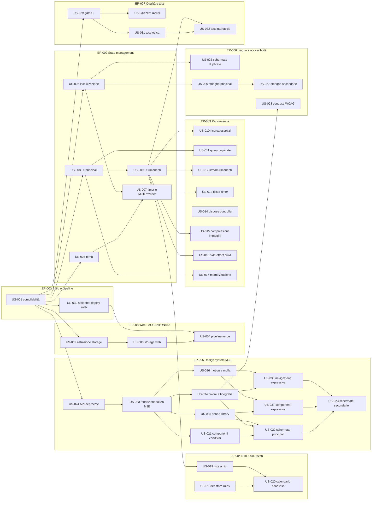

# GymFlow — Product Backlog

**Generated by:** Archetipo Spec Skill
**Date:** 2026-08-06
**Source PRD:** N/A — backlog derivato da analisi tecnica del codice e da esecuzione dell'app su emulatore Android
**Version:** 2.0
**Direzione UI/UX:** Material 3 Expressive su palette Indigo — vedi [`adr/001-material-3-expressive.md`](adr/001-material-3-expressive.md)
**Riferimenti visivi:** proposta approvata il 2026-08-06 (quindici schermate mockup, timer interattivo)
**Target attivo:** Android. Il Web è accantonato in EP-008, da affrontare per ultima.
**Processo di lavoro:** vedi [WORKFLOW.md](WORKFLOW.md)

---

## Backlog Summary

| Epic | Title | Stories | Story Points | Scope |
|---|---|---|---|---|
| EP-001 | Stabilità della build e della pipeline | 3 | 4 | MVP |
| EP-002 | Unificazione dello state management | 5 | 15 | MVP |
| EP-003 | Performance runtime e consumo risorse | 11 | 25 | MVP |
| EP-004 | Integrità dei dati e sicurezza Firestore | 5 | 17 | MVP |
| EP-005 | Design system Material 3 Expressive | 10 | 36 | Growth |
| EP-006 | Localizzazione e accessibilità | 4 | 12 | Growth |
| EP-007 | Qualità del codice e test automatizzati | 4 | 11 | Growth |
| EP-009 | Contenuti degli esercizi | 8 | 23 | MVP |
| EP-010 | Sessione di allenamento | 6 | 22 | MVP |
| EP-011 | Timer e gestione del tempo | 4 | 16 | MVP |
| EP-012 | Obiettivi e traguardi | 4 | 12 | Growth |
| EP-013 | Allenamenti oltre la palestra | 3 | 11 | Growth |
| EP-014 | Schermate ridisegnate | 6 | 20 | Growth |
| EP-015 | Progressione e primo avvio | 2 | 10 | Growth |
| EP-008 | Recupero del target Web | 3 | 10 | Later 🕓 |

**Total stories:** 80
**Total story points:** 249
**MVP stories:** 33 (98pt)
**Accantonate (Later):** 3 (10pt)

---

## Prioritization Notes

- **EP-001 viene prima di tutto**, ma è ora minima: due storie da 1 punto. US-001 sblocca il resto del backlog, US-039 impedisce alla pipeline di restare rossa per un target che abbiamo deciso di rimandare.
- **EP-008 è esplicitamente per ultima.** Decisione di prodotto del 2026-08-06: il target Web viene accantonato per concentrare l'attenzione su Android. Il costo del rinvio è documentato nell'epica.
- **EP-002 è un prerequisito tecnico di EP-003.** Non ha senso ottimizzare gli stream finché convivono due sistemi di dependency injection: si ottimizzerebbe codice destinato a essere riscritto. Le due epiche vanno affrontate in sequenza, non in parallelo.
- **EP-003 contiene i guadagni misurabili.** Query Firestore ricreate a ogni carattere digitato, stream N+1 e ticker a 33 Hz sono costi diretti in latenza, batteria e fatturazione Firestore.
- **EP-004 è MVP nonostante sembri infrastrutturale.** Le regole Firestore non sono versionate e a runtime si osservano `permission-denied`: è un rischio di sicurezza e di regressione silenziosa, non un refinement.
- **EP-009 viene prima di tutto il resto del ridisegno.** Le foto degli esercizi non sono una funzionalità fra le altre: sono il presupposto. Le app di riferimento vivono di immagini, e senza materiale visivo qualunque cambio di colori resta cosmesi su una lista di testo.
- **EP-010 è dove l'app viene usata davvero**, sotto il bilanciere con le mani occupate. Il criterio che guida ogni scelta è uno: niente tastiera durante l'allenamento.
- **EP-011 contiene le uniche due storie con codice nativo** di tutto il backlog: US-053 e US-054. Il timer che sopravvive all'uscita dall'app non è un widget Flutter.
- **EP-012 parte da zero**: obiettivi non esistono, né come modello né come calcolo.
- **EP-014 è l'ultimo strato.** Prima i token, poi i componenti, poi le schermate: invertire l'ordine significa riscrivere.
- **EP-005 è l'epica più grande del backlog e non è un refinement estetico.** Material 3 Expressive non è supportato da Flutter: va costruito. US-033 è la storia che decide *come*, e ogni altra storia dell'epica dipende da quella decisione. Affrontare EP-005 senza aver chiuso US-033 significa produrre codice da riscrivere.
- **EP-006 è Growth ma ad alta visibilità.** US-025 (unificazione delle due schermate duplicate) va anticipata rispetto al resto perché elimina codice invece di aggiungerne, ed è l'unica storia del backlog che riduce la superficie di manutenzione.
- **EP-007 chiude il ciclo.** Il gate di CI (US-029) nasce controllando solo gli errori; solo dopo US-030 può trattare anche gli avvisi come bloccanti, altrimenti nascerebbe già rosso.

---

## Dipendenze e ordine di esecuzione

> _Ogni storia riporta il campo **Depends on**. Questa sezione ne dà la vista d'insieme._

### Grafo delle dipendenze



### Percorsi critici

| Percorso | Storie | Punti | Nota |
|---|---|---|---|
| **Design system Expressive** | US-001 → US-024 → US-033 → US-035 → US-037 → US-023 | 22 | Il più lungo del backlog attivo; US-033 è il collo di bottiglia |
| **Abilitazione dei test** | US-001 → US-008 → US-009 → US-032 | 10 | Senza DI completa i widget test non possono sostituire i servizi |
| **Recupero del target Web** 🕓 | US-001 → US-002 → US-003 → US-004 | 11 | Accantonato in EP-008. Strettamente sequenziale: nessuna parallelizzazione possibile |

### Ordine di esecuzione consigliato

| Fase | Storie eseguibili | Punti | Razionale |
|---|---|---|---|
| **1 — Sblocco** | US-001, US-014, US-018 | 6 | US-001 sblocca quasi tutto. US-014 e US-018 sono indipendenti: si possono affrontare in parallelo da subito |
| **2 — Fondamenta** | US-039, US-005, US-006, US-008, US-024, US-029 | 14 | US-039 spegne il rumore della CI. Le altre sono fondamenta parallele: stato, DI, tema |
| **3 — Costruzione** | US-007, US-009, US-033, US-025, US-026, US-030, US-031 | 21 | US-033 apre l'intera EP-005; US-009 apre metà EP-003 |
| **4 — Ottimizzazione e stile** | US-010÷US-013, US-015÷US-017, US-019, US-021, US-034÷US-036, US-027, US-032 | 45 | La fase più larga: qui il lavoro si parallelizza al massimo |
| **5 — Rifinitura** | US-020, US-022, US-023, US-037, US-038, US-028 | 19 | Dipendono da tutto il resto; US-028 richiede la palette definitiva di US-034 |
| **6 — Web** 🕓 | US-002, US-003, US-004 | 10 | Accantonata per decisione di prodotto. Da riprendere solo a fase 5 conclusa, ristimando US-003 |

**Storie senza alcuna dipendenza** (attaccabili in qualsiasi momento): US-001, US-014, US-018.

---

## Epics & User Stories

---

### EP-001: Stabilità della build e della pipeline

> Riportare il progetto a uno stato in cui il target attivo compila e la pipeline non segnala falsi allarmi.
> **Scope:** MVP | **Stories:** 2 | **Story Points:** 2

> ℹ️ **Nota di scope.** Le storie relative al target Web sono state spostate in **EP-008**, da affrontare per ultima. Questa epica si limita a rendere sano il target Android e a impedire che la pipeline resti rossa nel frattempo.

---

#### US-001: Ripristinare la compilabilità del branch di sviluppo

**Epic:** EP-001 | **Priority:** HIGH | **Story Points:** 1
**Depends on:** —  _(nessuna: è la storia radice del backlog)_ | **Blocks:** US-005, US-006, US-008, US-024, US-029, US-039, US-002 🕓
**Status:** ✅ DONE

**Story**
Come sviluppatore del team GymFlow,
voglio che il branch `dev` compili senza errori,
così da poter lavorare e testare senza dover prima riparare il codice di qualcun altro.

**Demonstrates**
Dopo questa storia: `flutter analyze` non riporta alcun errore e `flutter run` parte su emulatore.

**Acceptance Criteria**
- [ ] `flutter analyze` riporta 0 elementi di severità `error`
- [ ] La voce "Elimina" del menu contestuale in `program_list_screen.dart` usa una chiave di localizzazione, non una stringa manipolata a runtime
- [ ] La chiave `delete` è presente sia nel dizionario EN sia in quello IT
- [ ] L'app si avvia su emulatore Android fino alla schermata di login

> **Nota:** già implementata durante la sessione di analisi del 2026-08-06. Resta a backlog per tracciabilità.

---

#### US-039: Sospendere il deploy web finché il target non viene recuperato

**Epic:** EP-001 | **Priority:** HIGH | **Story Points:** 1
**Depends on:** US-001 | **Blocks:** US-004
**Status:** ✅ DONE

**Story**
Come sviluppatore del team GymFlow,
voglio che la pipeline smetta di fallire per un target che abbiamo deciso di rimandare,
così da poter distinguere un fallimento reale da uno già noto e accettato.

**Demonstrates**
Dopo questa storia: nessun push su `main` produce una notifica di fallimento causata dal build web.

**Acceptance Criteria**
- [x] Il workflow `deploy_web.yml` non viene più eseguito automaticamente sui push a `main`
- [x] Il workflow resta nel repository e può essere avviato manualmente
- [x] Nel file del workflow è presente un commento che spiega la sospensione e rimanda a EP-008
- [x] Dopo un push su `main`, la lista delle esecuzioni non contiene esecuzioni fallite
- [x] La sospensione è reversibile con la sola riattivazione del trigger

---

#### US-040: Ripristinare la compilabilità della build release

**Epic:** EP-001 | **Priority:** HIGH | **Story Points:** 2
**Depends on:** —  _(nessuna)_ | **Blocks:** —  _(nessuna)_
**Status:** ✅ DONE

> **Risolta il 2026-08-06.** Il blocco condizionale in `android/build.gradle.kts` alza a 34 il `compileSdk` dei plugin che ne dichiarano meno di 31. Verifica A/B: senza il blocco la build release fallisce, con il blocco produce i pacchetti. Dimensioni: arm64-v8a 25,9 MB, armeabi-v7a 22,7 MB, x86_64 27,7 MB.

**Story**
Come sviluppatore del team GymFlow,
voglio poter produrre un pacchetto di release installabile,
così da poter distribuire l'applicazione a chi deve provarla o usarla.

**Demonstrates**
Dopo questa storia: `flutter build apk --release` completa e produce un pacchetto installabile.

**Acceptance Criteria**
- [x] `flutter build apk --release` termina con exit code 0
- [ ] Il pacchetto prodotto si installa e si avvia su un telefono Android reale — _da confermare sull'APK_
- [x] `flutter build apk --debug` continua a funzionare
- [x] La causa della correzione è documentata nel file di configurazione toccato
- [x] La dimensione del pacchetto release è riportata nella storia per riferimento futuro

> **Difetto rilevato il 2026-08-06** durante la verifica di US-007, fuori dallo scope di quella storia.
>
> `flutter build apk --release` fallisce al task `:isar_flutter_libs:verifyReleaseResources` con
> `AAPT: error: resource android:attr/lStar not found`. È un difetto noto di `isar_flutter_libs`
> con versioni di `androidx.core` non allineate: la risorsa `lStar` compare da `androidx.core` 1.7.
> La build **debug** funziona, quindi il problema si manifesta solo in release e non era mai emerso.
>
> **Conseguenza: oggi l'applicazione non e distribuibile.** Le prove sul telefono si fanno con
> pacchetti di debug, molto più pesanti (101 MB contro i 57 MB dell'ultima release riuscita,
> risalente al 28 gennaio 2026).
>
> Da valutare in fase di planning: forzare la versione di `androidx.core` nella configurazione
> Gradle, oppure sostituire Isar, il che intreccia questa storia con EP-008.

---

### EP-002: Unificazione dello state management

> Eliminare la convivenza di Provider e Riverpod, portando tutta l'applicazione su un unico sistema di dependency injection.
> **Scope:** MVP | **Stories:** 5 | **Story Points:** 15

---

#### US-005: Migrare la gestione del tema a Riverpod

**Epic:** EP-002 | **Priority:** MEDIUM | **Story Points:** 3
**Depends on:** US-001 | **Blocks:** US-007
**Status:** ✅ DONE

**Story**
Come sviluppatore del team GymFlow,
voglio che la preferenza di tema sia gestita da un provider Riverpod,
così da avere un solo modo di leggere e scrivere stato condiviso in tutta l'app.

**Demonstrates**
Dopo questa storia: cambiare tema e colore primario dalle impostazioni funziona come prima, ma senza `ChangeNotifierProvider`.

**Acceptance Criteria**
- [x] Il tema (modalità chiaro/scuro/sistema e colore primario) è esposto da un provider Riverpod
- [x] La preferenza continua a persistere tra riavvii tramite `SharedPreferences`
- [x] Cambiando tema dalle impostazioni, l'intera app si aggiorna immediatamente
- [x] Il colore selezionato è usato senza ricorrere all'API deprecata `Color.value`
- [x] `ThemeProvider` basato su `ChangeNotifier` è rimosso

---

#### US-006: Migrare la localizzazione a Riverpod

**Epic:** EP-002 | **Priority:** MEDIUM | **Story Points:** 3
**Depends on:** US-001 | **Blocks:** US-007, US-025, US-026
**Status:** ✅ DONE

**Story**
Come sviluppatore del team GymFlow,
voglio che la lingua corrente sia gestita da un provider Riverpod,
così da eliminare la seconda dipendenza da `package:provider` nelle schermate.

**Demonstrates**
Dopo questa storia: il cambio lingua funziona come prima e nessuna schermata usa più `Provider.of<LocalizationProvider>`.

**Acceptance Criteria**
- [x] La lingua corrente e la funzione di traduzione sono esposte da un provider Riverpod
- [x] Cambiando lingua dalle impostazioni, tutte le schermate aperte si aggiornano
- [x] La preferenza di lingua persiste tra riavvii
- [x] Nessun file in `lib/src/ui` importa più `LocalizationProvider` via `package:provider`

---

#### US-007: Migrare il servizio timer e rimuovere MultiProvider

**Epic:** EP-002 | **Priority:** MEDIUM | **Story Points:** 3
**Depends on:** US-005, US-006 | **Blocks:** US-013, US-052
**Status:** ✅ DONE

**Story**
Come sviluppatore del team GymFlow,
voglio che cronometro e timer siano gestiti da Riverpod e che `MultiProvider` sparisca dall'avvio dell'app,
così da avere un unico albero di stato e un solo punto di configurazione.

**Demonstrates**
Dopo questa storia: `app.dart` contiene solo `MaterialApp`, senza alcun `MultiProvider` annidato dentro `ProviderScope`.

**Acceptance Criteria**
- [x] Lo stato di cronometro e timer è esposto da un provider Riverpod
- [ ] L'overlay flottante del timer continua a comparire, essere trascinabile e controllabile come prima — _da confermare sull'APK_
- [x] `MultiProvider` è rimosso da `app.dart`
- [x] La dipendenza `provider` è rimossa da `pubspec.yaml`
- [x] Il doppio `@override` su `build` in `app.dart` è corretto

---

#### US-008: Consumare i servizi via DI nelle schermate principali

**Epic:** EP-002 | **Priority:** HIGH | **Story Points:** 3
**Depends on:** US-001 | **Blocks:** US-009, US-011, US-017
**Status:** ⬜ TODO

**Story**
Come sviluppatore del team GymFlow,
voglio che dashboard, calendario e lista allenamenti ottengano `FirestoreService` e `AuthService` dai provider,
così da poterli sostituire con dei doppi nei test e da non ricreare oggetti a ogni build.

**Demonstrates**
Dopo questa storia: le tre schermate più usate dell'app non contengono più alcuna chiamata a `FirestoreService()` o `AuthService()`.

**Acceptance Criteria**
- [ ] `dashboard_screen.dart`, `calendar_screen.dart` e `home_screen.dart` ottengono i servizi da provider Riverpod
- [ ] Nessuna di queste tre schermate contiene l'istanziazione diretta `FirestoreService()` o `AuthService()`
- [ ] Esiste un provider per `AuthService` analogo a `firestoreServiceProvider`
- [ ] Il comportamento funzionale delle tre schermate è invariato

---

#### US-009: Completare la migrazione a DI sulle schermate rimanenti

**Epic:** EP-002 | **Priority:** MEDIUM | **Story Points:** 3
**Depends on:** US-008 | **Blocks:** US-010, US-012, US-015, US-016, US-019, US-032
**Status:** ⬜ TODO

**Story**
Come sviluppatore del team GymFlow,
voglio che nessuna schermata istanzi più direttamente i servizi,
così da avere un unico punto di creazione e un solo posto da modificare quando cambia il backend.

**Demonstrates**
Dopo questa storia: una ricerca di `FirestoreService()` in `lib/src/ui` non produce risultati.

**Acceptance Criteria**
- [ ] Le schermate impostazioni, profilo, creazione programma, creazione allenamento, libreria esercizi, amici, gamification e misurazioni usano i provider
- [ ] Una ricerca di `FirestoreService()`, `AuthService()` e `HealthService()` in `lib/src/ui` non produce occorrenze
- [ ] `HealthService` è esposto da un provider
- [ ] Tutte le schermate migrate mantengono il comportamento precedente

---

### EP-003: Performance runtime e consumo risorse

> Eliminare le riletture inutili da Firestore, i rebuild superflui e le perdite di memoria.
> **Scope:** MVP | **Stories:** 11 | **Story Points:** 25

---

#### US-010: Ricerca esercizi senza riaprire la query a ogni tasto

**Epic:** EP-003 | **Priority:** HIGH | **Story Points:** 3
**Depends on:** US-009 | **Blocks:** —  _(nessuna)_
**Status:** ⬜ TODO

**Story**
Come atleta che cerca un esercizio nella libreria,
voglio che i risultati si filtrino in modo fluido mentre digito,
così da trovare quello che cerco senza sfarfallii né attese.

**Demonstrates**
Dopo questa storia: digitando "bench" nella ricerca, la lista si filtra senza spinner intermedi e senza nuove letture da Firestore.

**Acceptance Criteria**
- [ ] Lo stream degli esercizi è creato una sola volta e non dentro il metodo `build`
- [ ] Digitando nella barra di ricerca non viene aperta alcuna nuova sottoscrizione Firestore
- [ ] Il filtro per testo e per tipo di esercizio produce gli stessi risultati di oggi
- [ ] Durante la digitazione non compare l'indicatore di caricamento
- [ ] Il `TextEditingController` della ricerca viene rilasciato alla chiusura della schermata

---

#### US-011: Eliminare le query duplicate nel menu di avvio rapido

**Epic:** EP-003 | **Priority:** HIGH | **Story Points:** 3
**Depends on:** US-008 | **Blocks:** —  _(nessuna)_
**Status:** ⬜ TODO

**Story**
Come atleta che apre l'avvio rapido dalla dashboard,
voglio vedere subito l'elenco dei miei allenamenti,
così da iniziare la sessione senza attese.

**Demonstrates**
Dopo questa storia: aprendo l'avvio rapido con più programmi attivi viene eseguita una sola query sugli allenamenti invece di una per ciascun allenamento.

**Acceptance Criteria**
- [ ] Il menu di avvio rapido esegue una sola sottoscrizione alla collezione degli allenamenti
- [ ] Non esistono `StreamBuilder` annidati sulla stessa query dentro `dashboard_screen.dart`
- [ ] Gli allenamenti mostrati sono gli stessi di oggi, raggruppati per programma
- [ ] Nessun allenamento appare duplicato quando è associato a più programmi
- [ ] Con zero programmi viene mostrato il messaggio di stato vuoto

---

#### US-012: Stabilizzare gli stream nelle schermate rimanenti

**Epic:** EP-003 | **Priority:** MEDIUM | **Story Points:** 3
**Depends on:** US-009 | **Blocks:** —  _(nessuna)_
**Status:** ⬜ TODO

**Story**
Come atleta che usa l'app quotidianamente,
voglio che le schermate non ricarichino i dati ogni volta che tocco un controllo,
così da avere un'esperienza fluida e non consumare traffico inutilmente.

**Demonstrates**
Dopo questa storia: interagire con filtri e controlli in calendario, amici, impostazioni e gamification non provoca ricaricamenti.

**Acceptance Criteria**
- [ ] Nessuno `StreamBuilder` in `lib/src/ui` riceve uno stream costruito dentro `build`
- [ ] Gli stream sono creati in `initState` o esposti da provider
- [ ] Cambiando mese nel calendario non viene riaperta la sottoscrizione agli eventi
- [ ] Il comportamento funzionale di tutte le schermate coinvolte è invariato

---

#### US-013: Ticker del timer attivo solo quando serve

**Epic:** EP-003 | **Priority:** MEDIUM | **Story Points:** 2
**Depends on:** US-007 | **Blocks:** —  _(nessuna)_
**Status:** ✅ DONE — mandato in [`planning/US-013.md`](planning/US-013.md), review in [`planning/US-013-review.md`](planning/US-013-review.md) · implementata da Agy

**Story**
Come atleta che usa l'app durante l'allenamento,
voglio che l'app non consumi batteria quando cronometro e timer sono fermi,
così da arrivare a fine sessione senza aver scaricato il telefono.

**Demonstrates**
Dopo questa storia: con timer e cronometro fermi non viene eseguito alcun tick periodico.

**Acceptance Criteria**
- [x] Il ticker parte all'avvio di cronometro o timer e si ferma quando entrambi sono inattivi — cinque test su `isTickerActive`, compreso il caso «entrambi in corsa, ne fermo uno»
- [x] Il ticker non viene avviato nel costruttore del servizio — **il test consegnato non lo dimostrava**: col difetto reintrodotto la suite restava verde. Reso verificabile in review con un getter osservabile
- [x] La frequenza di aggiornamento è coerente con la precisione mostrata a schermo — 100 ms contro i decimi di `time_tools_screen`, in una costante nominata
- [x] Il tempo trascorso resta corretto anche quando l'app va in background e torna in primo piano — dimostrato che il valore viene da `DateTime.now()` e non dai tick. **Limite dichiarato**: il vero background non è riproducibile in un test
- [x] Il ticker viene fermato in `dispose`

---

#### US-014: Rilasciare i controller dei campi di testo

**Epic:** EP-003 | **Priority:** HIGH | **Story Points:** 2
**Depends on:** —  _(nessuna)_ | **Blocks:** —  _(nessuna)_
**Status:** ✅ DONE

**Story**
Come atleta che naviga a lungo tra le schermate dell'app,
voglio che l'app resti reattiva anche dopo molte aperture e chiusure,
così da non doverla riavviare per recuperare fluidità.

**Demonstrates**
Dopo questa storia: aprire e chiudere ripetutamente il creatore di allenamenti non fa crescere l'occupazione di memoria.

**Acceptance Criteria**
- [x] Ogni `TextEditingController` dichiarato in uno `State` viene rilasciato in `dispose`
- [x] Le schermate login, registrazione, profilo, creatore allenamenti, libreria esercizi e collegamento amici rilasciano tutti i propri controller
- [x] I controller creati dentro finestre di dialogo vengono rilasciati alla chiusura del dialogo
- [x] Aprendo e chiudendo 20 volte il creatore di allenamenti, la memoria rilevata da DevTools torna al livello iniziale — _verificato per via strutturale, vedi review_

---

#### US-015: Comprimere le immagini del profilo prima del caricamento

**Epic:** EP-003 | **Priority:** MEDIUM | **Story Points:** 2
**Depends on:** US-009 | **Blocks:** —  _(nessuna)_
**Status:** ⬜ TODO

**Story**
Come atleta che imposta la propria foto profilo,
voglio che il caricamento sia rapido anche con connessione lenta,
così da non dover attendere l'invio di una foto a piena risoluzione.

**Demonstrates**
Dopo questa storia: caricando una foto da 8 MB, il file trasferito su Storage è di poche centinaia di kilobyte.

**Acceptance Criteria**
- [ ] La selezione dell'immagine applica un limite di dimensione e un livello di qualità
- [ ] Un'immagine sorgente da 8 MP produce un caricamento inferiore a 500 KB
- [ ] L'avatar resta nitido alle dimensioni con cui è mostrato nell'app
- [ ] In caso di errore di caricamento viene mostrato un messaggio e lo stato di attesa viene chiuso
- [ ] Le chiamate a `print` nel flusso di caricamento sono sostituite da logging appropriato

---

#### US-016: Rimuovere gli effetti collaterali dalla costruzione delle impostazioni

**Epic:** EP-003 | **Priority:** MEDIUM | **Story Points:** 2
**Depends on:** US-009 | **Blocks:** —  _(nessuna)_
**Status:** ⬜ TODO

**Story**
Come atleta che modifica i dati della propria palestra,
voglio che ciò che digito non venga sovrascritto mentre scrivo,
così da poter salvare le modifiche in modo affidabile.

**Demonstrates**
Dopo questa storia: modificando il nome della palestra e attendendo un aggiornamento dal server, il testo digitato non viene perso.

**Acceptance Criteria**
- [ ] I campi di testo delle impostazioni non vengono popolati dentro il metodo `build`
- [ ] L'inizializzazione dei campi dal profilo avviene una sola volta, alla prima disponibilità dei dati
- [ ] Digitando in un campo e ricevendo un aggiornamento del profilo, il testo inserito non viene sovrascritto
- [ ] Il campo `_isLoading` inutilizzato viene rimosso o collegato all'indicatore di salvataggio
- [ ] Le chiamate a `print` nel salvataggio sono sostituite da logging appropriato

---

#### US-017: Memoizzare il calcolo delle statistiche

**Epic:** EP-003 | **Priority:** LOW | **Story Points:** 3
**Depends on:** US-008 | **Blocks:** —  _(nessuna)_
**Status:** ⬜ TODO

**Story**
Come atleta con centinaia di allenamenti registrati,
voglio che la dashboard resti fluida al crescere del mio storico,
così da non veder rallentare l'app proprio mentre accumulo risultati.

**Demonstrates**
Dopo questa storia: con 500 sessioni caricate, scorrere la dashboard non provoca cali di frame rate.

**Acceptance Criteria**
- [ ] Volume totale, RPE medio e serie di giorni consecutivi sono calcolati una sola volta per ogni aggiornamento dei dati
- [ ] I valori sono esposti da provider derivati e non ricalcolati a ogni `build`
- [ ] Con 500 sessioni di prova, lo scorrimento della dashboard resta sopra i 55 fps in profile mode
- [ ] I valori mostrati coincidono con quelli calcolati oggi
- [ ] I confronti sempre veri segnalati dall'analyzer in `statistics_helper.dart` sono rimossi

---

### EP-004: Integrità dei dati e sicurezza Firestore

> Versionare le regole di sicurezza e rimuovere i troncamenti silenziosi dei dati.
> **Scope:** MVP | **Stories:** 3 | **Story Points:** 9

---

#### US-018: Versionare le regole di sicurezza Firestore

**Epic:** EP-004 | **Priority:** HIGH | **Story Points:** 3
**Depends on:** —  _(nessuna)_ | **Blocks:** US-020
**Status:** ✅ DONE — regole versionate e pubblicate il 2026-08-10. Erano scadute dal 24 febbraio e negavano tutto: vedi [`firestore.rules`](../firestore.rules)

**Story**
Come atleta che affida a GymFlow i propri dati di allenamento,
voglio che nessun altro utente possa leggerli o modificarli,
così da poter usare l'app con fiducia.

**Demonstrates**
Dopo questa storia: le regole sono nel repository, applicate al database corretto, e un accesso non autorizzato viene respinto.

**Acceptance Criteria**
- [ ] Esiste un file `firestore.rules` versionato nel repository
- [ ] Le regole sono riferite nel `firebase.json` e si applicano al database `gymflow`
- [ ] Ogni utente autenticato può leggere e scrivere solo i propri documenti
- [ ] I dati condivisi sono leggibili solo dagli utenti presenti nella lista di condivisione del proprietario
- [ ] Un utente non autenticato non può leggere alcuna collezione
- [ ] Avviando l'app e autenticandosi non compaiono errori `permission-denied` nei log

---

#### US-019: Gestire liste di amici oltre i dieci elementi

**Epic:** EP-004 | **Priority:** MEDIUM | **Story Points:** 3
**Depends on:** US-009 | **Blocks:** US-020
**Status:** ⬜ TODO

**Story**
Come atleta con più di dieci amici collegati,
voglio vederli tutti nella lista,
così da non perdere il contatto con parte del mio gruppo.

**Demonstrates**
Dopo questa storia: un utente con 25 amici li vede tutti e 25 nella schermata amici.

**Acceptance Criteria**
- [ ] Le richieste sui profili amici sono suddivise in gruppi entro il limite di Firestore
- [ ] Con 25 amici collegati, la lista ne mostra 25
- [ ] I risultati dei gruppi sono uniti senza duplicati
- [ ] I commenti che documentano il limite come compromesso temporaneo sono rimossi
- [ ] La lista si aggiorna quando viene aggiunto un nuovo amico

---

#### US-020: Gestire il calendario condiviso oltre i dieci contatti

**Epic:** EP-004 | **Priority:** MEDIUM | **Story Points:** 3
**Depends on:** US-018, US-019 | **Blocks:** —  _(nessuna)_
**Status:** ⬜ TODO

**Story**
Come atleta che si allena con un gruppo numeroso,
voglio vedere sul calendario le sessioni di tutti quelli che le hanno condivise con me,
così da organizzare gli allenamenti insieme.

**Demonstrates**
Dopo questa storia: con 15 amici che condividono il calendario, gli eventi di tutti e 15 compaiono.

**Acceptance Criteria**
- [ ] Le sessioni condivise e gli allenamenti pianificati condivisi sono recuperati per tutti i contatti autorizzati
- [ ] Con 15 amici che condividono, il calendario mostra eventi provenienti da tutti e 15
- [ ] Il limite complessivo sul numero di eventi caricati resta configurabile e documentato
- [ ] Revocando la condivisione, gli eventi del contatto scompaiono dal calendario
- [ ] I cast superflui segnalati dall'analyzer in `calendar_screen.dart` sono rimossi

---

### EP-005: Design system Material 3 Expressive

> Costruire il linguaggio visivo dell'app su Material 3 Expressive: forme, movimento, tipografia e componenti.
> **Scope:** Growth | **Stories:** 10 | **Story Points:** 36

> ⚠️ **Vincolo di piattaforma.** Material 3 Expressive **non è supportato da Flutter** e non è in sviluppo. Del set Expressive, in Flutter 3.38.7 esistono nativamente solo: la variante di palette `DynamicSchemeVariant.expressive` e i token `Durations` / `Easing`. Le 35 forme, il motion fisico a molla, la tipografia emphasized e tutti e 15 i componenti vanno ottenuti da package di terze parti o implementati internamente. US-033 esiste per decidere come, ed è il prerequisito di ogni altra storia dell'epica.

> Le storie sono elencate in ordine di dipendenza: eseguirle in sequenza è la strada più corta.

---

#### US-024: Sostituire le API deprecate di colore e tema

**Epic:** EP-005 | **Priority:** MEDIUM | **Story Points:** 3
**Depends on:** US-001 | **Blocks:** US-033
**Status:** ✅ DONE

**Story**
Come sviluppatore del team GymFlow,
voglio che il codice non usi API deprecate del framework,
così da poter costruire il nuovo design system su fondamenta che non stanno per essere rimosse.

**Demonstrates**
Dopo questa storia: `flutter analyze` non riporta più avvisi di deprecazione su colori e tema.

**Acceptance Criteria**
- [x] Le 95 occorrenze di `withOpacity` sono sostituite dall'API corrente senza perdita di precisione
- [x] `background` e `onBackground` nel `ColorScheme` sono sostituiti da `surface` e `onSurface`
- [x] `MaterialStateProperty` è sostituito da `WidgetStateProperty`
- [x] `Color.value` e `activeColor` deprecati sono sostituiti
- [x] `flutter analyze` non riporta avvisi `deprecated_member_use` su queste API
- [x] I colori resi a schermo sono visivamente identici a prima

---

#### US-033: Decidere e fondare l'infrastruttura dei token Expressive

**Epic:** EP-005 | **Priority:** HIGH | **Story Points:** 3
**Depends on:** US-024 | **Blocks:** US-021, US-034, US-035, US-036
**Status:** ✅ DONE

> **Decisione presa il 2026-08-06:** approccio ibrido per categoria, documentato in [`docs/adr/001-material-3-expressive.md`](adr/001-material-3-expressive.md). Colore, durate e curve dai token nativi; spaziature, forme ed elevazioni interni; motion a molla dal package `motor` (238 like, 77k download mensili) da valutare in US-036; componenti interni, perche la famiglia `m3e_*` e tutta 0.x e `m3e_buttons` richiede un SDK superiore a quello del progetto.

**Story**
Come sviluppatore del team GymFlow,
voglio una decisione documentata su come ottenere Material 3 Expressive e un punto unico da cui leggere i suoi token,
così da non disseminare l'app di scelte incoerenti e da poter passare al supporto ufficiale quando arriverà.

**Demonstrates**
Dopo questa storia: esiste un file di token Expressive interrogabile dal tema, e la decisione package-contro-implementazione-propria è scritta e motivata.

**Acceptance Criteria**
- [x] È scritta una nota di decisione che confronta almeno tre opzioni: package di terze parti, implementazione interna, approccio ibrido
- [x] La nota valuta per ogni opzione: manutenzione, dimensione aggiunta al bundle, copertura dei 15 componenti, costo di migrazione al supporto ufficiale futuro
- [x] I token Expressive non nativi sono esposti tramite una `ThemeExtension` interrogabile con `Theme.of(context)`
- [x] I token già nativi (`Durations`, `Easing`, variante di palette) sono usati direttamente, senza duplicarli
- [x] La `ThemeExtension` è definita in modo che una futura sostituzione con le API ufficiali non richieda modifiche nei widget consumatori
- [x] Esiste una schermata di catalogo interna che mostra i token disponibili, accessibile solo in build di debug

---

#### US-034: Adottare la palette Indigo e la tipografia Expressive

**Epic:** EP-005 | **Priority:** HIGH | **Story Points:** 3
**Depends on:** US-033 | **Blocks:** US-022, US-028, US-038
**Status:** ✅ DONE

> **Palette decisa il 2026-08-06** su indicazione del prodotto, con riferimenti visivi forniti:
> `#312C51` fondo · `#48426D` superfici · `#F0C38E` azione · `#F1AA9B` dati vitali · `#221E3A` sfondo app.
>
> **Contrasti già verificati**: nessuna combinazione di testo scende sotto WCAG AA, quattro raggiungono AAA.
> Testo bianco su fondo 13,05:1 · ambra su fondo 8,02:1 · indigo su bottone ambra 8,02:1 · salmone su card 4,82:1.
> **Questo chiude US-028 invece di rimandarla**: col magenta precedente il testo si fermava intorno a 3:1.
>
> L'app diventa **scura per impostazione predefinita**: è un cambio di identità, non un ritocco.

**Story**
Come atleta che apre l'app,
voglio un'identità cromatica decisa e riconoscibile,
così da percepire GymFlow come un prodotto con un carattere proprio invece che come un tema predefinito.

**Demonstrates**
Dopo questa storia: l'app usa la palette Indigo su tutte le superfici, con l'ambra riservato alle azioni.

**Acceptance Criteria**
- [x] Il `ColorScheme` scuro è costruito sulla palette Indigo, con l'ambra come colore primario delle azioni
- [x] Il salmone è assegnato a un ruolo distinto, riservato ai dati vitali
- [x] Esiste anche il tema chiaro, coerente con la stessa identità
- [x] Il tema scuro è quello predefinito
- [x] La scala tipografica include le varianti emphasized per display, headline e title
- [x] Le varianti emphasized derivano da peso e spaziatura del font in uso, senza aggiungere una seconda famiglia
- [x] I numeri di metriche e timer usano cifre a larghezza fissa
- [x] I colori definiti a mano in `app_theme.dart` sono sostituiti dai ruoli del `ColorScheme`
- [x] I contrasti sono verificati da un test automatico sulle coppie effettivamente usate
- [x] La personalizzazione del colore primario resta possibile, con i preset limitati a valori che superano AA

---

#### US-021: Estrarre i componenti visivi condivisi

**Epic:** EP-005 | **Priority:** MEDIUM | **Story Points:** 3
**Depends on:** US-033 | **Blocks:** US-022, US-046, US-047, US-049, US-056, US-058, US-062, US-063, US-064, US-065, US-066, US-067, US-068
**Status:** ✅ DONE — piano in [`planning/US-021.md`](planning/US-021.md), review in [`planning/US-021-review.md`](planning/US-021-review.md)

**Story**
Come sviluppatore del team GymFlow,
voglio disporre di card, spaziature ed elevazioni definite in un unico posto e allineate ai token Expressive,
così da non riscrivere la stessa decorazione in ogni schermata.

**Demonstrates**
Dopo questa storia: esiste un widget card riutilizzabile che legge i propri valori dai token, e nessuna schermata ridefinisce le proprie costanti.

**Acceptance Criteria**
- [x] Esiste un widget card condiviso che copre i casi d'uso oggi risolti da `_buildBentoCard` — `ExpressiveCard`, stessa firma, sei usi sostituiti
- [x] Il widget legge raggi, spaziature ed elevazione dai token di US-033, senza valori numerici propri — provato **sostituendo i token** e verificando che il disegno cambi, non solo confrontando i valori di default
- [x] Il widget supporta titolo opzionale e azione al tocco opzionale — 6 test
- [x] Il widget rende correttamente sia in tema chiaro sia in tema scuro — 3 test, incluso quello che verifica che i due fondi siano davvero diversi
- [x] `_buildBentoCard` è rimosso da `dashboard_screen.dart` e sostituito dal componente condiviso — `grep -c` dà 0
- [~] Il componente compare nella schermata di catalogo interna — **criterio decaduto**: il catalogo è stato rimosso dall'app il 2026-08-06 per decisione del prodotto. I riferimenti visivi stanno nei mockup, non dentro l'applicazione

---

#### US-035: Introdurre la libreria di forme Expressive

**Epic:** EP-005 | **Priority:** MEDIUM | **Story Points:** 5
**Depends on:** US-033 | **Blocks:** US-022, US-037, US-051
**Status:** ⬜ TODO

**Story**
Come atleta che usa l'app,
voglio che elementi come badge, avatar e indicatori abbiano forme caratterizzanti invece del solito cerchio,
così da riconoscere a colpo d'occhio le diverse aree dell'applicazione.

**Demonstrates**
Dopo questa storia: i badge della sezione obiettivi usano forme della libreria Expressive e cambiano forma quando vengono sbloccati.

**Acceptance Criteria**
- [ ] È disponibile una scala di forme Expressive utilizzabile come `ShapeBorder` nei widget Material
- [ ] La scala copre almeno le forme usate dal design: pill, cookie, sunny, pentagon, oval
- [ ] È possibile animare la transizione tra due forme in modo continuo
- [ ] I badge della schermata obiettivi usano le nuove forme
- [ ] Le forme rendono correttamente a tutte le densità di pixel testate, senza bordi frastagliati
- [ ] Il costo di rendering è verificato in profile mode: nessun frame oltre i 16 ms sulla schermata obiettivi

---

#### US-036: Introdurre il movimento fisico a molla

**Epic:** EP-005 | **Priority:** MEDIUM | **Story Points:** 5
**Depends on:** US-033 | **Blocks:** US-037, US-038, US-051
**Status:** ⬜ TODO

**Story**
Come atleta che interagisce con l'app,
voglio che le transizioni rispondano ai miei gesti in modo naturale invece che con animazioni rigide,
così da percepire l'interfaccia come reattiva e viva.

**Demonstrates**
Dopo questa storia: aprire l'avvio rapido e cambiare scheda produce transizioni a molla interrompibili a metà.

**Acceptance Criteria**
- [ ] È disponibile un insieme di token di movimento a molla distinti per espressività e velocità
- [ ] I token sono esposti dalla stessa `ThemeExtension` degli altri token Expressive
- [ ] Il cambio di scheda nella navigazione principale usa il movimento a molla
- [ ] L'apertura del pannello di avvio rapido usa il movimento a molla
- [ ] Un'animazione interrotta a metà da un nuovo gesto riparte dalla posizione e dalla velocità correnti, senza scatti
- [ ] Con le animazioni di sistema disattivate, le transizioni degradano a cambi immediati senza errori
- [ ] Le durate esistenti sono espresse tramite i token `Durations` invece che con valori numerici

---

#### US-022: Applicare il design system alle schermate principali

**Epic:** EP-005 | **Priority:** MEDIUM | **Story Points:** 3
**Depends on:** US-021 (✅), US-034 (✅), US-073 (✅) | **Blocks:** US-023, US-062
**Status:** ✅ DONE — piano in [`planning/US-022.md`](planning/US-022.md), review in [`planning/US-022-review.md`](planning/US-022-review.md)

> 📌 **Dipendenza da US-035 rimossa il 2026-08-06, con il consenso dell'utente.** Nessuno dei sei criteri di accettazione qui sotto nomina forme o morphing: chiedono la card condivisa (US-021), i token di spaziatura, elevazione e tipografia (US-033) e i ruoli del `ColorScheme` (US-034), tutti già disponibili. US-035 serve ai **badge della schermata Obiettivi**, che sono materia di US-023, US-037 e US-051 — non delle tre schermate principali. Era un residuo di pianificazione, non un vincolo reale.

**Story**
Come atleta che usa l'app,
voglio che dashboard, allenamenti e calendario condividano lo stesso linguaggio visivo,
così da percepire un prodotto curato invece di schermate assemblate.

**Demonstrates**
Dopo questa storia: le tre schermate principali sono indistinguibili per stile e differiscono solo per contenuto.

**Acceptance Criteria**
- [ ] Le tre schermate usano il componente card condiviso — **due su tre**: il calendario no, e la ragione è dichiarata. Le sue righe sono vetro sfocato e `ExpressiveCard` porta un fondo opaco; allargarla per coprirle è il punto in cui un componente condiviso comincia a marcire
- [x] Non esistono più `BoxDecoration` con ombre definite inline — sei ombre nere per sempre sostituite dai livelli del design system, con un test sul sorgente e la controprova
- [x] Le spaziature usano i token invece di valori numerici sparsi — il test ha trovato tre residui che il controllo a mano aveva mancato
- [x] I colori provengono dai ruoli del `ColorScheme` — dodici colori fuori palette riportati sui ruoli. Restano quattro `Colors.transparent`, che significano «non disegnare niente»
- [ ] L'aspetto resta corretto in tema chiaro e scuro — **da confermare sull'APK**, e è il criterio che conta di più per una storia che cambia solo l'aspetto. Attenzione ai due fondi ambra in tema chiaro, dove `primary` è un marrone scuro
- [x] La gerarchia tipografica emphasized è applicata ai titoli di sezione — `titleEmphasized` esisteva da US-033 e non la usava nessuno

**Decisioni da confermare**, elencate nella review: la scala dei colori delle tessere della dashboard (due tinte invece di quattro), quella degli eventi del calendario, e la pillola «ATTIVA» in ambra.

---

#### US-037: Adottare i componenti Expressive

**Epic:** EP-005 | **Priority:** MEDIUM | **Story Points:** 5
**Depends on:** US-035, US-036 | **Blocks:** US-023
**Status:** ⬜ TODO

**Story**
Come atleta che registra un allenamento,
voglio controlli moderni e chiaramente raggruppati per le azioni frequenti,
così da agire rapidamente anche con le mani impegnate.

**Demonstrates**
Dopo questa storia: i filtri della libreria esercizi usano un gruppo di pulsanti connessi e i caricamenti mostrano l'indicatore Expressive con morphing.

**Acceptance Criteria**
- [ ] È disponibile un gruppo di pulsanti connessi con selezione singola e multipla
- [ ] I filtri per tipo della libreria esercizi usano il gruppo di pulsanti al posto dei chip attuali
- [ ] È disponibile un indicatore di caricamento con morphing di forma
- [ ] Gli indicatori circolari delle schermate principali usano il nuovo indicatore
- [ ] È disponibile un pulsante diviso, usato dove convivono azione principale e varianti
- [ ] Ogni componente reagisce al tocco con il movimento a molla di US-036
- [ ] Ogni componente è raggiungibile da tastiera e correttamente annunciato dallo screen reader
- [ ] Ogni componente compare nella schermata di catalogo interna

---

#### US-038: Rinnovare la navigazione in chiave Expressive

**Epic:** EP-005 | **Priority:** MEDIUM | **Story Points:** 3
**Depends on:** US-034, US-036 | **Blocks:** US-023
**Status:** ⬜ TODO

**Story**
Come atleta che si muove tra le sezioni dell'app,
voglio una navigazione fluida e coerente con il resto dell'interfaccia,
così da spostarmi senza attriti tra dashboard, calendario e allenamenti.

**Demonstrates**
Dopo questa storia: la barra di navigazione usa i token del design system e la transizione tra sezioni è a molla.

**Acceptance Criteria**
- [ ] La barra di navigazione principale usa colori, forme e movimento del design system
- [ ] È valutata e documentata la sostituzione della dipendenza `google_nav_bar` con un componente allineato al design system
- [ ] L'indicatore di sezione attiva si sposta con il movimento a molla
- [ ] Il pulsante di azione flottante usa forma e movimento del design system
- [ ] Le barre superiori delle schermate usano la tipografia emphasized
- [ ] La navigazione resta utilizzabile con dimensioni di testo di sistema ingrandite

---

#### US-023: Applicare il design system alle schermate secondarie

**Epic:** EP-005 | **Priority:** LOW | **Story Points:** 3
**Depends on:** US-022, US-037, US-038 | **Blocks:** —  _(nessuna)_
**Status:** ⬜ TODO

**Story**
Come atleta che esplora tutte le funzioni dell'app,
voglio che anche le schermate meno frequentate seguano lo stesso linguaggio visivo,
così da non avere la sensazione di cambiare applicazione.

**Demonstrates**
Dopo questa storia: nessuna schermata dell'app definisce decorazioni o costanti visive proprie.

**Acceptance Criteria**
- [ ] Impostazioni, profilo, gamification, misurazioni corporee, amici e sessione attiva usano i componenti condivisi
- [ ] Una ricerca di `BoxDecoration` con `boxShadow` inline in `lib/src/ui/screens` non produce occorrenze
- [ ] Una ricerca di valori numerici di raggio e spaziatura nelle schermate non produce occorrenze fuori dai token
- [ ] L'aspetto resta corretto in entrambi i temi
- [ ] Nessuna regressione visiva

---

### EP-006: Localizzazione e accessibilità

> Completare la traduzione dell'interfaccia e portare i contrasti a livello WCAG AA.
> **Scope:** Growth | **Stories:** 4 | **Story Points:** 12

---

#### US-025: Unificare le due schermate duplicate degli allenamenti

**Epic:** EP-006 | **Priority:** HIGH | **Story Points:** 3
**Depends on:** US-006 | **Blocks:** —  _(nessuna)_
**Status:** ⬜ TODO

**Story**
Come atleta che ha impostato l'app in italiano,
voglio che anche la scheda "Allenamenti" sia tradotta,
così da non trovarmi metà applicazione in inglese.

**Demonstrates**
Dopo questa storia: la scheda allenamenti è completamente in italiano e nel codice resta una sola implementazione invece di due.

**Acceptance Criteria**
- [ ] Esiste una sola schermata per l'elenco dei programmi, quella localizzata
- [ ] La navigazione principale punta alla schermata localizzata
- [ ] Con lingua italiana selezionata, nessun testo della scheda allenamenti resta in inglese
- [ ] Le funzioni di eliminazione e apertura programma continuano a funzionare
- [ ] Il file duplicato non localizzato è rimosso dal progetto

---

#### US-026: Localizzare le stringhe delle schermate principali

**Epic:** EP-006 | **Priority:** MEDIUM | **Story Points:** 3
**Depends on:** US-006 | **Blocks:** US-027
**Status:** ✅ DONE — mandato in [`planning/US-026.md`](planning/US-026.md), review in [`planning/US-026-review.md`](planning/US-026-review.md) · implementata da Agy

**Story**
Come atleta italiano,
voglio che dashboard, calendario e sessione attiva siano completamente in italiano,
così da usare l'app senza incontrare testi in un'altra lingua.

**Demonstrates**
Dopo questa storia: le tre schermate più usate non contengono testo non tradotto.

**Acceptance Criteria**
- [ ] Le stringhe letterali di dashboard, calendario e sessione attiva sono spostate nel dizionario
- [ ] Ogni nuova chiave è presente sia in EN sia in IT
- [ ] Con lingua italiana selezionata, nessun testo di queste schermate resta in inglese
- [ ] Il fallback su chiave mancante è visibile in sviluppo e non produce un crash
- [ ] Gli operatori di null coalescing morti su `loc.t` in `dashboard_screen.dart` sono rimossi

---

#### US-027: Localizzare le stringhe delle schermate secondarie

**Epic:** EP-006 | **Priority:** MEDIUM | **Story Points:** 3
**Depends on:** US-026 | **Blocks:** US-067
**Status:** ⬜ TODO

**Story**
Come atleta italiano,
voglio che l'intera applicazione sia tradotta,
così da non incontrare testi in inglese in nessun punto del percorso.

**Demonstrates**
Dopo questa storia: nessuna schermata dell'app mostra testo non tradotto.

**Acceptance Criteria**
- [ ] Le stringhe letterali delle schermate rimanenti sono spostate nel dizionario
- [ ] Anche i messaggi di errore e le notifiche toast sono localizzati
- [ ] Con lingua italiana selezionata, nessuna schermata mostra testo in inglese
- [ ] I dizionari EN e IT contengono le stesse chiavi

---

#### US-028: Portare i contrasti al livello WCAG AA

**Epic:** EP-006 | **Priority:** MEDIUM | **Story Points:** 3
**Depends on:** US-034 | **Blocks:** —  _(nessuna)_
**Status:** ⬜ TODO

**Story**
Come atleta che usa l'app in palestra, con luce forte o schermo poco luminoso,
voglio riuscire a leggere testi e pulsanti senza sforzo,
così da poter registrare le serie senza fermarmi a mettere a fuoco.

**Demonstrates**
Dopo questa storia: ogni testo dell'app supera il rapporto di contrasto minimo richiesto in entrambi i temi.

**Acceptance Criteria**
- [ ] Il testo su sfondo chiaro raggiunge un rapporto di contrasto di almeno 4.5:1
- [ ] Il testo di grandi dimensioni raggiunge almeno 3:1
- [ ] Il colore primario usato per testo e link è verificato o affiancato da una variante accessibile
- [ ] I colori dei preset selezionabili nelle impostazioni sono tutti verificati
- [ ] La verifica è documentata per tema chiaro e scuro

---

### EP-007: Qualità del codice e test automatizzati

> Introdurre una rete di sicurezza automatica e riportare l'analyzer a zero avvisi.
> **Scope:** Growth | **Stories:** 4 | **Story Points:** 11

---

#### US-029: Bloccare le regressioni con un controllo automatico continuo

**Epic:** EP-007 | **Priority:** MEDIUM | **Story Points:** 2
**Depends on:** US-001 | **Blocks:** US-030, US-031
**Status:** ✅ DONE

> **Criteri rivisti il 2026-08-06.** La formulazione originale parlava di controllo "sulle pull request". Le pull request sono state successivamente rimosse dal processo (vedi `WORKFLOW.md`): i criteri sono stati riscritti sul flusso effettivo — push su `main` e `dev` — mantenendo invariato l'obiettivo della storia.

**Story**
Come sviluppatore del team GymFlow,
voglio che analisi statica e test girino automaticamente a ogni modifica dei branch principali,
così da scoprire subito una regressione invece che al prossimo avvio manuale.

**Demonstrates**
Dopo questa storia: un push che introduce un errore di compilazione viene segnalato in rosso entro pochi minuti.

**Acceptance Criteria**
- [x] Esiste un workflow che esegue `flutter analyze` e `flutter test` sui push a `main` e `dev`
- [x] Il workflow fallisce se l'analyzer riporta errori
- [x] Il workflow fallisce se un test fallisce
- [x] Il workflow è verde sullo stato attuale del repository
- [x] Il workflow può essere avviato anche manualmente
- [x] Un errore di compilazione introdotto di proposito rende il workflow rosso

---

#### US-030: Azzerare gli avvisi dell'analisi statica

**Epic:** EP-007 | **Priority:** LOW | **Story Points:** 3
**Depends on:** US-029 | **Blocks:** —  _(nessuna)_
**Status:** ⬜ TODO

**Story**
Come sviluppatore del team GymFlow,
voglio che l'analyzer non riporti avvisi,
così da poter riconoscere subito un problema nuovo invece di cercarlo tra il rumore.

**Demonstrates**
Dopo questa storia: `flutter analyze` termina pulito e la CI può trattare gli avvisi come bloccanti.

**Acceptance Criteria**
- [ ] Gli import, i campi e le variabili locali inutilizzati sono rimossi
- [ ] Il codice morto segnalato è rimosso
- [ ] Le chiamate a `print` sono sostituite da logging appropriato
- [ ] Gli usi di `BuildContext` attraverso confini asincroni sono protetti da un controllo di `mounted`
- [ ] `flutter analyze` riporta 0 avvisi
- [ ] La CI tratta gli avvisi come bloccanti

---

#### US-031: Coprire con test la logica di calcolo e conversione

**Epic:** EP-007 | **Priority:** MEDIUM | **Story Points:** 3
**Depends on:** US-029 | **Blocks:** US-032
**Status:** ✅ DONE — mandato in [`planning/US-031.md`](planning/US-031.md), review in [`planning/US-031-review.md`](planning/US-031-review.md) · implementata da Agy · **era da 1 punto, non da 3**: i test dei calcoli esistevano già

**Story**
Come sviluppatore del team GymFlow,
voglio test automatici sulle statistiche e sulle conversioni dei modelli,
così da poter rifattorizzare senza il timore di alterare i numeri mostrati all'utente.

**Demonstrates**
Dopo questa storia: modificare il calcolo della serie di giorni consecutivi fa fallire un test se il risultato cambia.

**Acceptance Criteria**
- [x] Esistono test per volume totale, RPE medio, distribuzione per tipo e serie di giorni consecutivi — **esistevano già** in `statistics_helper_test.dart`, arrivati con US-047÷US-050
- [x] I test coprono i casi limite: lista vuota, un solo allenamento, più allenamenti nello stesso giorno, interruzione della serie — idem
- [x] Esistono test di andata e ritorno per la conversione tra modello locale e modello di dominio — **è il lavoro di questa consegna**: diciassette casi, più la serializzazione verso Firestore che era scoperta
- [x] I test passano con `flutter test` — 364 verdi

---

#### US-032: Coprire con test i percorsi critici dell'interfaccia

**Epic:** EP-007 | **Priority:** LOW | **Story Points:** 3
**Depends on:** US-009, US-031 | **Blocks:** —  _(nessuna)_
**Status:** ⬜ TODO

**Story**
Come sviluppatore del team GymFlow,
voglio test che verifichino i percorsi principali dell'interfaccia,
così da accorgermi subito se un refactoring rompe l'accesso o la registrazione di un allenamento.

**Demonstrates**
Dopo questa storia: rimuovere per errore il pulsante di login fa fallire un test.

**Acceptance Criteria**
- [ ] Esiste un test che verifica il passaggio da login a schermata principale con utente autenticato
- [ ] Esiste un test che verifica la registrazione di una serie nella sessione attiva
- [ ] Esiste un test che verifica lo stato vuoto della dashboard senza sessioni
- [ ] I servizi esterni sono sostituiti da doppi, senza chiamate di rete reali
- [ ] Il `widget_test.dart` predefinito è sostituito o rimosso
- [ ] I test passano con `flutter test`

---

### EP-009: Contenuti degli esercizi — ✅ COMPLETATA

> Dare all'app il materiale visivo che oggi non ha: foto e video di esecuzione per ogni esercizio.
> **Scope:** MVP | **Stories:** 5 | **Story Points:** 15

> ⚠️ **È il presupposto del ridisegno, non una funzionalità fra le altre.** Le tre app di riferimento vivono di immagini: senza foto degli esercizi, qualunque cambio di colori resta cosmesi su una lista di testo. Ogni storia di EP-014 che mostra miniature dipende da qui.

> ✅ **Chiusa il 2026-08-06**, tutte e cinque le storie in `main`. Cosa esiste adesso: il modello porta immagine e video (US-041), un widget unico decide sempre cosa mostrare con quattro anelli di ripiego (US-042), le liste mostrano le miniature con l'indicatore del video (US-043), toccarle apre l'esecuzione senza lasciare la schermata (US-044), e la libreria curata di 43 esercizi si importa dalle impostazioni (US-045).
>
> **Cosa resta aperto, e non è un difetto**: solo **15 esercizi su 43 hanno un video**, quindi 28 mostrano il segnaposto e aprono una ricerca invece dell'esecuzione. Completarli è la domanda aperta n. 2 del [documento di passaggio](HANDOFF.md#6-domande-aperte-che-richiedono-lutente) e **non richiede modifiche al codice**: basta popolare `videoUrl` nel file della libreria.
>
> **Da confermare sul dispositivo**: i 55 fps di US-043, l'import e la sua idempotenza (US-045), e il comportamento del video durante una sessione attiva (US-044).

---

#### US-041: Estendere l'esercizio con foto e video

**Epic:** EP-009 | **Priority:** HIGH | **Story Points:** 3
**Depends on:** —  _(nessuna)_ | **Blocks:** US-042, US-043, US-044, US-045, US-059, US-068
**Status:** ✅ DONE

> ⚠️ **Nessuno dei 43 URL del materiale e un video: sono tutte ricerche YouTube.** Verificato sul file: 43 occorrenze di `search_query`, zero di `watch?v=`. Conseguenza: la miniatura si ricava dall'identificativo del video, e una ricerca non ne ha, quindi **il terzo anello della catena di ripiego non produce nulla** per la libreria curata. Aggiunto il campo `videoSearchQuery` come ripiego: l'app apre la ricerca, e `hasSpecificVideo` permette alla UI di distinguere le due promesse. Sostituire le ricerche con video scelti resta un lavoro incrementale che non richiede modifiche al codice.

**Story**
Come sviluppatore del team GymFlow,
voglio che il modello dell'esercizio possa portare un'immagine e un video di esecuzione,
così da poter costruire sopra di esso tutte le schermate che mostrano contenuti visivi.

**Demonstrates**
Dopo questa storia: un esercizio può avere immagine e video, e i valori sopravvivono alla sincronizzazione.

**Acceptance Criteria**
- [x] Il modello espone un campo per l'immagine dell'utente, uno per l'immagine curata e uno per il video
- [x] I campi sono opzionali: gli esercizi esistenti restano validi senza migrazione
- [x] L'URL del video accetta i formati `youtube.com/watch?v=`, `youtu.be/`, `youtube.com/shorts/` ed embed
- [x] Un URL non riconosciuto viene rifiutato con un messaggio che dice quale formato serve
- [x] L'identificativo del video è estraibile dall'URL con una funzione pura, coperta da test
- [x] I campi sono serializzati e deserializzati da Firestore senza perdita

---

#### US-042: Catena di ripiego dell'immagine

**Epic:** EP-009 | **Priority:** HIGH | **Story Points:** 3
**Depends on:** US-041 | **Blocks:** US-043, US-062
**Status:** ✅ DONE — piano in [`planning/US-042.md`](planning/US-042.md), review in [`planning/US-042-review.md`](planning/US-042-review.md)

**Story**
Come atleta che sfoglia i propri esercizi,
voglio vedere sempre un'immagine sensata accanto a ogni esercizio,
così da riconoscere il movimento a colpo d'occhio, anche quando nessuno ha caricato una foto.

**Demonstrates**
Dopo questa storia: ogni esercizio mostra qualcosa: la foto dell'utente, quella curata, la miniatura del video o un segnaposto disegnato.

**Acceptance Criteria**
- [~] Esiste un widget unico che decide quale immagine mostrare, usato da tutte le schermate — `ExerciseImage` esiste ed è l'unico punto che decide, ma è usato solo dal catalogo del design system: **portarlo nelle liste è il primo criterio di US-043**, e si chiude lì
- [x] Ordine rispettato: foto dell'utente, poi immagine curata, poi miniatura del video, poi segnaposto
- [x] La miniatura del video è costruita dall'identificativo, senza che nessuno la carichi
- [x] Il segnaposto deriva colore e sagoma dal gruppo muscolare: non è mai un rettangolo vuoto
- [x] Le immagini remote sono memorizzate in cache: la seconda visita non ripete la richiesta — provider `CachedNetworkImageProvider`, con l'uguaglianza per URL verificata sul sorgente del package
- [~] Senza rete si mostra la cache, e in sua assenza il segnaposto — il ramo del segnaposto è coperto da test; **il ramo della cache resta da confermare sull'APK** (prima visita con rete, riavvio, modalità aereo)
- [x] Un'immagine che non si carica ripiega sull'anello successivo invece di lasciare uno spazio rotto

---

#### US-043: Miniature nelle liste di esercizi

**Epic:** EP-009 | **Priority:** MEDIUM | **Story Points:** 3
**Depends on:** US-041, US-042 | **Blocks:** US-065
**Status:** ✅ DONE — piano in [`planning/US-043.md`](planning/US-043.md), review in [`planning/US-043-review.md`](planning/US-043-review.md)

**Story**
Come atleta che cerca un esercizio,
voglio vedere le miniature nelle liste invece di soli nomi,
così da trovare quello che cerco guardando invece di leggere.

**Demonstrates**
Dopo questa storia: libreria, scheda e sessione mostrano la miniatura accanto a ogni esercizio, con l'indicatore del video dove presente.

**Acceptance Criteria**
- [x] Le liste di esercizi mostrano la miniatura secondo la catena di ripiego — libreria, scheda e sessione usano `ExerciseThumbnail`; **a schermo da confermare sull'APK**
- [x] Un esercizio con video porta un indicatore riconoscibile sulla miniatura — solo per un video vero, non per una ricerca: 5 test
- [~] Lo scorrimento di una lista di 100 esercizi resta sopra i 55 fps in profile mode — **non misurato, e ora non misurabile con questo strumento**: la lista di prova viveva nel catalogo, rimosso dall'app il 2026-08-06. Restano le tre leve strutturali (`decodeWidth`, `itemExtent`, `select`), in codice e testate. Se il criterio va chiuso davvero, serve una lista lunga vera — la libreria curata ne ha 43
- [x] Le immagini si caricano progressivamente senza far saltare il layout — la misura della miniatura è identica prima e dopo l'arrivo del fotogramma
- [x] La miniatura ha dimensione e forma dai token del design system — nuova categoria `ExpressiveSizing`, verificata da 4 test

---

#### US-044: Guardare l'esecuzione senza uscire dall'allenamento

**Epic:** EP-009 | **Priority:** MEDIUM | **Story Points:** 3
**Depends on:** US-041 | **Blocks:** —  _(nessuna)_
**Status:** ✅ DONE — piano in [`planning/US-044.md`](planning/US-044.md), review in [`planning/US-044-review.md`](planning/US-044-review.md)

**Story**
Come atleta che non ricorda come si esegue un movimento,
voglio vedere il video dell'esecuzione senza perdere il punto in cui sono nella sessione,
così da correggere la tecnica sul momento invece di rimandare.

**Demonstrates**
Dopo questa storia: toccando l'indicatore video si apre l'esecuzione, e chiudendola si torna esattamente dove si era.

**Acceptance Criteria**
- [x] Il video si apre da libreria, scheda esercizio e sessione attiva — «scheda esercizio» interpretata come la scheda di allenamento: una schermata di dettaglio dell'esercizio non esiste. **Da confermare sul dispositivo**
- [~] Dalla sessione attiva, lo stato della sessione è intatto alla chiusura del video — **strutturale**: un foglio modale non smonta la schermata sotto. Da provare con una sessione vera
- [~] Il cronometro della sessione continua a scorrere mentre il video è aperto — stessa ragione, stessa prova mancante
- [x] Un video non disponibile mostra un messaggio, non una schermata bianca — 4 test
- [x] Senza rete si spiega che il video richiede connessione — 4 test, e il messaggio è diverso da quello del video rimosso
- [~] Il video non parte da solo con l'audio a volume pieno — `autoPlay: false`, **non montabile in un test**: costruire il riproduttore richiede già la WebView

---

#### US-045: Popolare la libreria di esercizi curata

**Epic:** EP-009 | **Priority:** HIGH | **Story Points:** 3
**Depends on:** US-041 | **Blocks:** —  _(nessuna)_
**Status:** ✅ DONE — piano in [`planning/US-045.md`](planning/US-045.md), review in [`planning/US-045-review.md`](planning/US-045-review.md)

**Story**
Come atleta che apre l'app per la prima volta,
voglio trovare una libreria di esercizi già completa di immagini e video,
così da iniziare ad allenarmi subito invece di dover prima riempire un archivio vuoto.

**Demonstrates**
Dopo questa storia: la libreria di base contiene gli esercizi forniti dal team, ciascuno con gruppi muscolari e video.

**Acceptance Criteria**
- [x] Esiste uno script che importa gli esercizi da un file di partenza verso Firestore — realizzato come comando dentro l'app (Impostazioni → «Carica Dati Default»): passa dalle regole di sicurezza vere invece di scavalcarle con la chiave del service account. **Interpretazione dichiarata** nella review
- [x] Lo script è idempotente: eseguirlo due volte non crea duplicati — l'identificativo del documento è quello del file, quindi `set` riscrive invece di aggiungere. **Da confermare sul dispositivo** premendo due volte
- [x] Ogni esercizio importato ha nome, tipo, gruppi muscolari e, dove disponibile, il video — verificato sul file vero: 43 esercizi, 15 con video, 28 con la sola ricerca
- [x] Gli URL dei video sono validati durante l'importazione, e quelli scartati vengono elencati — 4 test; ogni scarto porta identificativo, campo, valore e motivo
- [x] Il numero di esercizi importati è riportato al termine — finestra con i tre conteggi e l'elenco degli scarti. **Da confermare sul dispositivo**
- [x] Gli esercizi curati sono distinguibili da quelli creati dagli utenti — `isCurated: true`, `isCustom: false`, `userId: null` su tutti e 43

---

### EP-010: Sessione di allenamento

> Ripensare il momento in cui l'app viene davvero usata: sotto il bilanciere, con le mani occupate.
> **Scope:** MVP | **Stories:** 6 | **Story Points:** 22

> È l'epica con il maggiore impatto sull'uso quotidiano. Il criterio che guida ogni scelta: **niente tastiera durante l'allenamento**.

---

#### US-046: Registrare una serie senza tastiera

**Epic:** EP-010 | **Priority:** HIGH | **Story Points:** 5
**Depends on:** US-021 (✅) | **Blocks:** US-048, US-050, US-066
**Status:** ✅ DONE — piano in [`planning/US-046.md`](planning/US-046.md)

**Story**
Come atleta con le mani sudate fra due serie,
voglio impostare carico, ripetizioni e sforzo trascinando invece di digitare,
così da chiudere una serie in tre secondi senza combattere con un tastierino numerico.

**Demonstrates**
Dopo questa storia: carico, ripetizioni e RPE si impostano con i cursori, partendo dai valori della serie precedente.

**Acceptance Criteria**
- [x] I tre valori si impostano con cursori a passo definito: 2,5 kg per il carico, 1 per le ripetizioni, 1 per l'RPE
- [x] I valori iniziali sono quelli della serie precedente dello stesso esercizio — **della sessione in corso**; quella della sessione precedente richiede lo storico ed è dichiarata fuori
- [x] La serie precedente è visibile come riferimento mentre si imposta la nuova
- [x] Resta possibile inserire un valore da tastiera per i casi fuori scala — toccando il valore di carico o ripetizioni
- [x] I cursori sono azionabili con una sola mano, con aree di tocco di almeno 48 dp — misurato nel test; **la comodità con una mano sola è da confermare sull'APK**
- [x] Ogni cursore è raggiungibile da tastiera e annunciato dallo screen reader con valore e unità — il test ha trovato che annunciava «14%»: corretto con `semanticFormatterCallback`
- [x] Il valore cambiato è confermato da un riscontro visivo immediato

---

#### US-047: Metriche dal vivo durante la sessione

**Epic:** EP-010 | **Priority:** HIGH | **Story Points:** 5
**Depends on:** US-021 | **Blocks:** —  _(nessuna)_
**Status:** ✅ DONE — mandato in [`planning/US-047.md`](planning/US-047.md), review in [`planning/US-047-review.md`](planning/US-047-review.md)

**Story**
Come atleta che si sta allenando,
voglio vedere calorie e battito aggiornarsi mentre mi alleno,
così da capire l'intensità reale dell'allenamento invece di scoprirla alla fine.

**Demonstrates**
Dopo questa storia: il pannello della sessione mostra cronometro, calorie e battito con l'andamento dell'ultimo minuto.

**Acceptance Criteria**
- [x] Calorie e battito si aggiornano durante la sessione, con periodo dichiarato — 30 s in una costante nominata, e un test fa scorrere il periodo con l'orologio finto invece di fidarsi della costante
- [x] Ogni metrica porta l'andamento recente come sparkline — la finestra è di 20 campioni; sotto i due punti la sparkline non traccia nulla. In review: il pannello dentro la lista veniva smontato scorrendo e azzerava la finestra
- [x] L'assenza del permesso Salute mostra come concederlo, non un errore — il test cerca l'invito e il pulsante, e verifica che non compaia nessuno zero. Prima non cercava niente
- [ ] Su un dispositivo senza sensore di battito la metrica è assente, non a zero — **non implementabile da Dart**: `health` 13.3.0 non distingue il sensore del dispositivo (`isDataTypeAvailable` è una capacità di piattaforma, verificata nel sorgente). Il codice nasconde la tessera quando il battito non è leggibile e mostra «—», mai zero: il danno non si verifica, il criterio come è scritto no. Serve il controllo nativo, come US-053 e US-054
- [ ] L'aggiornamento non fa scendere lo scorrimento sotto i 55 fps — **da confermare sull'APK**, non misurabile in un test. Prove strutturali: lettura ogni 30 s, `RepaintBoundary` sulla sparkline, pannello fuori dalla lista. Sospetto aperto: il velo sfocato si ricalcola al secondo per il cronometro
- [ ] Il pannello resta leggibile sopra la foto dell'esercizio, con qualunque immagine — **non verificabile oggi**: la foto a tutta larghezza è US-062. Prova strutturale: fondo al 90% con bordo al 10%. Da riaprire con US-062
- [x] La lettura si interrompe alla chiusura della sessione: nessuna sottoscrizione sopravvive — chiuso l'ascoltatore, il contatore del servizio finto non si muove per tre periodi, e un timer sopravvissuto farebbe fallire `testWidgets` da solo

---

#### US-048: Recupero che parte da solo

**Epic:** EP-010 | **Priority:** MEDIUM | **Story Points:** 3
**Depends on:** US-046, US-052 | **Blocks:** —  _(nessuna)_
**Status:** ⬜ TODO

**Story**
Come atleta che ha appena chiuso una serie,
voglio che il recupero parta senza che io debba avviarlo,
così da non perdere il conto del tempo né dover toccare il telefono fra le serie.

**Demonstrates**
Dopo questa storia: chiudendo una serie il recupero parte con la durata prevista, e alla fine il telefono vibra.

**Acceptance Criteria**
- [ ] Chiudendo una serie il recupero parte con la durata dell'esercizio, o con quella predefinita
- [ ] La durata predefinita è configurabile nelle impostazioni
- [ ] Alla fine del recupero il dispositivo vibra; il riscontro sonoro è disattivabile
- [ ] L'avvio automatico si può disattivare dalle impostazioni
- [ ] Il recupero è prolungabile e interrompibile senza aprire la schermata del timer
- [ ] Il recupero prosegue passando all'esercizio successivo

---

#### US-049: Riepilogo di fine allenamento

**Epic:** EP-010 | **Priority:** MEDIUM | **Story Points:** 3
**Depends on:** US-021 | **Blocks:** —  _(nessuna)_
**Status:** ✅ DONE — mandato in [`planning/US-049.md`](planning/US-049.md), review in [`planning/US-049-review.md`](planning/US-049-review.md)

**Story**
Come atleta che ha finito di allenarsi,
voglio vedere in un colpo d'occhio com'è andato l'allenamento appena chiuso,
così da avere la soddisfazione di ciò che ho fatto e accorgermi di quello che è rimasto indietro.

**Demonstrates**
Dopo questa storia: chiudendo la sessione compare il riepilogo con volume, serie, sforzo medio, calorie e battito.

**Acceptance Criteria**
- [x] Il riepilogo mostra volume sollevato, serie completate sul totale, sforzo medio, calorie e battito medio — il volume troncava i mezzi chili, corretto in review
- [x] Le serie non completate sono indicate, non nascoste — «12 / 18», con un test
- [x] Un record superato durante la sessione è riportato con il valore precedente — chiuso da **US-050**: la card contornata è fra lo scontrino e «Chiudi», con il valore precedente e la sua data. La schermata resta senza stringhe scritte a mano, che era la condizione dell'accettazione
- [x] Il riepilogo è raggiungibile anche dopo, dallo storico della sessione — riempie un `// TODO` nella dashboard. **Da confermare sull'APK**
- [x] Chiudendo il riepilogo la sessione risulta salvata — il salvataggio precede la schermata; la CTA diceva «Salva e chiudi» e mentiva, corretta in «Chiudi»
- [x] Interrompendo un allenamento a metà, il riepilogo riporta ciò che è stato fatto — test dedicato

---

#### US-050: Riconoscere i record personali

**Epic:** EP-010 | **Priority:** MEDIUM | **Story Points:** 3
**Depends on:** US-046 | **Blocks:** US-068
**Status:** ✅ DONE — mandato in [`planning/US-050.md`](planning/US-050.md), review in [`planning/US-050-review.md`](planning/US-050-review.md)

**Story**
Come atleta che ha appena superato il proprio massimo,
voglio che l'app me lo dica nel momento in cui accade,
così da accorgermi dei miglioramenti mentre succedono invece di dedurli dai numeri.

**Demonstrates**
Dopo questa storia: chiudendo una serie che supera il massimo precedente, l'app lo segnala subito.

**Acceptance Criteria**
- [x] Il massimo per esercizio è calcolato dalle serie completate, non da quelle pianificate — il test mancava e l'ha aggiunto la review: aprendo un allenamento i carichi della volta prima si precompilano con `isCompleted` a false, quindi è il caso che succede sempre
- [ ] Il confronto tiene conto sia del carico sia delle ripetizioni — **non soddisfatto**: il confronto è sul solo carico, per la scelta motivata nel piano. Tracciato in **US-074**. Era stato spuntato nel rapporto di consegna e non lo era
- [x] Il superamento è segnalato alla chiusura della serie, senza interrompere l'allenamento — la riga compare mentre imposti il carico, prima ancora di chiudere la serie. In review: leggeva i massimi da freddo e non si sarebbe segnalato nell'app vera
- [x] La storia dei record per esercizio è consultabile — chiusa da **US-068**: scheda dell'esercizio con record, data e grafico del massimo nel tempo
- [x] Al primo allenamento di un esercizio non si segnala alcun record — due test: massimo assente, ed esercizio nuovo dentro una sessione con altri record
- [x] Il calcolo è coperto da test, compresi i casi limite di parità — pareggio, carico inferiore, zero ripetizioni, corpo libero, storia vuota, serie non completate

---

### EP-011: Timer e gestione del tempo

> Un timer che si vede da lontano e che non si perde quando esci dall'app.
> **Scope:** MVP | **Stories:** 4 | **Story Points:** 16

> US-053 e US-054 richiedono **codice nativo Android**: sono le uniche storie del backlog che escono da Dart. La Now Bar di One UI 8 è alimentata dalle Live Updates di Android 16, quindi non serve un'API proprietaria Samsung.

---

#### US-051: Schermata del tempo a tutta altezza

**Epic:** EP-011 | **Priority:** HIGH | **Story Points:** 5
**Depends on:** US-035, US-036 | **Blocks:** US-053
**Status:** ⬜ TODO

**Story**
Come atleta che controlla il recupero da tre metri di distanza,
voglio un quadrante grande che si legge senza mettere a fuoco,
così da sapere quanto tempo resta con un'occhiata, mentre sono sotto il bilanciere.

**Demonstrates**
Dopo questa storia: il quadrante occupa lo spazio disponibile, con anello, tacche e cifre che rotolano.

**Acceptance Criteria**
- [ ] Il quadrante occupa lo spazio fra intestazione e comandi, adattandosi all'altezza del dispositivo
- [ ] L'anello si svuota in proporzione al tempo rimanente, con corona di tacche
- [ ] Le cifre che cambiano scorrono; quelle invariate restano ferme
- [ ] Il pulsante principale cambia forma fra avvio e pausa
- [ ] Durante il conteggio, onde concentriche segnalano che il tempo scorre
- [ ] Cambiando modalità, il selettore scorre e il colore del quadrante cambia
- [ ] Con le animazioni di sistema ridotte, tutto degrada a cambi immediati
- [ ] Il quadrante resta leggibile con dimensioni di testo di sistema ingrandite

---

#### US-052: Pillola del tempo stabile dentro l'app

**Epic:** EP-011 | **Priority:** MEDIUM | **Story Points:** 3
**Depends on:** US-007 | **Blocks:** US-048
**Status:** ⬜ TODO

**Story**
Come atleta che naviga fra le schermate con il recupero in corso,
voglio vedere il tempo restante sempre nello stesso posto,
così da non dover cercare la pillola né trovarla sopra il contenuto che sto leggendo.

**Demonstrates**
Dopo questa storia: la pillola compare in una posizione fissa in alto su ogni schermata e riporta al timer con un tocco.

**Acceptance Criteria**
- [ ] La pillola occupa una posizione fissa in alto, senza coprire il contenuto
- [ ] Compare solo quando cronometro o recupero sono attivi
- [ ] Un tocco porta alla schermata del tempo
- [ ] Porta i comandi di pausa e azzeramento
- [ ] Non compare sulla schermata del tempo, dove sarebbe un doppione
- [ ] Il contenuto sottostante si sposta invece di essere coperto

---

#### US-053: Il tempo prosegue con l'app chiusa

**Epic:** EP-011 | **Priority:** HIGH | **Story Points:** 5
**Depends on:** US-051 | **Blocks:** US-054
**Status:** ⬜ TODO

**Story**
Come atleta che durante il recupero guarda un messaggio o mette la musica,
voglio che il timer continui a scorrere e resti visibile fuori dall'app,
così da non perdere il recupero solo perché ho cambiato applicazione.

**Demonstrates**
Dopo questa storia: uscendo dall'app il timer prosegue e resta visibile in una notifica con i comandi.

**Acceptance Criteria**
- [ ] Il conteggio prosegue con l'app in background e a schermo bloccato
- [ ] Una notifica persistente mostra il tempo che scorre
- [ ] La notifica porta i comandi di pausa e prolungamento
- [ ] Il permesso notifiche è richiesto spiegando a cosa serve
- [ ] Negato il permesso, il timer funziona comunque dentro l'app
- [ ] Alla fine del recupero la notifica si aggiorna e il dispositivo vibra
- [ ] Chiudendo il timer la notifica scompare: nessun servizio resta attivo
- [ ] Il consumo di batteria in un'ora di servizio attivo è misurato e riportato

---

#### US-054: Il tempo nella Now Bar

**Epic:** EP-011 | **Priority:** MEDIUM | **Story Points:** 3
**Depends on:** US-053 | **Blocks:** —  _(nessuna)_
**Status:** ⬜ TODO

**Story**
Come atleta con un telefono Samsung recente,
voglio vedere il recupero nella Now Bar e nella barra di stato,
così da controllare il tempo senza aprire nulla, nemmeno la tenda delle notifiche.

**Demonstrates**
Dopo questa storia: il timer compare nella Now Bar sul blocco, nel chip della barra di stato e in cima al pannello notifiche.

**Acceptance Criteria**
- [ ] La notifica del timer usa lo stile a progresso introdotto da Android 16
- [ ] Su One UI 8 il timer compare nella Now Bar della schermata di blocco
- [ ] Il chip nella barra di stato mostra il tempo mentre si usano altre app
- [ ] Un tocco sul chip riporta alla schermata del tempo
- [ ] Sotto Android 16 si ripiega su una notifica con cronometro, senza perdere funzionalità
- [ ] Verificato su dispositivo reale con Android 16

---

### EP-012: Obiettivi e traguardi

> Dare all'allenamento una direzione: cosa stai inseguendo e quanto ti manca.
> **Scope:** Growth | **Stories:** 4 | **Story Points:** 12

> **Parte da zero**: non esistono modello, persistenza né calcolo dell'avanzamento. La gamificazione esistente viene assorbita e ridisegnata.

---

#### US-055: Modello e persistenza degli obiettivi

**Epic:** EP-012 | **Priority:** HIGH | **Story Points:** 3
**Depends on:** —  _(nessuna)_ | **Blocks:** US-056, US-057, US-058, US-069
**Status:** ⬜ TODO

**Story**
Come sviluppatore del team GymFlow,
voglio un modello di obiettivo con il calcolo dell'avanzamento,
così da poter costruire sopra di esso la schermata e le notifiche di traguardo raggiunto.

**Demonstrates**
Dopo questa storia: un obiettivo si crea, si persiste e sa dire da solo quanto è stato completato.

**Acceptance Criteria**
- [ ] Il modello copre almeno: numero di allenamenti a settimana, carico su un esercizio, peso corporeo
- [ ] Ogni obiettivo ha un valore da raggiungere, uno attuale e una scadenza opzionale
- [ ] L'avanzamento è calcolato dai dati esistenti, senza inserimenti manuali
- [ ] Un obiettivo raggiunto resta nello storico con la data
- [ ] Il calcolo per ciascun tipo è coperto da test, compreso il caso di dati assenti
- [ ] Gli obiettivi si sincronizzano fra dispositivi

---

#### US-056: Schermata degli obiettivi

**Epic:** EP-012 | **Priority:** MEDIUM | **Story Points:** 3
**Depends on:** US-055, US-021 | **Blocks:** —  _(nessuna)_
**Status:** ⬜ TODO

**Story**
Come atleta che si allena per un motivo preciso,
voglio vedere i miei obiettivi e quanto mi manca a ciascuno,
così da sapere se sto andando dove volevo o se mi sono perso per strada.

**Demonstrates**
Dopo questa storia: la schermata mostra gli obiettivi attivi con l'avanzamento, e quelli già raggiunti.

**Acceptance Criteria**
- [ ] L'obiettivo della settimana in corso occupa la posizione primaria
- [ ] Ogni obiettivo mostra valore attuale, traguardo e avanzamento visivo
- [ ] Gli obiettivi con scadenza indicano il tempo rimanente
- [ ] Quelli raggiunti restano visibili in fondo con la data
- [ ] Senza obiettivi, la schermata propone di crearne uno invece di restare vuota
- [ ] Un obiettivo si crea, modifica ed elimina dalla stessa schermata

---

#### US-057: Sfide mensili

**Epic:** EP-012 | **Priority:** LOW | **Story Points:** 3
**Depends on:** US-055 | **Blocks:** —  _(nessuna)_
**Status:** ⬜ TODO

**Story**
Come atleta che ha bisogno di uno stimolo esterno,
voglio una sfida che cambia ogni mese con un avanzamento visibile,
così da avere un motivo in più per allenarmi anche nei periodi meno motivati.

**Demonstrates**
Dopo questa storia: ogni mese propone una sfida, con l'avanzamento aggiornato dai dati di allenamento e salute.

**Acceptance Criteria**
- [ ] Ogni mese ha una sfida con un traguardo misurabile
- [ ] L'avanzamento si calcola dai dati esistenti, senza inserimenti
- [ ] Una sfida completata resta nello storico
- [ ] Le sfide coprono tipi diversi: allenamenti, distanza, volume
- [ ] A metà mese la sfida indica se il ritmo attuale basta a completarla

---

#### US-058: Traguardi ridisegnati

**Epic:** EP-012 | **Priority:** LOW | **Story Points:** 3
**Depends on:** US-055, US-021 | **Blocks:** —  _(nessuna)_
**Status:** ⬜ TODO

**Story**
Come atleta che accumula costanza,
voglio che la mia serie di giorni consecutivi sia la prima cosa che vedo,
così da sapere qual è il dato che devo proteggere.

**Demonstrates**
Dopo questa storia: la schermata dei traguardi apre con la serie in corso, poi la sfida, poi i badge.

**Acceptance Criteria**
- [ ] La serie di giorni consecutivi occupa la posizione primaria, con il record personale accanto
- [ ] I badge bloccati dichiarano cosa serve per sbloccarli
- [ ] Il badge successivo più vicino è indicato
- [ ] Sbloccare un badge produce un riscontro visibile al momento
- [ ] I badge usano forme e colori del design system, non icone generiche

---

### EP-013: Allenamenti oltre la palestra

> Registrare corsa, mobilità e sport senza forzarli nello schema di serie e ripetizioni.
> **Scope:** Growth | **Stories:** 3 | **Story Points:** 11

> Oggi ogni allenamento è modellato come una sessione di palestra: registrare una corsa significa inventarsi serie e carichi che non esistono.

---

#### US-059: Campi diversi per tipo di allenamento

**Epic:** EP-013 | **Priority:** HIGH | **Story Points:** 5
**Depends on:** US-041 | **Blocks:** US-060, US-061, US-063, US-064
**Status:** ⬜ TODO

**Story**
Come sviluppatore del team GymFlow,
voglio che ogni tipo di allenamento registri i propri campi,
così da non dover forzare una corsa nello schema di serie, ripetizioni e carico.

**Demonstrates**
Dopo questa storia: scegliendo il tipo di allenamento, i campi da compilare cambiano di conseguenza.

**Acceptance Criteria**
- [ ] I tipi supportati sono almeno: palestra, cardio, mobilità, sport
- [ ] Ogni tipo dichiara i propri campi: la palestra ha carico e ripetizioni, il cardio distanza e ritmo
- [ ] Il tipo si scegli alla creazione della scheda e determina la schermata di sessione
- [ ] Le sessioni esistenti restano valide e vengono lette come palestra
- [ ] Le statistiche aggregano per tipo, senza sommare grandezze diverse
- [ ] Una scheda può contenere giorni di tipi diversi
- [ ] La conversione fra modello e Firestore è coperta da test per ogni tipo

---

#### US-060: Registrare un allenamento cardio

**Epic:** EP-013 | **Priority:** MEDIUM | **Story Points:** 3
**Depends on:** US-059 | **Blocks:** —  _(nessuna)_
**Status:** ⬜ TODO

**Story**
Come atleta che corre oltre ad allenarsi in palestra,
voglio registrare distanza, durata e ritmo senza inventarmi serie e carichi,
così da tenere in un posto solo tutto ciò che faccio, non solo la palestra.

**Demonstrates**
Dopo questa storia: una corsa si registra con i propri campi e compare nello storico accanto agli allenamenti in palestra.

**Acceptance Criteria**
- [ ] La sessione cardio registra distanza, durata, ritmo medio e battito
- [ ] Il ritmo è calcolato da distanza e durata, non inserito a mano
- [ ] Distanza e battito arrivano da Salute quando disponibili
- [ ] Lo storico distingue il cardio dalla palestra con colore e icona
- [ ] Le statistiche riportano distanza totale e ritmo medio del periodo
- [ ] Il volume in chilogrammi non include il cardio

---

#### US-061: Registrare mobilità e sport

**Epic:** EP-013 | **Priority:** LOW | **Story Points:** 3
**Depends on:** US-059 | **Blocks:** —  _(nessuna)_
**Status:** ⬜ TODO

**Story**
Come atleta che fa stretching e gioca a calcetto,
voglio registrare anche queste attività con i loro campi,
così da avere il quadro completo della mia settimana, non solo dei giorni in palestra.

**Demonstrates**
Dopo questa storia: mobilità e sport si registrano con durata, lato e intensità, e contano nella costanza.

**Acceptance Criteria**
- [ ] La mobilità registra durata per posizione e lato del corpo
- [ ] Lo sport registra durata, intensità percepita e note libere
- [ ] Entrambi contano nella serie di giorni consecutivi
- [ ] Entrambi compaiono nel calendario con il proprio colore
- [ ] Nessuno dei due richiede di inserire carichi o ripetizioni

---

### EP-014: Schermate ridisegnate

> Applicare la direzione Indigo alle schermate che l'utente attraversa ogni giorno.
> **Scope:** Growth | **Stories:** 6 | **Story Points:** 20

> Dipendono tutte dal design system di EP-005 e, dove mostrano esercizi, dai contenuti di EP-009. Sono l'ultimo strato: prima i token, poi i componenti, poi le schermate.

---

#### US-062: Home ridisegnata

**Epic:** EP-014 | **Priority:** HIGH | **Story Points:** 5
**Depends on:** US-021, US-022, US-042 | **Blocks:** US-069
**Status:** ⬜ TODO

**Story**
Come atleta che apre l'app,
voglio trovare subito l'allenamento di oggi e una sola azione ovvia da compiere,
così da iniziare ad allenarmi in un tocco invece di cercare da dove ripartire.

**Demonstrates**
Dopo questa storia: la home apre con la scheda in corso, l'avanzamento del ciclo e la lista degli esercizi di oggi.

**Acceptance Criteria**
- [ ] La scheda in corso occupa la posizione primaria con l'anello di avanzamento del ciclo
- [ ] Una sola azione principale, in ambra: riprendere o iniziare l'allenamento
- [ ] La lista degli esercizi di oggi mostra miniature e indicatori video
- [ ] Senza scheda attiva, la home propone di crearne una invece di restare vuota
- [ ] Il nome dell'utente e il saluto sono localizzati
- [ ] L'apertura non attende dati remoti per mostrare la struttura

---

#### US-063: Scheda con lo stato dei giorni

**Epic:** EP-014 | **Priority:** MEDIUM | **Story Points:** 3
**Depends on:** US-021, US-059 | **Blocks:** —  _(nessuna)_
**Status:** ⬜ TODO

**Story**
Come atleta a metà di un ciclo di allenamento,
voglio vedere a che punto sono dentro la scheda,
così da sapere qual è il prossimo giorno senza dovermelo ricordare.

**Demonstrates**
Dopo questa storia: la scheda elenca i giorni numerati con lo stato: completati, in corso, da fare.

**Acceptance Criteria**
- [ ] I giorni sono numerati e mostrano lo stato: completato, in corso, da fare
- [ ] Il giorno in corso è distinto dagli altri
- [ ] Un giorno può essere di tipo diverso dalla palestra e resta coerente nell'elenco
- [ ] Da ogni giorno si raggiunge la sessione corrispondente
- [ ] La scheda si modifica dalla stessa schermata
- [ ] Completato l'ultimo giorno, il ciclo riparte dal primo

---

#### US-064: Calendario che distingue i tipi

**Epic:** EP-014 | **Priority:** MEDIUM | **Story Points:** 3
**Depends on:** US-021, US-059 | **Blocks:** —  _(nessuna)_
**Status:** ⬜ TODO

**Story**
Come atleta che vuole capire quanto è costante,
voglio vedere colpo d'occhio quali giorni mi sono allenato e come,
così da riconoscere i buchi nella settimana senza contare a mano.

**Demonstrates**
Dopo questa storia: il calendario mostra un pallino colorato per tipo di allenamento su ogni giorno.

**Acceptance Criteria**
- [ ] Ogni giorno con allenamento porta un pallino colorato per tipo
- [ ] Una legenda spiega i colori
- [ ] Toccando un giorno si vede il dettaglio degli allenamenti svolti o previsti
- [ ] Il prossimo allenamento programmato è indicato
- [ ] Il mese si cambia senza ricreare la sottoscrizione ai dati
- [ ] Gli allenamenti condivisi dagli amici sono distinguibili dai propri

---

#### US-065: Libreria esercizi ridisegnata

**Epic:** EP-014 | **Priority:** MEDIUM | **Story Points:** 3
**Depends on:** US-043, US-021 | **Blocks:** —  _(nessuna)_
**Status:** ✅ DONE — mandato in [`planning/US-065.md`](planning/US-065.md), review in [`planning/US-065-review.md`](planning/US-065-review.md) · implementata da Agy · **da confermare sull'APK**: è la prova che chiude la storia

**Story**
Come atleta che cerca un esercizio da aggiungere,
voglio arrivare all'esercizio filtrando invece di digitare,
così da trovare quello che cerco anche quando non ricordo come l'ho chiamato.

**Demonstrates**
Dopo questa storia: la libreria filtra per gruppo muscolare e tipo, con miniature su ogni riga.

**Acceptance Criteria**
- [ ] Chip di filtro per gruppo muscolare sopra la lista
- [ ] Distinzione fra tutti gli esercizi, i propri e quelli usati di recente
- [ ] La ricerca testuale non ricrea la query a ogni carattere
- [ ] Ogni riga mostra miniatura, nome, gruppi e indicatore video
- [ ] Gli esercizi creati dall'utente sono riconoscibili
- [ ] Creare un esercizio partendo da uno esistente è la prima azione proposta

---

#### US-066: Peso e misure in una sola schermata

**Epic:** EP-014 | **Priority:** LOW | **Story Points:** 3
**Depends on:** US-021, US-046 | **Blocks:** —  _(nessuna)_
**Status:** 🔍 IN REVIEW — cursore e misure mergiati, **tre criteri su sei restano aperti**. Mandato in [`planning/US-066.md`](planning/US-066.md), review in [`planning/US-066-review.md`](planning/US-066-review.md) · implementata da Agy

**Story**
Come atleta che si pesa la mattina,
voglio registrare il peso in tre secondi e vedere l'andamento,
così da tenere traccia del peso senza che diventi una scocciatura quotidiana.

**Demonstrates**
Dopo questa storia: peso e circonferenze stanno nella stessa schermata, con il peso impostabile a cursore.

**Acceptance Criteria**
- [ ] Il peso si imposta con un cursore che parte dall'ultimo valore registrato — il cursore c'è (`SetValueSlider`, 30–250 kg, passo 0,1, con la via d'uscita da tastiera) ma **parte da 70 kg fissi**
- [ ] L'andamento è mostrato con un grafico ad area sul periodo scelto — **da verificare sull'APK**: lo storico c'è, il periodo selezionabile non è stato trovato nel codice
- [ ] La differenza rispetto all'ultima misurazione è indicata — **da verificare sull'APK**
- [x] Le circonferenze sono nella stessa schermata, non in una separata — **la consegna le aveva ridotte da undici a quattro**, rendendo invisibili i dati già salvati: ripristinate in review, con un test che lega la schermata al modello
- [ ] Il peso arriva da Salute quando disponibile, restando modificabile — **non soddisfatto**: nel file non c'è un riferimento a `HealthService`. Il rapporto lo dichiarava soddisfatto capovolgendo il criterio in «nessuna importazione da Health»
- [ ] L'unità di misura segue l'impostazione dell'utente — **non soddisfatto**, e dichiarato bene: l'impostazione non esiste e **non è stata inventata**

---

#### US-067: Impostazioni raggruppate per intenzione

**Epic:** EP-014 | **Priority:** LOW | **Story Points:** 3
**Depends on:** US-021, US-027 | **Blocks:** —  _(nessuna)_
**Status:** ⬜ TODO

**Story**
Come atleta che cerca un'impostazione,
voglio trovarla al primo colpo senza aprire ogni voce,
così da cambiare ciò che mi serve senza esplorare tutto il menu.

**Demonstrates**
Dopo questa storia: le impostazioni sono raggruppate per motivo e mostrano il valore corrente accanto a ogni voce.

**Acceptance Criteria**
- [ ] Le voci sono raggruppate per intenzione: allenamento, aspetto, dati, account
- [ ] Il valore corrente è visibile accanto alla voce, senza dover entrare
- [ ] Esiste l'impostazione della durata predefinita del recupero
- [ ] Esiste l'interruttore per l'avvio automatico del recupero
- [ ] Esiste l'impostazione per ridurre le animazioni, oltre a quella di sistema
- [ ] Il campo `_isLoading` inutilizzato è rimosso o collegato allo stato di salvataggio
- [ ] Nessun effetto collaterale dentro il metodo di costruzione

---

### EP-015: Progressione e primo avvio

> Rendere leggibile il miglioramento nel tempo, e non lasciare un'app vuota al primo accesso.
> **Scope:** Growth | **Stories:** 2 | **Story Points:** 10

---

#### US-068: Scheda esercizio con la progressione

**Epic:** EP-015 | **Priority:** MEDIUM | **Story Points:** 5
**Depends on:** US-041, US-050, US-021 | **Blocks:** —  _(nessuna)_
**Status:** ✅ DONE — mandato in [`planning/US-068.md`](planning/US-068.md), review in [`planning/US-068-review.md`](planning/US-068-review.md) · implementata da Agy

**Story**
Come atleta che vuole sapere se sta migliorando su un movimento,
voglio vedere l'andamento dei carichi di un esercizio nel tempo,
così da capire se sto progredendo su quel movimento, non solo nell'insieme.

**Demonstrates**
Dopo questa storia: aprendo un esercizio si vedono foto, video, andamento dei carichi e ultima sessione svolta.

**Acceptance Criteria**
- [ ] La scheda mostra immagine, video, gruppi muscolari e tipo
- [ ] Un grafico riporta l'andamento del carico massimo nel tempo
- [ ] Il periodo del grafico è selezionabile
- [ ] L'ultima sessione svolta è riportata con le serie effettive
- [ ] Il record personale è indicato con la data
- [ ] Un esercizio senza storico mostra un invito a usarlo, non un grafico vuoto
- [ ] I dati sono calcolati dallo storico locale, senza attendere la rete

---

#### US-069: Primo avvio guidato

**Epic:** EP-015 | **Priority:** MEDIUM | **Story Points:** 5
**Depends on:** US-055, US-062 | **Blocks:** —  _(nessuna)_
**Status:** ⬜ TODO

**Story**
Come persona che ha appena creato un account,
voglio essere accompagnato fino al primo allenamento,
così da non trovarmi davanti a un'app vuota senza sapere da dove cominciare.

**Demonstrates**
Dopo questa storia: dopo la registrazione, poche domande portano a una scheda già pronta da usare.

**Acceptance Criteria**
- [ ] Il percorso chiede obiettivo, frequenza settimanale ed esperienza
- [ ] Ogni domanda si può saltare, con un valore predefinito sensato
- [ ] Al termine esiste una scheda pronta, coerente con le risposte
- [ ] Al termine esiste un obiettivo settimanale impostato
- [ ] Il percorso si mostra una volta sola, ed è ripetibile dalle impostazioni
- [ ] Interrompendolo a metà, l'app resta usabile
- [ ] Tutti i testi sono localizzati

---

#### US-070: Rendere raggiungibile la libreria esercizi

**Epic:** EP-009 | **Priority:** HIGH | **Story Points:** 2
**Depends on:** US-043 (✅) | **Blocks:** US-065
**Status:** ✅ DONE — piano in [`planning/US-070.md`](planning/US-070.md), review in [`planning/US-070-review.md`](planning/US-070-review.md)

> ⚠️ **Aperta il 2026-08-06 dopo una segnalazione dell'utente**: «l'app sta rimanendo uguale tranne il design system». Verificato: `ExerciseLibraryScreen` è aperta da **un solo punto** in tutto il codice, `workout_creator_screen.dart:450`, e in modalità «scegli un esercizio». Non c'è nessuna voce di menu né tab. Tutto il lavoro di EP-009 — miniature, indicatori del video, esecuzione, 43 esercizi curati — è quindi raggiungibile solo entrando nella creazione di una scheda. Il backlog non aveva una storia per questo: US-065 ridisegna la libreria dando per scontato che ci si arrivi.

**Story**
Come atleta che vuole vedere quali esercizi conosce l'app,
voglio aprire la libreria dal menu principale,
così da consultarla quando voglio invece che solo mentre costruisco una scheda.

**Demonstrates**
Dopo questa storia: dal menu si apre la libreria in consultazione, con le miniature, gli indicatori del video e l'accesso all'esecuzione.

**Acceptance Criteria**
- [x] Esiste una voce nel menu principale che apre la libreria esercizi — **verificato sul telefono**: voce «Esercizi» fra Impostazioni e Obiettivi
- [x] La voce e i testi della schermata sono localizzati in EN e IT — **verificato sul telefono**, più 3 test
- [x] Aperta dal menu, la schermata è in consultazione: toccare un esercizio non lo «sceglie»
- [~] In consultazione, toccare un esercizio ne apre l'esecuzione — **non verificabile**: la libreria in Firestore è **vuota**, non c'era nessuna cella da toccare. Serve prima l'import di US-045
- [~] Il percorso esistente — creazione scheda → «Add» → scegli un esercizio — continua a funzionare come prima — non toccato dal diff, **da riprovare sul telefono**

---

#### US-071: Stringhe non tradotte visibili a schermo

**Epic:** EP-005 | **Priority:** HIGH | **Story Points:** 2
**Depends on:** —  _(nessuna)_ | **Blocks:** —  _(nessuna)_
**Status:** ✅ DONE — piano in [`planning/US-071.md`](planning/US-071.md), review in [`planning/US-071-review.md`](planning/US-071-review.md)

> ⚠️ **Aperta il 2026-08-06 guardando l'app sul telefono.** Sulla dashboard, al posto del nome della metrica, si legge `rpe_label`. Un controllo su tutto il codice ha trovato **11 chiavi usate e mai definite**, in nessuna delle due lingue: `Localization.t` restituisce la chiave quando manca — scelta giusta, che rende il problema visibile — ma nessuno stava guardando. Due punti del codice contengono già aggiramenti scritti a mano per nascondere il buco.

**Story**
Come atleta che usa l'app in italiano,
voglio leggere parole al posto di codici,
così da non avere l'impressione di usare qualcosa di incompiuto.

**Demonstrates**
Dopo questa storia: nessuna schermata mostra il nome di una chiave, e un test impedisce che succeda di nuovo.

**Acceptance Criteria**
- [x] Le 11 chiavi mancanti esistono in EN e IT, con traduzioni pertinenti al punto in cui compaiono — la **pertinenza** resta da leggere sul telefono
- [x] Un test verifica che **ogni** chiave usata nel codice esista in entrambe le lingue, e fallisce se qualcuno ne aggiunge una senza tradurla — **provato al contrario**: rimossa `cancel` dall'italiano, il test è fallito nominando i due file che la usano
- [x] Un test verifica che le due tabelle contengano le stesse chiavi — più un test che verifica che non siano la stessa parola
- [x] Gli aggiramenti scritti a mano per nascondere le chiavi mancanti sono rimossi — il conteggio degli avvisi scende **da 66 a 63**
- [x] Nessuna stringa visibile viene introdotta al posto di una chiave — il diff ne toglie tre e non ne aggiunge

---

#### US-072: La libreria curata si carica da sola, senza scrivere su Firestore

**Epic:** EP-009 | **Priority:** HIGH | **Story Points:** 3
**Depends on:** US-045 (✅) | **Blocks:** —  _(nessuna)_
**Status:** ✅ DONE — piano in [`planning/US-072.md`](planning/US-072.md), review in [`planning/US-072-review.md`](planning/US-072-review.md)

> ⚠️ **Aperta il 2026-08-06: US-045 non funziona in produzione.** Premendo «Carica Dati Default» Firestore risponde **`The caller does not have permission`**. Le regole negano la scrittura sulla collezione `exercises`, ed è la scelta corretta: quei documenti sono visibili a **tutti** gli utenti, e un client non deve poterli scrivere. La review di US-045 aveva elencato il rischio e lo aveva liquidato con «il comando attuale scrive già documenti così: se funziona oggi, funziona» — non funzionava nemmeno prima, ed è il motivo per cui la libreria era vuota.
>
> **Decisione dell'utente**: gli esercizi devono comparire da soli usando l'app, non dietro un pulsante.

**Story**
Come atleta che apre l'app,
voglio trovare la libreria di esercizi già pronta senza premere niente,
così da usarla subito invece di scoprire che va caricata da un menu.

**Demonstrates**
Dopo questa storia: aprendo la libreria si vedono i 43 esercizi curati, anche al primo avvio e anche senza rete, senza che nessuno abbia premuto nulla.

**Acceptance Criteria**
- [x] La libreria curata è disponibile senza alcuna scrittura su Firestore — `importCuratedExercises` non esiste più e `getExercises` interroga solo gli esercizi dell'utente
- [x] Gli esercizi curati compaiono al primo avvio, senza azioni dell'utente — **da confermare sul telefono**
- [x] Gli esercizi creati dall'utente continuano a comparire accanto a quelli curati, e restano suoi
- [x] Un esercizio curato e uno dell'utente con lo stesso identificativo non producono un doppione — vince quello dell'utente
- [x] La libreria curata è disponibile anche senza rete — testato con lo stream che emette `permission-denied`, l'errore reale. **Modalità aereo da confermare**
- [x] Il comando «Carica Dati Default» è rimosso — voce, metodo e sei chiavi

---

#### US-073: Allineare i componenti già costruiti ai mockup

**Epic:** EP-005 | **Priority:** HIGH | **Story Points:** 3
**Depends on:** US-021 (✅), US-042 (✅), US-043 (✅) | **Blocks:** US-022
**Status:** ✅ DONE — mandato in [`planning/US-073.md`](planning/US-073.md), review in [`planning/US-073-review.md`](planning/US-073-review.md)

> ⚠️ **Aperta il 2026-08-06.** I mockup approvati esistevano solo come artefatti privati: non erano nel repository, non erano citati in `CLAUDE.md`, e chi ha implementato EP-009 e US-021 non li ha letti. Ora sono in [`docs/design/`](design/) con l'estratto in [`DESIGN-SPEC.md`](DESIGN-SPEC.md), e il confronto mostra **quattro scelte che li contraddicono**. Le misure invece tornano, una volta applicata la conversione `dp ≈ px × 1,36`.

**Story**
Come atleta che ha approvato dei mockup,
voglio che l'app assomigli a quei mockup,
così da riconoscere il prodotto che ho scelto invece di una sua variante.

**Demonstrates**
Dopo questa storia: miniature, segnaposto, indicatore video e card corrispondono al disegno approvato.

**Acceptance Criteria**
- [x] Il segnaposto della miniatura è il gradiente indigo del mockup (`ink-600 → ink-800`), uguale per tutti gli esercizi, con la sagoma a tratto — **limite dichiarato**: cinque sagome su sette restano piene, perché in Flutter non esiste la variante `_outlined` (verificato)
- [x] L'indicatore del video è un pallino **salmone** con il simbolo scuro, in basso a destra
- [x] Le card e le righe degli esercizi stanno su `surfaceContainerHigh` (`ink-700`), due gradini sopra lo sfondo, come nel mockup
- [x] Il padding della card è quello del mockup (16 dp), non 20
- [x] La riga dell'esercizio è il componente del mockup — il raggio era stato **copiato** dal mockup (16) invece che convertito (22): corretto in review
- [x] Le tinte per regione del corpo e le loro prove di contrasto sono rimosse — i test sono stati riscritti sul gradiente unico, non cancellati
- [x] Nessuna misura scritta a mano — non era rispettato: `18`, `13`, `3`, `56` e i margini della libreria sono stati riportati ai token in review
- [ ] **Da confermare sull'APK**: in Menu → Esercizi, i 28 senza video con lo stesso segnaposto e i 15 con video col pallino salmone

---

#### US-074: Il record tiene conto anche delle ripetizioni

**Epic:** EP-010 | **Priority:** LOW | **Story Points:** 3
**Depends on:** US-050 (✅) | **Blocks:** —  _(nessuna)_
**Status:** ⬜ TODO

> ⚠️ **Aperta il 2026-08-07**, dalla review di US-050. Il criterio «il confronto tiene conto sia del carico sia delle ripetizioni» era fra quelli di US-050 e **non è stato soddisfatto**: il piano di US-050 ha scelto deliberatamente la regola più semplice — è record il carico più alto sollevato per almeno una ripetizione — e ha dichiarato il resto come limite. La scelta è motivata: «record» deve essere una parola che l'utente capisce senza spiegazioni, e un massimale stimato sposterebbe la soglia a ogni cambio di ripetizioni. Il criterio resta però scoperto, e questa storia è il posto dove decidere se coprirlo.

**Story**
Come atleta che solleva lo stesso carico per più ripetizioni di prima,
voglio che l'app riconosca anche questo come un miglioramento,
così da non sentirmi fermo quando invece sto progredendo.

**Demonstrates**
Dopo questa storia: 60 kg × 10 dopo un 60 kg × 8 viene riconosciuto come miglioramento, con parole che restano comprensibili.

**Acceptance Criteria**
- [ ] A parità di carico, più ripetizioni della volta prima sono riconosciute come miglioramento
- [ ] Il messaggio distingue un record di carico da un record di ripetizioni: non sono la stessa cosa e non vanno chiamati allo stesso modo
- [ ] La formula usata è dichiarata nel codice e nella review, con la ragione della scelta
- [ ] Un massimale stimato, se adottato, non fa comparire e sparire un record al solo cambiare delle ripetizioni impostate
- [ ] I casi di parità piena (stesso carico, stesse ripetizioni) non producono alcun record
- [ ] La regola resta una funzione pura, coperta da test

**Note**
La strada più ovvia è un massimale stimato (Epley, Brzycki), che US-050 ha messo esplicitamente fuori scope. Prima di implementarla va deciso **se** serve: il rischio è un numero corretto in palestra e illeggibile in un messaggio. L'alternativa è un secondo tipo di record, dichiarato come tale.

---

#### US-075: Il cronometro si apre invece di mostrare una schermata rossa

**Epic:** EP-003 | **Priority:** HIGH | **Story Points:** 1
**Depends on:** US-007 (✅) | **Blocks:** —  _(nessuna)_
**Status:** ✅ DONE — mandato in [`planning/US-075.md`](planning/US-075.md), review in [`planning/US-075-review.md`](planning/US-075-review.md)

> ⚠️ **Aperta il 2026-08-07**, segnalata dall'utente sul dispositivo e **riprodotta**: aprendo gli strumenti del tempo compare l'`ErrorWidget` rosso con «Tried to modify a provider while the widget tree was building».
>
> **Causa individuata**, non ipotizzata: [`time_tools_screen.dart:57-61`](planning/US-075.md) modifica `timerNotifierProvider` dentro `didChangeDependencies`, e [`:63-67`](planning/US-075.md) dentro `deactivate`. Riverpod lo vieta, e il messaggio d'errore elenca `didChangeDependencies` fra i metodi proibiti. `didChangeDependencies` viene chiamato **al primo build**, quindi la schermata è rotta **sempre**, non a intermittenza.
>
> È il prezzo del criterio di US-007 «l'overlay flottante del timer continua a comparire, essere trascinabile e controllabile come prima», rimasto **non confermato sul dispositivo** dal 2026-08-06. Una schermata intera irraggiungibile per due mesi di lavoro non è un dettaglio.

**Story**
Come utente che tocca «Cronometro» nel menu,
voglio vedere il cronometro,
così da non trovarmi davanti a una schermata di errore.

**Demonstrates**
Dopo questa storia: la voce Cronometro del menu apre gli strumenti del tempo, e l'overlay flottante si nasconde mentre ci si è dentro.

**Acceptance Criteria**
- [x] Aprendo gli strumenti del tempo non compare nessun `ErrorWidget`, e un test lo dimostra montando la schermata — verificato anche al contrario: reintroducendo il difetto due test su tre diventano rossi. **E riaperto sul telefono dopo la correzione**
- [x] L'overlay flottante si nasconde entrando nella schermata e ricompare uscendone — con un test. Che sia *trascinabile* resta il criterio non confermato di US-007
- [x] Nessun provider viene modificato dentro `build`, `initState`, `didChangeDependencies`, `deactivate` o `dispose` — quelle tre erano le uniche modifiche fuori da un callback in tutto `lib/src`
- [x] Il cronometro che stava scorrendo continua a scorrere: la correzione non azzera lo stato — con un test sulla durata impostata e sullo stato «in corsa»
- [x] I commenti-diario nel corpo di `dispose` sono sostituiti dalla ragione della scelta

---

#### US-076: La libreria esercizi non sfarfalla e non rallenta

**Epic:** EP-003 | **Priority:** HIGH | **Story Points:** 3
**Depends on:** US-072 (✅) | **Blocks:** —  _(nessuna)_
**Status:** 🔍 IN REVIEW — sfarfallio corretto e mergiato, **il rallentamento resta da misurare**. Mandato in [`planning/US-076.md`](planning/US-076.md), review in [`planning/US-076-review.md`](planning/US-076-review.md) · implementata da Agy

> ⚠️ **Aperta il 2026-08-07**, segnalata dall'utente: «la sezione degli esercizi lagga di brutto e sfarfalla».
>
> **Causa dello sfarfallio individuata leggendo il codice**: `exercise_library_screen.dart:115` controlla `snapshot.isLoading` **prima** di `hasValue`, e restituisce un `CircularProgressIndicator` a tutta pagina. `exercisesProvider` osserva `customExercisesProvider`, che è uno stream Firestore: **a ogni emissione** il provider ricalcola, torna in stato di caricamento pur avendo già un valore, e la lista intera viene sostituita dallo spinner per un istante. Uno `snapshots()` di Firestore emette tipicamente due volte all'apertura, cache e server: da qui il lampeggio.
>
> **Il rallentamento non è stato diagnosticato e non va indovinato.** Due ipotesi verificate e **scartate**: le immagini passano già da `ResizeImage.resizeIfNeeded` (quindi non si decodificano a piena risoluzione) e la lista non crea stream dentro `build`. Va misurato con `adb shell dumpsys gfxinfo` prima di cambiare qualsiasi cosa.

**Story**
Come utente che cerca un esercizio,
voglio una lista che resti ferma e scorra fluida,
così da poter leggere quello che sto scorrendo.

**Demonstrates**
Dopo questa storia: aprendo la libreria la lista compare una volta e non lampeggia più, e lo scorrimento non perde fotogrammi.

**Acceptance Criteria**
- [x] Lo spinner compare **solo** quando non c'è ancora nessun valore: un aggiornamento non sostituisce una lista già mostrata
- [x] Un test dimostra che, passando da valore a ricaricamento con valore presente, la lista resta a schermo — **il test consegnato non lo dimostrava**: montava una copia del widget, e col difetto rimesso nel file vero restava verde. Rifatto in review sulla funzione della schermata
- [ ] Il rallentamento è **misurato** con `dumpsys gfxinfo` prima e dopo, e il numero è riportato nella review — **non eseguito**: serve il telefono, e il piano lo autorizzava
- [ ] Se la causa del rallentamento risulta diversa da quella dello sfarfallio, viene dichiarata e non corretta a naso — non applicabile finché non è misurato
- [ ] Scorrendo i 43 esercizi non si perdono fotogrammi — **da confermare sul dispositivo**

---

#### US-077: Le date localizzate non fanno crollare la lista degli allenamenti

**Epic:** EP-003 | **Priority:** HIGH | **Story Points:** 1
**Depends on:** —  _(nessuna)_ | **Blocks:** —  _(nessuna)_
**Status:** ✅ DONE — mandato in [`planning/US-077.md`](planning/US-077.md), review in [`planning/US-077-review.md`](planning/US-077-review.md) · implementata da Agy

> ⚠️ **Aperta il 2026-08-07** durante US-022, e **provata con una sonda**, non dedotta.
>
> `program_list_screen.dart:254` formatta le date con `DateFormat.yMMMd(loc.locale.languageCode)`, ma **`initializeDateFormatting` non viene chiamata da nessuna parte** nel progetto. Un test-sonda in un worktree lo conferma:
>
> ```
> LocaleDataException: Locale data has not been initialized,
> call initializeDateFormatting(<locale>).
> ```
>
> Conseguenza: **la lista degli allenamenti va in schermata rossa appena una scheda ha una data di inizio.** Non si è ancora visto perché serve una scheda con le date impostate. È lo stesso difetto di US-075 — un'eccezione a schermo intero su una funzionalità raggiungibile dal menu — con una condizione di innesco meno probabile.
>
> `workout_summary_screen.dart` aveva già evitato la trappola scrivendo i nomi dei mesi a mano, con il commento che spiega perché: la conoscenza c'era, in un file solo.

**Story**
Come utente che ha una scheda con una data di inizio,
voglio vedere la lista delle mie schede,
così da non trovarmi davanti a una schermata di errore.

**Demonstrates**
Dopo questa storia: le schede con le date si vedono, e le date sono nella lingua dell'app.

**Acceptance Criteria**
- [x] La lista degli allenamenti mostra una scheda con data di inizio e fine senza sollevare eccezioni, con un test che lo dimostra — la prova è **in due pezzi**, perché la schermata non è montabile in un test (Firebase, stream in `build`): `intl` funziona una volta inizializzato, e un test sul sorgente garantisce che `main` lo inizializzi. **L'apertura con una scheda che ha le date resta da confermare sull'APK**
- [x] La scelta è dichiarata: `initializeDateFormatting()` nel main, con il prezzo scritto nel piano — i dati di tutte le locale invece delle sole EN e IT
- [x] Se si sceglie `initializeDateFormatting`, un test copre almeno le due lingue del progetto, EN e IT
- [x] Nessun altro punto del progetto usa `DateFormat` con una locale senza che i dati siano inizializzati — il test si è rivelato fragile e la via d'uscita prevista dal piano era un `grep`, rifatto in review: `program_list_screen.dart:254` è l'unico punto con un argomento di locale

---

#### US-078: Un campo aggiunto a un modello non può sparire nel mapper

**Epic:** EP-004 | **Priority:** MEDIUM | **Story Points:** 3
**Depends on:** US-031 (✅) | **Blocks:** —  _(nessuna)_
**Status:** ⬜ TODO

> ⚠️ **Aperta il 2026-08-07**, dall'osservazione dell'esecutore di US-031 durante la sua stessa consegna: *«il mapper fa cascate di assegnazioni dirette. Un campo aggiunto al modello e dimenticato nel mapper non produce errori di compilazione»*.
>
> È vero, e US-031 ha reso il rischio più visibile invece di ridurlo: ora ci sono diciassette test che **passano** finché il mapper è completo, ma nessuno di essi si accorge di un campo **nuovo**. I modelli di dominio non definiscono `==`, quindi il confronto è campo per campo e va aggiornato a mano; e Dart senza `dart:mirrors` — non disponibile in Flutter — non permette di contare i campi di una classe a runtime.
>
> Perché conta: [`session_mapper.dart`](../lib/src/models/mappers/session_mapper.dart) è **l'unico punto in cui i dati dell'utente attraversano un confine**. Un campo dimenticato non fa fallire niente: salva un allenamento incompleto, per sempre, in silenzio.

**Story**
Come sviluppatore che aggiunge un campo a una serie o a una sessione,
voglio che qualcosa mi fermi se dimentico di mapparlo,
così da non scoprire fra sei mesi che un dato non è mai stato salvato.

**Demonstrates**
Dopo questa storia: aggiungere un campo a `WorkoutSet` senza toccare il mapper fa fallire la costruzione o un test, non passa in silenzio.

**Acceptance Criteria**
- [ ] Aggiungere un campo a un modello di sessione senza mapparlo **non compila** oppure fa fallire un test, e la prova è fatta aggiungendo davvero un campo di prova
- [ ] La strada scelta è dichiarata con le alternative scartate: generazione del mapper, `freezed`, oppure un controllo sul sorgente che confronti i campi del modello con quelli toccati dal mapper
- [ ] I diciassette casi di andata e ritorno di US-031 continuano a passare
- [ ] Nessun dato già salvato cambia forma: se la strada scelta tocca la serializzazione, la compatibilità con quanto è in Isar e in Firestore è dimostrata

**Note**
Non è delegabile: `docs/DELEGA.md` mette modello dati e migrazioni fra ciò che non si affida a un esecutore, e questa storia sta esattamente lì.

---

#### US-079: Creare un esercizio proprio funziona, e se fallisce lo dice

**Epic:** EP-009 | **Priority:** HIGH | **Story Points:** 3
**Depends on:** US-018 | **Blocks:** —  _(nessuna)_
**Status:** ⬜ TODO

> ⚠️ **Aperta il 2026-08-07, segnalata dall'utente**: «se faccio save quando tento di aggiungere un nuovo esercizio non succede nulla».
>
> **Riprodotto leggendo il codice, e sono due difetti sovrapposti.**
>
> **1. La scrittura è negata dalle regole.** `FirestoreService.addExercise` scrive su `_db.collection('exercises')`, e le regole Firestore **negano al client la scrittura su quella collezione** — è il fatto documentato in `AGENTS.md` e la ragione per cui US-072 esiste. Il commento di `getExercises`, scritto durante US-072, lo dice già: *«una query che restituiva sempre zero documenti, perché nessuno era mai riuscito a scriverceli»*. Nessuno però ha collegato quella frase al fatto che **anche l'aggiunta di un esercizio proprio passa da lì**.
>
> **2. Il fallimento è silenzioso.** Il gestore del pulsante è `catch (e) { debugPrint('Error saving exercise: $e'); }`: l'errore finisce nel log di sviluppo, il dialogo resta aperto, e a schermo non compare niente. Da qui il «non succede nulla».
>
> **Non è una regressione recente**: il dialogo esiste da `604bb05` e US-065 non l'ha toccato. Gli esercizi propri **non sono mai stati salvabili**, e il segmentato «Miei» introdotto da US-065 non ha quindi mai potuto mostrare niente.

**Story**
Come atleta che fa un esercizio che nella libreria non c'è,
voglio poterlo aggiungere,
così da registrare i miei allenamenti veri invece di adattarli all'elenco.

**Demonstrates**
Dopo questa storia: «Nuovo esercizio» salva davvero, l'esercizio compare in «Miei», e se qualcosa non funziona lo schermo lo dice.

**Acceptance Criteria**
- [ ] Un esercizio creato dall'utente viene salvato e compare nella libreria, anche dopo aver chiuso e riaperto l'app
- [ ] La destinazione della scrittura è **decisa e dichiarata**: le regole Firestore aprono la scrittura sui documenti dell'utente sulla collezione `exercises`, oppure gli esercizi propri vanno in una sotto-collezione dell'utente. La scelta va scritta nella review con l'alternativa scartata
- [ ] `getExercises` e `deleteExercise` leggono e cancellano da dove `addExercise` scrive: oggi puntano tutti a `exercises`, e se la destinazione cambia devono cambiare insieme
- [ ] **Un fallimento del salvataggio è visibile a schermo**, non solo in `debugPrint`. Nessun `catch` che inghiotte un errore di scrittura in questa schermata
- [ ] Il dialogo non si chiude quando il salvataggio fallisce
- [ ] Il nome vuoto è rifiutato con un messaggio, non con un `return` muto
- [ ] Un test dimostra che, con il servizio che solleva, la schermata mostra l'errore e non chiude il dialogo

**Note**
⚠️ **Non delegabile a un esecutore.** Il criterio centrale richiede di decidere le regole Firestore o la disposizione delle collezioni, e `docs/DELEGA.md` mette entrambe fra ciò che non si affida: US-045 è morta esattamente lì. Dipende da **US-018**, che porta le regole nel repository — oggi non sono versionate, quindi non si può nemmeno leggere cosa permettono.

---

#### US-080: Condividere con un amico senza scrivere sui suoi dati

**Epic:** EP-004 | **Priority:** MEDIUM | **Story Points:** 5
**Depends on:** US-018 (✅) | **Blocks:** —  _(nessuna)_
**Status:** ⬜ TODO

> ⚠️ **Aperta il 2026-08-10**, come conseguenza dichiarata di US-018. La condivisione con gli amici **oggi non funziona**, e le regole pubblicate la lasciano chiusa deliberatamente.
>
> Il modello attuale chiede due cose che nessuna regola può concedere senza aprire i dati di tutti:
>
> 1. **Scrivere sul documento di un altro utente.** `addFriend` fa un `batch.update` su `users/{amico}` per aggiungersi al suo array `friends`. Permetterlo significa permettere a qualunque utente autenticato di modificare il documento di qualunque altro.
> 2. **Leggere i documenti utente di tutti.** Trovare un amico dal suo codice è `where('friendCode', isEqualTo: ...)` su `users`, e Firestore **non sa limitare i campi restituiti da una query**: concedere quella lettura concede il documento intero, a chiunque, per ogni utente.
>
> Non è un difetto di implementazione: è il modello che chiede troppo. Va ripensato, non aggiustato.

**Story**
Come atleta che vuole vedere il calendario di un amico,
voglio poterglielo chiedere,
così da allenarmi con lui senza che nessuno possa leggere o modificare i dati di chi non conosce.

**Demonstrates**
Dopo questa storia: si aggiunge un amico e si vedono le sue sessioni condivise, e nessun utente può leggere o scrivere il documento di un altro.

**Acceptance Criteria**
- [ ] Aggiungere un amico non richiede di scrivere sul suo documento: l'invito vive in una collezione propria, dove chi invita crea e chi è invitato accetta, oppure passa da una Cloud Function
- [ ] Trovare un utente dal codice amico non richiede di poter leggere i documenti utente: il codice sta in una collezione con i soli campi necessari, oppure la ricerca la fa una Cloud Function
- [ ] Le regole non contengono nessuna concessione di lettura o scrittura fra utenti diversi che non passi da un invito accettato
- [ ] La condivisione del calendario e delle schede funziona di nuovo, con un test che dimostra che un utente non invitato **non** vede i dati
- [ ] `firestore.rules` è aggiornato nello stesso commit del codice, e il deploy è verificato leggendo il ruleset attivo

**Note**
⚠️ **Non delegabile**: tocca le regole Firestore e la disposizione delle collezioni. Se la strada scelta è una Cloud Function, apre un pezzo di progetto che oggi non esiste — e va deciso prima, non durante.

---

### EP-008: Recupero del target Web

> Riportare l'applicazione a compilare ed essere distribuita sul web.
> **Scope:** Later | **Stories:** 3 | **Story Points:** 10

> 🕓 **Epica accantonata per decisione di prodotto (2026-08-06).** Va affrontata **per ultima**, dopo il completamento di EP-002÷EP-007. Fino ad allora il deploy web resta sospeso da US-039. Le tre storie mantengono gli ID originali assegnati in v1.0, quando facevano parte di EP-001.

> ⚠️ **Costo del rinvio.** Più a lungo il target web resta fuori dalla pipeline, più codice viene scritto senza verificarne la compatibilità: US-003 crescerà di conseguenza. La stima di 5pt riflette lo stato di oggi e va rivista al momento della ripresa.

---

#### US-002: Astrarre la persistenza locale dietro un'interfaccia

**Epic:** EP-008 | **Priority:** LOW | **Story Points:** 3
**Depends on:** US-001 | **Blocks:** US-003
**Status:** ⬜ TODO

**Story**
Come sviluppatore del team GymFlow,
voglio che il codice applicativo dipenda da un'interfaccia di persistenza locale e non direttamente da Isar,
così da poter cambiare il motore di storage per piattaforma senza riscrivere provider e schermate.

**Demonstrates**
Dopo questa storia: `dashboard_provider` e `sync_provider` non importano più `package:isar` e funzionano identicamente su Android.

**Acceptance Criteria**
- [ ] Esiste un'interfaccia `LocalSessionStore` con i metodi usati oggi (watch delle sessioni per utente, scrittura batch)
- [ ] L'implementazione Isar attuale soddisfa l'interfaccia senza cambiare comportamento
- [ ] `dashboard_provider.dart` e `sync_provider.dart` dipendono dall'interfaccia, non da Isar
- [ ] Il comportamento della dashboard su Android è invariato: sessioni ordinate per data decrescente, aggiornamento reattivo alla sincronizzazione
- [ ] L'import inutilizzato di `package:isar/isar.dart` in `sync_provider.dart` è rimosso

---

#### US-003: Rendere funzionante la persistenza locale su Web

**Epic:** EP-008 | **Priority:** LOW | **Story Points:** 5
**Depends on:** US-002 | **Blocks:** US-004
**Status:** ⬜ TODO

**Story**
Come atleta che usa GymFlow dal browser,
voglio poter aprire l'app e vedere il mio storico allenamenti,
così da consultare i miei progressi anche senza il telefono a portata di mano.

**Demonstrates**
Dopo questa storia: `flutter build web --release` completa con successo e la dashboard mostra le sessioni nel browser.

**Acceptance Criteria**
- [ ] `flutter build web --release` termina con exit code 0
- [ ] Esiste un'implementazione di `LocalSessionStore` compatibile con il target web
- [ ] La selezione dell'implementazione avviene per piattaforma, senza `if (kIsWeb)` sparsi nelle schermate
- [ ] Aperta l'app su Chrome e autenticandosi, la dashboard mostra le sessioni sincronizzate da Firestore
- [ ] Le funzionalità non disponibili su web (integrazione Health) degradano senza errori a schermo
- [ ] Il comportamento su Android resta invariato
- [ ] Il design system di EP-005 rende correttamente anche su browser

---

#### US-004: Riportare la pipeline di deploy allo stato verde

**Epic:** EP-008 | **Priority:** LOW | **Story Points:** 2
**Depends on:** US-003, US-039 | **Blocks:** —  _(nessuna)_
**Status:** ⬜ TODO

**Story**
Come sviluppatore del team GymFlow,
voglio che il workflow di deploy su Firebase Hosting completi con successo,
così da avere una versione web pubblicata e aggiornata a ogni merge su `main`.

**Demonstrates**
Dopo questa storia: il badge della action è verde e l'URL di Firebase Hosting serve la build corrente.

**Acceptance Criteria**
- [ ] Il trigger automatico sospeso da US-039 è riattivato e il commento di sospensione rimosso
- [ ] Il workflow `deploy_web.yml` completa senza errori su un push a `main`
- [ ] Il workflow fissa una versione esplicita di Flutter invece del generico `channel: stable`
- [ ] Il deploy su Firebase Hosting pubblica la build e l'URL risponde con l'app funzionante
- [ ] Se il build fallisce, il deploy non viene eseguito

---

## Backlog Assumptions & Open Questions

> _Questa sezione elenca le assunzioni fatte durante la generazione del backlog e le domande che restano aperte per il team._

- **[VINCOLO ACCERTATO — Material 3 Expressive]** Verificato il 2026-08-06 sull'SDK installato (Flutter 3.38.7) e sull'issue ombrello ufficiale [flutter/flutter#168813](https://github.com/flutter/flutter/issues/168813). Material 3 Expressive **non è supportato da Flutter e non è in sviluppo**: il team ha dichiarato che non accetta nemmeno contributi sul tema. Del set Expressive esistono nativamente solo `DynamicSchemeVariant.expressive` (palette) e `Durations` / `Easing` (token di durata e curve). Non esistono: il motion fisico a molla — `page_transitions_theme.dart` lo dichiara esplicitamente non implementato — le 35 forme, la tipografia emphasized e tutti e 15 i componenti. Il lavoro futuro avverrà nei package standalone in cui Material verrà scorporato (iniziativa avviata a luglio 2025, tracciata su flutter/flutter#101479). **Conseguenza sul backlog:** EP-005 costruisce internamente ciò che il framework non offre. US-033 è la storia che rende questa costruzione sostituibile il giorno in cui arriverà il supporto ufficiale, e per questo è prerequisito di tutta l'epica.
- **[ASSUNZIONE]** La stima di EP-005 (36pt) presuppone l'adozione di package di terze parti per i componenti più onerosi. Se US-033 decidesse per l'implementazione interna integrale, US-035, US-036 e US-037 andrebbero ristimate al rialzo e probabilmente suddivise. Package individuati durante l'analisi, da valutare in US-033 per maturità e manutenzione: `m3e_collection` / `m3e_design` / `m3e_buttons`, `motor` (motion a molla), `material3_expressive_loading_indicator`.
- **[ASSUNZIONE]** US-003 non prescrive quale motore di persistenza usare sul web. La scelta tecnica (sostituire Isar ovunque, oppure affiancargli un'implementazione web dedicata) resta al team in fase di planning. US-002 è progettata proprio per rendere questa decisione reversibile.
- **[ASSUNZIONE]** Le soglie di performance in US-017 (500 sessioni, 55 fps) sono valori di riferimento ragionevoli in assenza di requisiti non funzionali dichiarati. Vanno confermati o corretti dal team.
- **[ASSUNZIONE]** US-018 assume che il modello di condivisione desiderato sia quello già implementato nel codice (liste `calendarSharedWith` e `programsSharedWith` sul documento utente). Se il modello di permessi deve cambiare, la storia va rivista prima dell'implementazione.
- **[ASSUNZIONE]** Le storie di localizzazione assumono che le lingue supportate restino due, inglese e italiano. L'aggiunta di altre lingue richiederebbe di valutare il passaggio a `flutter_localizations` con file ARB, oggi non previsto.
- **[APERTA]** Il colore primario è personalizzabile dall'utente dalle impostazioni. US-028 richiede contrasti conformi, ma un utente può scegliere un colore che li viola. Va deciso se limitare i preset a colori verificati, se calcolare a runtime una variante accessibile, o se accettare il rischio sui colori personalizzati. L'adozione di `DynamicSchemeVariant.expressive` in US-034 attenua il problema — la palette è derivata algoritmicamente e rispetta i rapporti tonali — ma non lo elimina per i colori applicati fuori dai ruoli del `ColorScheme`.
- **[APERTA]** Material 3 Expressive privilegia forme marcate e movimento pronunciato. Va deciso se offrire un'impostazione per ridurre l'intensità del movimento oltre a quella di sistema, utile a chi soffre di sensibilità al moto. Oggi il backlog assume il solo rispetto dell'impostazione di sistema (US-036).
- **[APERTA]** L'integrazione con Health non è disponibile su web né su desktop. Va deciso se, su queste piattaforme, nascondere del tutto la sezione salute della dashboard o mostrare uno stato informativo.
- **[APERTA]** Il database Firestore usato è `gymflow`, non quello predefinito. Va verificato che le regole di sicurezza e gli indici siano applicati al database corretto: è una causa plausibile dei `permission-denied` osservati a runtime.
- **[APERTA]** Non esiste un PRD. Diverse scelte di prodotto sono state dedotte dal codice. Se il team vuole una base condivisa per le decisioni future, vale la pena eseguire una sessione di inception dedicata.

---

---

## Change Log

**2026-08-06** — Scritti in anticipo i mandati di **US-073, US-047, US-049 e US-050**, pronti da assegnare a esecutori diversi. Ogni piano ha ora una sezione **«Fedeltà al mockup»** con i valori esatti convertiti in dp: è la cosa che mancava a US-042, che ha prodotto una grafica che il disegno approvato non prevede. Il processo per il lavoro parallelo è in [`DELEGA.md`](DELEGA.md).

**2026-08-06** — **Rimosso il catalogo del design system dall'app.** Decisione del prodotto: *«se dobbiamo tenere traccia delle cose grafiche creiamo dei mockup dentro la cartella del progetto; dentro l'app non ha il minimo senso»*. Spariscono la schermata, la voce di menu e la lista di prova da 100 esercizi. I riferimenti visivi restano in `docs/design/`. Decadono due criteri, di US-021 e US-043, marcati come tali.

**2026-08-06** — Aggiunta **US-073**: i mockup approvati non erano nel repository e chi ha implementato EP-009 e US-021 non li ha letti. Portati in `docs/design/`, estratti in `docs/DESIGN-SPEC.md`, e aperta la storia per allineare ciò che li contraddice. **US-022 dipende ora da US-073**: non ha senso applicare alle schermate componenti che vanno corretti.

**2026-08-06** — **US-022** non dipende più da US-035: verificato criterio per criterio che le forme Expressive non servano alle tre schermate principali. US-035 resta necessaria a US-037 e US-051.

**2026-08-06** — Aggiunta **US-072**: US-045 non funziona in produzione, le regole Firestore negano la scrittura su `exercises`. La libreria curata passa dall'asset locale invece che dal database.

**2026-08-06** — Aggiunta **US-071** dopo aver guardato l'app sul telefono: 11 chiavi di localizzazione usate e mai definite, visibili a schermo come `rpe_label`.

**2026-08-06** — Aggiunta **US-070** dopo una verifica richiesta dall'utente: la libreria esercizi non era raggiungibile dal menu, quindi tutto EP-009 era di fatto invisibile. Le epiche restano 15; EP-009 passa da 5 a 6 storie e da 15 a 17 punti.

### 2026-08-06 — Update v2.0 · ridisegno di interfaccia ed esperienza

Aggiornamento più ampio dalla creazione del backlog. Nasce dall'approvazione della direzione visiva **Indigo** e dall'elenco di funzionalità richieste.

**Added — sette epiche nuove, 29 storie, 103 punti:**

| Epica | Storie | Punti | Cosa porta |
|---|---|---|---|
| EP-009 Contenuti degli esercizi | 5 | 15 | Foto e video, catena di ripiego, libreria curata |
| EP-010 Sessione di allenamento | 5 | 19 | Serie a cursori, metriche dal vivo, recupero automatico, riepilogo, record |
| EP-011 Timer e gestione del tempo | 4 | 16 | Quadrante a tutta altezza, pillola stabile, servizio nativo, Now Bar |
| EP-012 Obiettivi e traguardi | 4 | 12 | Modello, schermata, sfide mensili, traguardi ridisegnati |
| EP-013 Allenamenti oltre la palestra | 3 | 11 | Campi per tipo, cardio, mobilità e sport |
| EP-014 Schermate ridisegnate | 6 | 20 | Home, scheda, calendario, libreria, peso, impostazioni |
| EP-015 Progressione e primo avvio | 2 | 10 | Progressione per esercizio, percorso guidato |

**Modified:**
- **US-034** riformulata: la palette non è più da decidere. Indigo scelto dal prodotto, con i contrasti misurati e riportati nella storia. L'app diventa **scura per impostazione predefinita**: è un cambio di identità, non un ritocco.
- **US-028** (contrasti WCAG) è di fatto risolta dalla scelta della palette: nessuna combinazione scende sotto AA, quattro raggiungono AAA. Resta come verifica automatica sulle coppie effettivamente usate.
- Note di prioritizzazione riscritte con l'ordine dei nuovi strati.

**Decisioni di prodotto incorporate:**
- **Contenuti degli esercizi:** misto. Foto curate dal team, caricabili dall'utente, con la miniatura YouTube ricavata dall'URL come terzo anello e un segnaposto generato come ultimo.
- **Portata:** ridisegno completo delle schermate chiave.
- **Palette:** Indigo, con riferimenti visivi forniti dal prodotto.
- **Timer fuori dall'app:** via Live Updates di Android 16, che One UI 8 porta nella Now Bar. Nessuna API proprietaria Samsung.

**Verificato prima di pianificare:**
- Contrasti WCAG della palette, coppia per coppia
- Integrazione Now Bar / Live Updates su One UI 8, da fonti Samsung
- Stato dei package Material 3 Expressive su pub.dev, che ha determinato l'approccio ibrido di ADR-001

**Non ancora disponibile:** il materiale per la libreria curata — schede e link YouTube — è in preparazione. US-045 può essere costruita prima con un file di esempio, e popolata quando arriva.

---

### 2026-08-06 — Update v1.3 · prime sei storie completate

**Completate:** US-001, US-039, US-014, US-024, US-005, US-006, US-029 — 7 storie, 13 punti.

| Storia | Effetto misurato |
|---|---|
| US-001 | Branch `dev` di nuovo compilabile |
| US-039 | Pipeline non più rossa: nessun run generato dai push successivi |
| US-014 | 20 controller rilasciati, nessuno squilibrio residuo in `lib/` |
| US-024 | Avvisi analyzer da 172 a 67 (−105) |
| US-005 | Tema su Riverpod, `ThemeProvider` rimosso |
| US-006 | Localizzazione su Riverpod, 8 consumatori migrati |
| US-029 | CI attiva, 15 test verdi dove prima erano zero |

**Modified:**
- **US-029**: criteri riscritti. Parlavano di controllo "sulle pull request", rimosse dal processo dopo la stesura del backlog — un workflow su `pull_request` non si sarebbe mai attivato. Obiettivo invariato, criteri riportati sul flusso reale (push su `main` e `dev`), più due criteri aggiuntivi su verde iniziale e avvio manuale.
- **Campo `Status`** aggiunto a tutte le storie per tracciare l'avanzamento.

**Nota su US-031 e US-032:** US-029 ha rimosso `test/widget_test.dart` — il file generato da `flutter create`, che cercava un testo mai esistito e falliva da sempre — sostituendolo con 15 test su `StatisticsHelper`. È un anticipo parziale e dichiarato: senza test veri il gate sarebbe stato verde su zero verifiche. **Entrambe le storie restano necessarie** per mapper, casi limite completi e test di interfaccia.

**Debito noto introdotto:** `package:provider` è importato con prefisso `legacy` in cinque file, dove convive con Riverpod per `FirestoreService` e `TimerService`. Ogni occorrenza ha un commento che ne indica la scadenza. **US-007 lo elimina** ed è ora eseguibile, avendo US-005 e US-006 concluse.

---

### 2026-08-06 — Update v1.2

**Added:**
- **EP-008: Recupero del target Web** (3 storie, 10pt, scope Later). Accoglie US-002, US-003 e US-004 spostate da EP-001, che mantengono gli ID originali.
- US-039: Sospendere il deploy web finché il target non viene recuperato (1pt, HIGH) — impedisce che la pipeline resti rossa per un target rimandato.
- Sezione "Processo di lavoro" nella testata, con rimando a `WORKFLOW.md`.

**Modified:**
- **EP-001** ridotta da 4 storie / 11pt a 2 storie / 2pt. Obiettivo riscritto: riguarda ora il solo target Android.
- US-002, US-003, US-004: epica cambiata in EP-008, priorità abbassata a LOW.
- US-003: aggiunto criterio sul rendering del design system di EP-005 su browser, conseguenza del rinvio.
- US-004: ora dipende anche da US-039, di cui deve annullare la sospensione.
- US-001: aggiornata la lista `Blocks` — non blocca più US-002 direttamente nel percorso attivo.
- Grafo, percorsi critici e ordine di esecuzione aggiornati: aggiunta una fase 6 dedicata al Web.

**Archived:** nessuna

**Triggered by:** decisione di prodotto di accantonare il target Web e affrontarlo per ultimo.

---

### 2026-08-06 — Update v1.1

**Added:**
- **Dipendenze esplicite su tutte le 38 storie.** Ogni storia riporta ora i campi `Depends on` e `Blocks`. Aggiunta la sezione "Dipendenze e ordine di esecuzione" con grafo, percorsi critici e ordine consigliato in 5 fasi.
- US-033: Decidere e fondare l'infrastruttura dei token Expressive (3pt) — prerequisito dell'intera EP-005
- US-034: Adottare palette e tipografia Expressive (3pt)
- US-035: Introdurre la libreria di forme Expressive (5pt)
- US-036: Introdurre il movimento fisico a molla (5pt)
- US-037: Adottare i componenti Expressive (5pt)
- US-038: Rinnovare la navigazione in chiave Expressive (3pt)

**Modified:**
- **EP-005** rinominata da "Design system e coerenza visiva" a "Design system Material 3 Expressive". Riscritto l'obiettivo dell'epica e documentato il vincolo di piattaforma. Storie riordinate per dipendenza. Da 4 storie / 12pt a 10 storie / 36pt.
- US-021: i valori visivi ora derivano dai token di US-033 invece di essere costanti proprie; aggiunto il catalogo interno
- US-022: aggiunti criteri su ruoli del `ColorScheme` e tipografia emphasized
- US-023: aggiunto criterio sull'assenza di valori numerici fuori dai token
- US-024: promossa a prerequisito di US-033, motivazione riscritta — la pulizia dei deprecati precede la costruzione del nuovo tema per non doverla rifare

**Archived:** nessuna

**Triggered by:** richiesta di esplicitare le dipendenze tra le storie e di adottare Material 3 Expressive come direzione UI/UX.

---

_Backlog generated via Archetipo — 2026-08-06_
_[80 storie in 15 epiche — 249 story points totali · 3 storie accantonate in EP-008 · 34 completate]_
