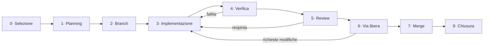

# GymFlow — Processo di implementazione delle storie

**Versione:** 1.0 · **Data:** 2026-08-06

Questo documento definisce il ciclo che va seguito per portare una storia del [backlog](BACKLOG.md) dalla selezione al merge in `main`.

Le regole operative in forma sintetica, caricate automaticamente all'inizio di ogni sessione di Claude Code, sono in [`CLAUDE.md`](../CLAUDE.md). Per eseguire il ciclo su una storia specifica esiste la skill `/gymflow-story US-XXX`.

---

## Principi

1. **Una storia, un branch.** Mai due storie nello stesso branch, mai una storia spalmata su più branch.
2. **Nessuna implementazione senza piano.** Il piano si scrive prima di toccare il codice e resta agli atti.
3. **La review è una fase distinta.** Non si fonde con l'implementazione e non si salta.
4. **Il merge è una decisione umana.** Nessun merge in `main` senza via libera esplicito.
5. **`dev` e `main` restano allineati.** Dopo ogni merge, `dev` viene riportato su `main`. I due branch non divergono mai.
6. **Il backlog è la fonte di verità.** Ogni avanzamento si riflette nel backlog, non solo nel codice.
7. **Fuori scope significa fuori.** Ciò che si scopre strada facendo diventa una nuova storia, non un'aggiunta silenziosa al branch corrente.

## Chi esegue

**Un solo agente esegue l'intero ciclo**, dalla selezione alla chiusura, senza delegare a sotto-agenti. Su storie di questa dimensione la delega costa più tempo di quanto ne faccia risparmiare.

La conseguenza va detta apertamente: **la review è un'autoverifica, non un giudizio indipendente**. Chi ha scritto il codice è la persona meno adatta a trovarne i difetti, perché rilegge ciò che intendeva scrivere invece di ciò che ha scritto. Il processo compensa in due modi — la fase 5 impone un cambio di ruolo con checklist adversariale, e il controllo reale resta l'approvazione umana della fase 6 — ma non elimina il limite.

Su storie particolarmente delicate (sicurezza, regole Firestore, modifiche alla CI) o superiori a 5 punti, vale la pena chiedere esplicitamente una review delegata a un agente indipendente.

---

## Il ciclo in sette fasi



## Convenzioni dei messaggi di commit

- In italiano, con il codice della storia in testa: `US-010: sposta lo stream fuori da build()`
- Prima riga sotto i 72 caratteri, all'imperativo o alla terza persona, senza punto finale
- Il corpo spiega **perché**, non cosa: il cosa si legge nel diff
- **Nessuna attribuzione ad AI o strumenti**: niente trailer `Co-Authored-By` verso assistenti, niente firme automatiche, nessun riferimento a come il codice è stato prodotto. L'autore del commit è chi ha fatto il lavoro.

---

### Fase 0 — Selezione

**Obiettivo:** scegliere una storia effettivamente eseguibile.

1. Leggere la storia nel backlog: `Depends on`, `Blocks`, `Status`, criteri di accettazione.
2. Verificare che **tutte** le storie in `Depends on` siano in stato `✅ DONE`.
3. Verificare che la storia non appartenga a **EP-008** (accantonata): va affrontata solo dopo il completamento delle fasi 1-5 dell'ordine di esecuzione.
4. Verificare che nessun'altra storia sia in stato `🔵 IN PROGRESS`.

**Uscita bloccante.** Se una dipendenza non è soddisfatta, fermarsi e segnalarlo. Non si "inizia comunque".

---

### Fase 1 — Planning

**Obiettivo:** un piano tecnico che chiunque possa eseguire.

Produrre `docs/planning/US-XXX.md` con:

| Sezione | Contenuto |
|---|---|
| **Contesto** | Cosa esiste oggi, con riferimenti a file e riga |
| **Obiettivo** | Cosa cambia, in una frase |
| **Approccio** | La strada scelta e perché, con le alternative scartate e la ragione dello scarto |
| **File toccati** | Elenco puntuale, con la natura dell'intervento per ciascuno |
| **Passi** | Sequenza ordinata e verificabile |
| **Piano di test** | Come si dimostra che ogni criterio di accettazione è soddisfatto |
| **Rischi** | Cosa può rompersi, e come ce ne accorgiamo |
| **Fuori scope** | Cosa esplicitamente non viene toccato |

Aggiornare lo stato della storia a `📋 PLANNED`.

**Punto di controllo.** Se il piano rivela che la storia è più grande della stima, o che ne servono due, fermarsi e proporre la suddivisione **prima** di scrivere codice.

---

### Fase 2 — Branch

**Obiettivo:** isolare il lavoro.

```bash
git switch main
git pull --ff-only origin main
git switch -c feature/US-XXX-slug-descrittivo
```

Convenzioni:

| Tipo di storia | Prefisso |
|---|---|
| Funzionalità, miglioramento | `feature/` |
| Correzione di difetto | `fix/` |
| Refactoring senza cambi di comportamento | `refactor/` |

Lo slug è breve e in inglese: `feature/US-010-exercise-search-stream`.

**Il branch parte sempre da `main` aggiornato.** Mai da `dev`, mai da un altro branch di storia.

Aggiornare lo stato a `🔵 IN PROGRESS`.

---

### Fase 3 — Implementazione

**Obiettivo:** soddisfare i criteri di accettazione, nient'altro.

- Seguire il piano. Se il piano si rivela sbagliato, **aggiornare il piano** e annotare il perché, poi proseguire.
- Restare dentro l'elenco dei file previsti. Un file in più è un segnale: o il piano era incompleto, o si sta uscendo dallo scope.
- Commit piccoli e in italiano, con riferimento alla storia:
  ```
  US-010: sposta lo stream degli esercizi fuori da build()
  ```
- Non toccare i criteri di accettazione per farli combaciare con l'implementazione. Se un criterio è sbagliato, dirlo.

---

### Fase 4 — Verifica

**Obiettivo:** dimostrare che funziona, prima di chiedere a qualcuno di guardarlo.

Sequenza obbligatoria, tutta verde:

```bash
flutter analyze
flutter test
flutter build apk --debug
```

1. `flutter analyze` — nessun errore, e nessun avviso **nuovo** rispetto al branch di partenza.
2. `flutter test` — tutti i test passano.
3. `flutter build apk` — la build va a buon fine. **L'app non viene eseguita su emulatore**: la prova funzionale la fa chi sviluppa, installando l'APK sul proprio telefono.
4. Ogni criterio di accettazione viene verificato **uno per uno** e spuntato nel backlog. I criteri che richiedono interazione a schermo restano **da confermare sull'APK**: vanno marcati come tali, non dati per soddisfatti.
5. L'APK viene consegnato insieme al riepilogo di fase 6.

**Nessuna eccezione su analyze e test.** Un criterio non verificabile è un criterio scritto male: va corretto nel backlog, motivando. Un criterio verificabile solo a mano va dichiarato come tale e girato a chi prova l'APK.

---

### Fase 5 — Review

**Obiettivo:** cercare attivamente ciò che non va, prima che lo faccia qualcun altro.

Si riparte dal diff (`git diff main...HEAD`), non dalla memoria di ciò che si intendeva fare. Il ragionamento che ha portato a scrivere il codice non è una prova che il codice sia corretto.

Produce `docs/planning/US-XXX-review.md` con:

- **Verdetto**: `APPROVATA` · `APPROVATA CON RISERVE` · `RESPINTA`
- **Copertura dei criteri**: per ciascuno, soddisfatto o no, con la prova
- **Rilievi**, ciascuno classificato:
  - 🔴 **Bloccante** — va corretto prima del merge
  - 🟡 **Da valutare** — merita una decisione esplicita
  - 🔵 **Suggerimento** — non blocca
- **Fuori scope rilevato**: modifiche presenti nel diff ma non previste dal piano
- **Regressioni sospette**

**Checklist adversariale.** Per ogni voce si cerca il caso in cui fallisce, non la conferma che funzioni:

- Ogni criterio è soddisfatto, e con quale prova concreta?
- Il diff contiene modifiche non previste dal piano?
- Cosa succede con dato assente, lista vuota, utente non autenticato, rete assente?
- Ogni risorsa creata viene rilasciata? Controller, sottoscrizioni, timer, stream.
- C'è uno `Stream` o un `Future` creato dentro `build`? Un effetto collaterale dentro `build`?
- Le convenzioni di `CLAUDE.md` sono rispettate?
- Qualcosa può rompere una funzionalità non testata?
- Ci sono segreti, credenziali o percorsi locali nel diff?
- Il codice resta comprensibile a chi lo rileggerà tra sei mesi senza contesto?

Se dalla checklist non emerge nulla, il sospetto è di non aver guardato abbastanza.

Con verdetto `RESPINTA` o rilievi 🔴, si torna alla fase 3.
Aggiornare lo stato a `🔍 IN REVIEW`.

---

### Fase 6 — Via libera

**Obiettivo:** la decisione umana.

Presentare in forma sintetica:

- Cosa è stato fatto e in quali file
- Esito della verifica e della review
- Rilievi aperti e come sono stati affrontati
- Cosa resta fuori scope

**Attendere approvazione esplicita.** Nessun merge senza. Se arrivano richieste di modifica, si torna alla fase 3 e si ripete dalla verifica.

---

### Fase 7 — Merge

**Obiettivo:** portare il lavoro in `main`.

Solo dopo il via libera della fase 6:

```bash
git switch main
git pull --ff-only origin main
git merge --squash feature/US-XXX-slug
git commit          # messaggio riepilogativo della storia
git push origin main
```

Il merge è **squash**: ogni storia corrisponde a un solo commit su `main`, e la storia del repository resta leggibile come sequenza di storie completate. I commit intermedi del branch non vengono conservati — il loro contenuto è già documentato nel piano e nel report di review.

Il messaggio del commit di squash riassume la storia intera: cosa cambia, perché, cosa resta esplicitamente fuori.

Il branch di storia **non viene pushato**: resta locale e si cancella dopo il merge.

```bash
git branch -D feature/US-XXX-slug   # -D perché lo squash non marca il branch come merged
```

> Non si usano pull request. Il controllo di qualità è dato dalla review di fase 5 e dall'approvazione di fase 6, non da un secondo passaggio su GitHub.

---

### Fase 8 — Chiusura

**Obiettivo:** lasciare il backlog coerente con la realtà e i due branch allineati.

1. Spuntare tutti i criteri di accettazione della storia.
2. Portare lo stato a `✅ DONE`.
3. Verificare le storie in `Blocks`: se ora hanno tutte le dipendenze soddisfatte, sono diventate eseguibili.
4. Se durante il lavoro sono emersi problemi fuori scope, aprire le storie corrispondenti in coda al backlog con ID progressivi e aggiornare il change log.
5. **Allineare `dev` a `main`:**

```bash
git switch main
git pull --ff-only origin main
git switch dev
git merge --ff-only main
git push origin dev
git switch main
```

Il merge deve riuscire in fast-forward. Se fallisce, significa che `dev` ha commit propri mai passati da `main`: fermarsi e capire perché, senza forzare.

6. Verificare: `git rev-list --left-right --count main...dev` deve restituire `0 0`.

---

## Modello dei branch

```
main ──●────────────●────────────●──►   sempre stabile, un commit per storia
        \          / \          /
         feature/US-039        feature/US-014
                  ↓             ↓
dev  ──●─────────●─────────────●──►     specchio di main, allineato a ogni chiusura
```

`dev` **non** è un branch di integrazione: è uno specchio di `main`. Non si sviluppa direttamente su `dev`, non ci si mergiano feature. Esiste per compatibilità con la storia del repository e resta allineato a `main` dopo ogni chiusura di storia.

Chi sviluppa apre sempre un branch di storia da `main`.

---

## Stati di una storia

| Stato | Significato |
|---|---|
| `⬜ TODO` | Non iniziata |
| `📋 PLANNED` | Piano scritto e approvato, codice non ancora toccato |
| `🔵 IN PROGRESS` | Branch aperto, implementazione in corso |
| `🔍 IN REVIEW` | Verifica superata, in attesa di review o di via libera |
| `✅ DONE` | Mergiata in `main` |
| `🚫 BLOCKED` | Ferma per una causa esterna, che va annotata nella storia |

**Una sola storia per volta in `🔵 IN PROGRESS`.**

---

## Struttura dei file di processo

```
docs/
├── BACKLOG.md              fonte di verità: storie, dipendenze, stati
├── WORKFLOW.md             questo documento
└── planning/
    ├── US-XXX.md           piano tecnico (fase 1)
    └── US-XXX-review.md    report di review (fase 5)
```

---

## Quando fermarsi e chiedere

Il ciclo prevede l'autonomia dentro i confini della storia. Va invece chiesto, sempre:

- Quando una dipendenza non è soddisfatta
- Quando il piano rivela che la storia va suddivisa o ristimata
- Quando servono modifiche fuori dai file previsti dal piano
- Quando un criterio di accettazione risulta sbagliato o non verificabile
- Prima di qualsiasi merge in `main`
- Prima di aggiungere una dipendenza a `pubspec.yaml`
- Prima di toccare le regole Firestore, i workflow CI o la configurazione Firebase
- Quando la review lascia rilievi 🟡 su cui serve una decisione di prodotto

---

_Processo definito il 2026-08-06 · Da rivedere dopo le prime tre storie completate._
